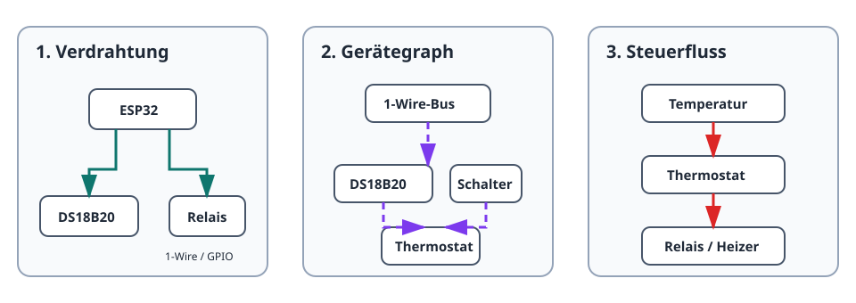

Gekko bildet angeschlossene Hardware als Graph kleiner, kombinierbarer Geräte
ab. Betrachten Sie jedes System aus drei Perspektiven: Verdrahtung, Abhängigkeiten
in Gekko und den Laufzeitfluss von Messwerten zu Aktionen.

## 1. Physische Verdrahtung

Hardware wird an ESP32-Pins und -Busse angeschlossen. In einer Temperaturregelung
liegt ein DS18B20 am 1-Wire-Pin und ein Relais an einem GPIO-Ausgang. Der Heizer
ist am Relais angeschlossen, niemals direkt am ESP32.

## 2. Geräteabhängigkeiten

Jede Hardware- oder Steuerrolle ist eine Geräteinstanz. Ein Sensor benötigt seinen
Bus; ein Thermostat benötigt einen kompatiblen Temperatursensor und einen Schalter.



Gekko prüft kompatible Rollen beim Anlegen und Ändern. Fehlt eine Abhängigkeit,
meldet das betroffene Gerät `dependency_blocked` statt mit alten Werten zu arbeiten.

## 3. Steuerfluss zur Laufzeit

```text
DS18B20-Temperatur → Thermostatentscheidung → Ein/Aus-Befehl → Relais → Heizer
```

Der Thermostat vergleicht die Temperatur mit Sollwert und Hysterese und steuert
den Schalter. Das ist ein Informations- und Befehlsfluss, kein weiterer Draht.

## In Abhängigkeitsreihenfolge anlegen

1. Busse und Hardwareausgänge anlegen.
2. Davon abhängige Sensoren oder Kanäle anlegen.
3. Für jedes Gerät den Status `ready` abwarten.
4. Steuer- und Automatisierungsgeräte anlegen.
5. Normalbetrieb und sicheres Verhalten bei fehlender Abhängigkeit testen.

Siehe auch [Geräte und Abhängigkeiten](/gekko/de/guides/devices-and-dependencies/)
und das vollständige Projekt [Thermostat mit Relais](/gekko/de/projects/thermostat-with-relay/).
