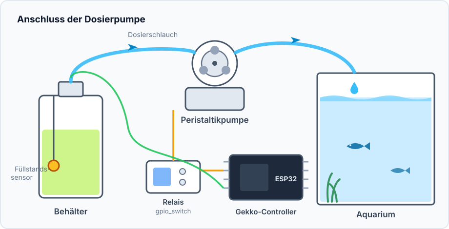
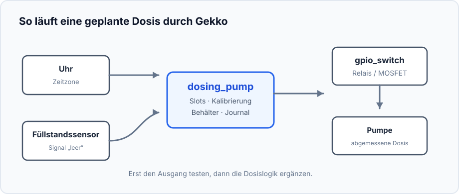
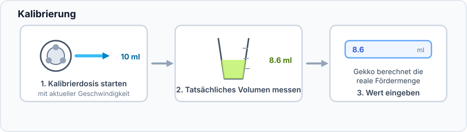
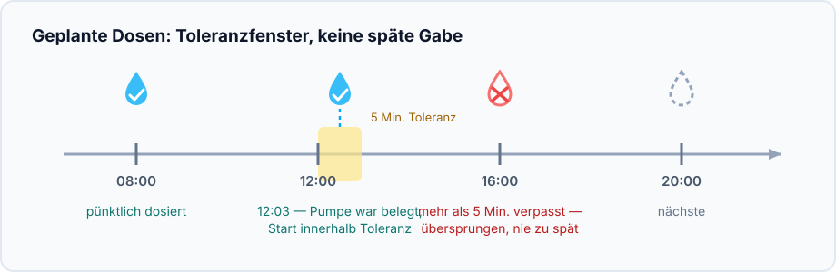
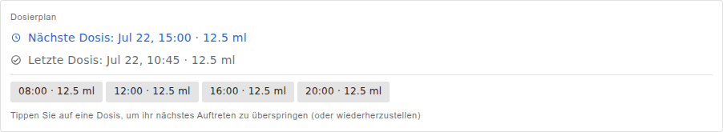
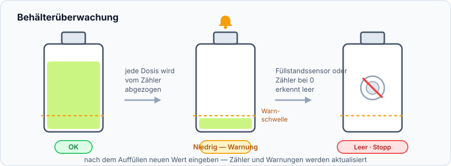

Dieses Projekt gibt zu festgelegten Zeiten kleine, abgemessene Flüssigkeitsmengen
ab — etwa für Aquarienzusätze, Dünger oder andere Lösungen, die von mehreren
kleinen statt einer großen Gabe profitieren.

## Ergebnis

```text
Uhr → Dosis-Slots → dosing_pump
                    ├→ GPIO-Schalter → Pumpe
                    └→ Behälterzähler und Journal
```

## Hardware und Sicherheit



- ESP32, Niedervolt-Peristaltikpumpe und ein für die Pumpe ausgelegtes Relais
  oder MOSFET.
- Schlauch, Behälter und Messzylinder oder Waage zur Kalibrierung.
- Optional ein Schwimmerschalter im Behälter.

> Testen Sie zuerst mit sauberem Wasser in einen Messzylinder, nicht mit einer
> unbekannten Menge Zusatz im Aquarium. Versorgen Sie den Pumpenmotor niemals
> direkt über einen ESP32-GPIO.

## Gerätegraph und Reihenfolge



1. Stellen Sie Zeitzone ein und warten Sie auf eine plausible NTP-Uhrzeit oder
   fügen Sie eine DS3231-RTC hinzu.
2. Erstellen Sie einen [`gpio_switch`](/gekko/de/reference/devices/gpio-switch/)
   für Relais oder MOSFET. Sein sicherer Zustand muss den Motor ausschalten.
3. Schalten Sie den GPIO-Ausgang mit Wasser und Messzylinder kurz manuell ein
   und aus. Prüfen Sie, dass der Motor stoppt.
4. Erstellen und testen Sie bei Bedarf den Füllstandssensor.
5. Erstellen Sie `dosing_pump`: Pumpenschalter, Sensor, Behälter und
   Warnschwelle auswählen.

## Reale Fördermenge kalibrieren



Schlauchlänge, Höhe und Pumpenverschleiß verändern die Fördermenge. Kalibrieren
Sie mit dem endgültig verlegten Schlauch; die Testflüssigkeit verlässt den
Behälter wirklich.

## Ersten Zeitplan anlegen



Legen Sie zunächst eine kleine Dosis einige Minuten in der Zukunft an. Die Pumpe
muss einmal laufen und dann stoppen. Eine zu alte verpasste Dosis wird nicht
nachgeholt; so entsteht nach einem Neustart keine gefährliche Sammeldosis.

## Beispiel eines gespeicherten Zeitplans



Das Beispiel hat vier Slots zu je 12,5 ml: 08:00, 12:00, 16:00 und 20:00,
zusammen 50 ml pro Tag. Es zeigt nur die Struktur: Die Menge bestimmen
Wassertests und die Anleitung des jeweiligen Zusatzes. Wählen Sie einen Slot,
um nur dessen nächste Ausführung zu überspringen.

## Behälter überwachen



Füllen Sie vor der Warnschwelle nach und geben Sie den neuen Wert mit **Set
volume** an. Der Füllstandssensor schützt zusätzlich gegen Trockenlauf, wenn
der Zähler nicht stimmt. Prüfen Sie in den ersten Tagen Tests und Dosisjournal.

## Häufige Probleme

- **Die Dosis startet nicht:** Uhrzeit, Zeitzone, Automatikmodus und den Status
  „leer“ prüfen.
- **Die Menge stimmt nicht:** mit der installierten Schlauchführung erneut
  kalibrieren.
- **Motor läuft, aber keine Flüssigkeit:** Schlauch mit Wasser füllen und
  Ansaugung, Knicke sowie Schlauchweg prüfen.
- **Motor stoppt nicht:** GPIO-Ausgang sofort ausschalten und Relais sowie den
  sicheren Zustand vor der Automatik prüfen.

Alle Einstellungen stehen in der [Referenz zur Dosierpumpe](/gekko/de/reference/devices/dosing-pump/).
