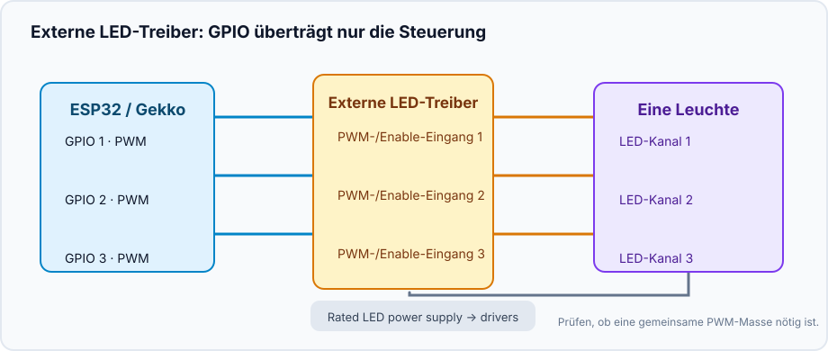
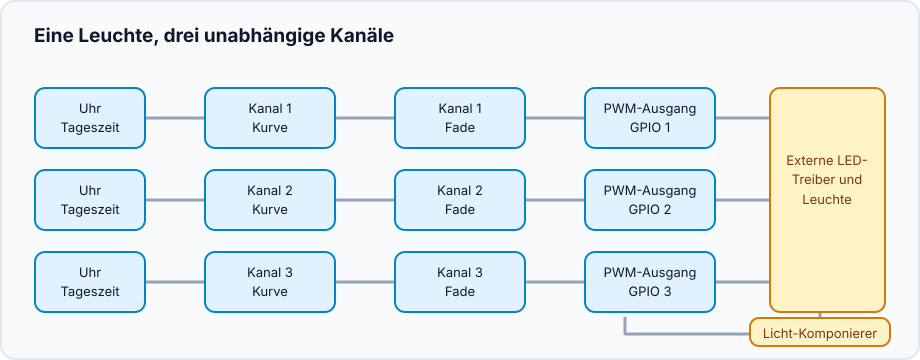
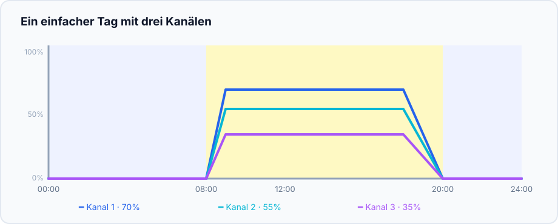

Dieses Projekt fasst unabhängige dimmbare LED-Kanäle zu einer Leuchte zusammen.
Die Kanäle können beliebige LED-Linien oder andere PWM-gesteuerte Lasten sein:
Namen und Werte bestimmen Sie. Gekko steuert den Tagesrhythmus; LED-Treiber
oder MOSFET-Stufe liefern die Leistung.

## Ergebnis

```text
Uhr → Kanal-Kurven → weiche Übergänge → PWM-Ausgänge → LED-Treiber → Leuchte
                                └──────── Komponierer ────────┘
```

Jeder Kanal hat eine eigene Kurve; ein Komponierer gibt der ganzen Leuchte den
gemeinsamen Modus **Off**, **Manual** oder **Scheduled**.

## Hardware und Sicherheit



- ESP32 und ein geeigneter PWM-GPIO je Kanal.
- LED-Treiber mit dokumentiertem PWM-/Enable-Dimmeingang oder eine für Last
  und Netzteil ausgelegte MOSFET-Stufe.
- Ein eigenes passend dimensioniertes Netzteil für die LEDs. Eine LED-Linie
  darf **nicht** direkt an einem ESP32-GPIO hängen.
- Gemeinsame Masse nur, wenn die Treiberdokumentation eine PWM-Bezugsm­asse
  verlangt. Eingangsspannung, Polarität und Isolation vorher prüfen.

Testen Sie zuerst einen Kanal bei niedrigem manuellen Wert und erst danach die
restlichen Kanäle.

## Gerätegraph erstellen



Für jeden physischen Kanal:

1. Erstellen Sie einen [`analog_output`](/gekko/de/reference/devices/analog-outputs/) für den GPIO, etwa „PWM Kanal 1“.
2. Fügen Sie einen `fade_analog_output` hinzu, der auf diesen Ausgang zeigt.
3. Fügen Sie einen `scheduled_analog_output` hinzu, der auf den Fade zeigt.
4. Wiederholen Sie dies für alle Kanäle. Erstellen Sie dann einen
   `analog_output_composer` („Hauptlicht“) mit allen Scheduled Outputs.

Der Komponierer ist die normale Bedienstelle; platzieren Sie ihn statt der
einzelnen PWM-Ausgänge auf dem Dashboard.

## Ersten einfachen Tag zeichnen

| Zeit | Kanal 1 | Kanal 2 | Kanal 3 | Bedeutung |
| --- | ---: | ---: | ---: | --- |
| 00:00 | 0% | 0% | 0% | Nacht / aus |
| 08:00 | 0% | 0% | 0% | Rampe beginnt |
| 09:00 | 35% | 20% | 10% | sanfter Morgen |
| 12:00 | 70% | 55% | 35% | Tagesniveau |
| 18:00 | 70% | 55% | 35% | halten |
| 20:00 | 0% | 0% | 0% | Rampe endet |



Diese Werte sind nur ein Kurvenbeispiel, keine Helligkeitsvorgabe. Starten Sie
unterhalb des Zielwerts und ändern Sie jeweils nur eine Variable.

## Leuchte prüfen

1. Im Komponierer **Manual** wählen und alle Kanäle auf niedrigen Wert setzen.
   Jeden Kanal und die Treibertemperatur prüfen.
2. Zu **Off** wechseln: alle Kanäle müssen null werden.
3. **Scheduled** wählen und eine Rampe wenige Minuten voraus eintragen.
4. Controller neu starten oder die gültige Uhrzeit entfernen: Scheduled Outputs
   müssen sicher auf null gehen, nicht die alte Helligkeit behalten.

Ein speicherbares Leuchtenprofil und geführte Akklimatisierung folgen später;
bis dahin hält der Komponierer die vorhandenen Kurven zusammen.

## Häufige Probleme

- **Kanal ist invertiert:** Dimm-Logik des Treibers prüfen.
- **Licht springt:** Scheduled Output muss auf `fade_analog_output` zeigen.
- **Leuchte bleibt dunkel:** Uhr, Komponierer-Modus, Netzteil und Enable-Eingang prüfen.
- **Nur ein Kanal ändert sich:** alle Scheduled Outputs müssen im Komponierer sein.

Details: [Analog outputs & light composer](/gekko/de/reference/devices/analog-outputs/).
