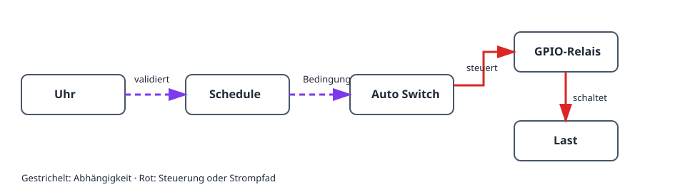

Dieses Projekt schaltet eine Last zu gewählten Zeiten. Das physische Relais
ist von der Zeitregel getrennt: Ein **Schedule** entscheidet, ob ein Zeitfenster
aktiv ist; ein **Auto Switch** überträgt diese Bedingung auf den GPIO-Relaisausgang.

## Ergebnis

```text
Uhr und Zeitzone → Schedule → Auto Switch → GPIO-Relais → Last
```

## Hardware und Sicherheit

- ESP32-Board und ein für die Last geeignetes Relaismodul.
- Eine Kleinspannungs-Testlast, etwa eine LED, für die erste Prüfung.

> Schließen Sie Netzspannung nie direkt an den ESP32 an. Verwenden Sie ein
> geschlossenes, passend bemessenes Relais oder Schütz und beachten Sie die
> örtlichen Sicherheitsregeln.

## Gerätegraph und Einrichtungsreihenfolge



1. Stellen Sie die Zeitzone ein und warten Sie auf eine plausible Uhrzeit per
   NTP, oder fügen Sie eine DS3231-RTC hinzu. Bis dahin bleibt der Schedule
   absichtlich ungültig.
2. Erstellen Sie einen [`gpio_switch`](/gekko/de/reference/devices/gpio-switch/)
   für das Relais und wählen Sie einen sicheren, stromlosen Zustand der Last.
3. Schalten Sie den GPIO-Ausgang mit der Kleinspannungs-Testlast manuell ein
   und aus.
4. Erstellen Sie einen [`schedule`](/gekko/de/reference/devices/schedule/) mit
   einer einfachen täglichen Regel, zum Beispiel 09:00–09:10, **Always on**.
5. Erstellen Sie einen `auto_switch`: GPIO-Schalter als Ziel **switch**,
   Schedule als **condition**, anschließend Modus **Auto** wählen.

Der Auto Switch verknüpft alle Bedingungen mit UND. Bei dieser einzelnen
Bedingung ist das Relais nur während des aktiven Zeitfensters an. Manuelle Modi
ignorieren Bedingungen; nach dem Test wieder zu Auto wechseln.

## Sicher prüfen

1. Prüfen Sie Uhrzeit und Zeitzone der Installation.
2. Legen Sie ein kurzes Zeitfenster einige Minuten in der Zukunft an und
   beobachten Sie Schedule-Status und nächste Umschaltung.
3. Prüfen Sie, dass Auto Switch die Testlast am Fensteranfang einschaltet und
   am Ende ausschaltet.
4. Ändern Sie in einer sicheren Testumgebung die Controllerzeit oder trennen
   Sie die Zeitsynchronisierung. Der Schedule muss ungültig oder inaktiv werden
   und das Relais in den sicheren Aus-Zustand zurückkehren.

## Häufige Probleme

- **Relais schaltet nicht ein:** Auto-Modus und aktuell aktiven Schedule prüfen.
- **Schedule ist ungültig:** Zeitzone und NTP prüfen oder DS3231 einrichten.
- **Relaislogik ist umgekehrt:** Erst GPIO-Schalter testen; GPIO-Invertierung
  nur bei einem active-low Relais aktivieren.
- **Zeit weicht um eine Stunde ab:** Zeitzone und Sommerzeit prüfen, nicht
  einzelne Regeln ändern.

Details finden Sie unter [Schedules & automation](/gekko/de/guides/schedules-and-automation/).
