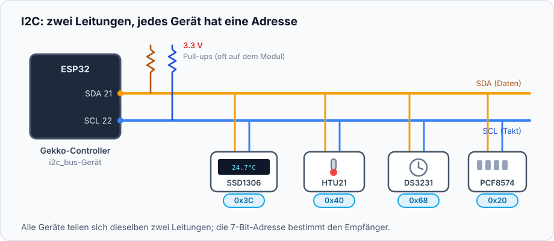
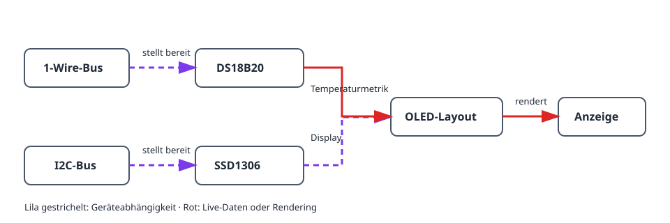
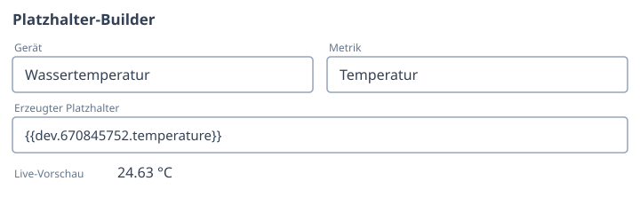
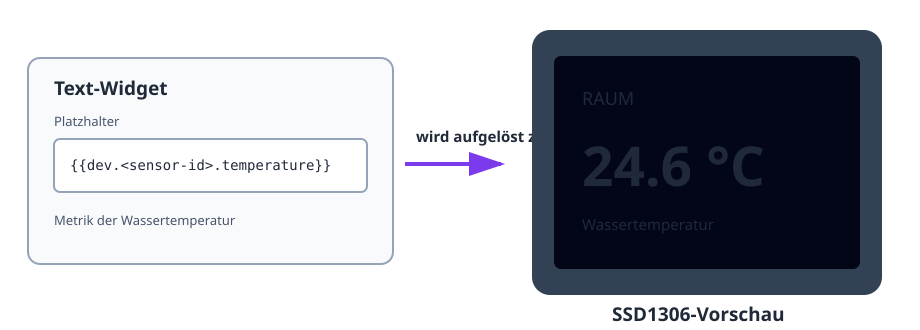

Dieses Projekt macht aus einem Temperatursensor eine kompakte Statusanzeige.
Der DS18B20 nutzt 1-Wire, das SSD1306 OLED I2C; das Display-Layout verwendet
die Live-Metrik des Sensors.

## Ergebnis

```text
DS18B20 → Temperaturmetrik → OLED-Layout → Live-Anzeige
                 ↑
        1-Wire-Bus     I2C-Bus → SSD1306-Display
```

## Hardware

- ESP32-Board und DS18B20 mit 4,7-kΩ-Pull-up zwischen DATA und 3V3.
- SSD1306-I2C-OLED, meist an Adresse `0x3C`.
- I2C-Leitungen SDA, SCL, 3V3 und GND zwischen ESP32 und Display.



DS18B20 und OLED verwenden unterschiedliche Leitungen: DATA für 1-Wire sowie
SDA/SCL für I2C.

## Gerätegraph und Einrichtungsreihenfolge



1. Erstellen und prüfen Sie einen [`onewire_bus`](/gekko/de/reference/devices/onewire-bus/),
   scannen Sie ihn und erstellen Sie einen
   [`ds18b20_temperature_sensor`](/gekko/de/reference/devices/ds18b20/).
2. Erstellen Sie einen [`i2c_bus`](/gekko/de/reference/devices/i2c-bus/) für
   SDA und SCL des OLED. Scannen Sie bei unbekannter Display-Adresse.
3. Erstellen Sie ein `ssd1306`-Display auf diesem Bus.
4. Warten Sie auf `ready`, öffnen Sie **Design** und erstellen Sie ein
   Text-Widget.
5. Fügen Sie die Temperaturmetrik mit dem Platzhalter-Builder ein:

   ```text
   Raum {{dev.<sensor-id>.temperature | fixed:1}} °C
   ```

Der Platzhalter wird zu einer echten Display-Abhängigkeit. Gekko warnt daher,
bevor ein noch im Layout verwendeter Sensor gelöscht wird.



## Anzeige prüfen



1. Prüfen Sie die Designer-Vorschau vor dem Speichern.
2. Vergleichen Sie OLED-Wert und Sensorseite.
3. Erwärmen oder kühlen Sie den Fühler leicht und prüfen Sie die Änderung.
4. Trennen Sie den Sensor in einer sicheren Testumgebung. Sein Platzhalter muss
   leer oder nicht verfügbar werden, ohne das übrige Layout zu blockieren.

## Häufige Probleme

- **OLED bleibt leer:** Versorgung, SDA/SCL, I2C-Adresse und das konfigurierte Panel prüfen.
- **Sensorwert fehlt:** auf `ready` warten und den Platzhalter-Builder nutzen.
- **Text wird abgeschnitten:** Vorschau, kleinere Schrift oder zweite Seite nutzen.
- **Sensor lässt sich nicht löschen:** Platzhalter zuerst im Layout entfernen.

Den vollständigen Ablauf beschreibt [Displays & layout designer](/gekko/de/guides/displays/).
