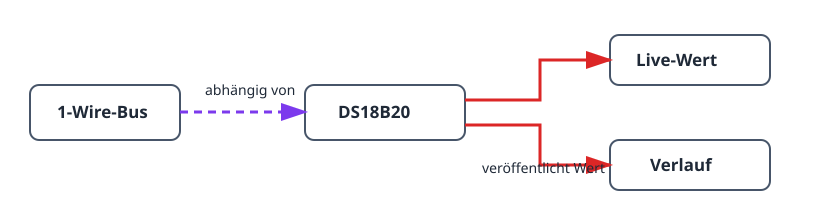

Dieses Projekt baut die kleinste nützliche Sensorkette: einen DS18B20 an einem
1-Wire-Bus. Es vermittelt die gleiche Abhängigkeitsreihenfolge wie größere
Systeme und liefert eine aktuelle Temperatur mit Verlauf. So lassen sich
Verdrahtung und Einbauort vor einem Thermostat oder anderer Automatisierung
prüfen.

## Ergebnis

```text
DS18B20-Fühler → 1-Wire-Bus → aktueller Temperaturwert und Verlauf
```

## Hardware

- ESP32-Board.
- DS18B20-Temperaturfühler.
- 4,7-kΩ-Pull-up-Widerstand zwischen der DATA-Leitung des Fühlers und 3V3.


Lassen Sie DATA nicht offen: Ohne Pull-up kann der Bus Fühler nur
unzuverlässig finden oder ungültige Werte melden.

## Gerätegraph und Einrichtungsreihenfolge



1. Erstellen Sie einen [`onewire_bus`](/gekko/de/reference/devices/onewire-bus/)
   für den GPIO an der DATA-Leitung.
2. Öffnen Sie den Bus und führen Sie **Scan** aus. Der erwartete Fühler muss
   erscheinen.
3. Erstellen Sie einen
   [`ds18b20_temperature_sensor`](/gekko/de/reference/devices/ds18b20/) mit
   der gefundenen Adresse.
4. Warten Sie auf den Status `ready`. Öffnen Sie den Sensor und prüfen Sie den
   Live-Wert sowie den Verlaufsgraphen.

Der Scan bindet den Sensor an eine eindeutige 64-Bit-ROM-Adresse. Mehrere
Fühler können einen Bus teilen, aber jede gefundene Adresse benötigt eine
eigene Sensorinstanz.

## Messwert prüfen

1. Vergleichen Sie den angezeigten Wert nach der Stabilisierung am selben Ort
   mit einem verlässlichen Thermometer.
2. Bewegen Sie den Fühler kurz zwischen wärmerer und kälterer Umgebung. Wert
   und Verlauf müssen sich in die erwartete Richtung ändern.
3. Trennen Sie den Fühler in einer sicheren Testumgebung. Der Sensor muss
   nicht verfügbar oder fehlerhaft werden; er darf keinen alten Wert weiter als
   aktuellen Messwert ausgeben.

## Häufige Probleme

- **Der Scan findet keinen Fühler:** Prüfen Sie DATA, 3V3, GND und den
  4,7-kΩ-Pull-up.
- **Die Temperatur springt:** Prüfen Sie Kabel und Einbauort, bevor Sie
  Glättung oder Kalibrierung hinzufügen.
- **Der falsche Fühler ist ausgewählt:** Scannen Sie erneut und verwenden Sie
  die angezeigte ROM-Adresse, nicht nur Kabelfarbe oder Einbauposition.

Sobald der Messwert zuverlässig ist, verwenden Sie ihn als
Temperaturabhängigkeit für den
[Thermostat mit Relais](/gekko/de/projects/thermostat-with-relay/).
