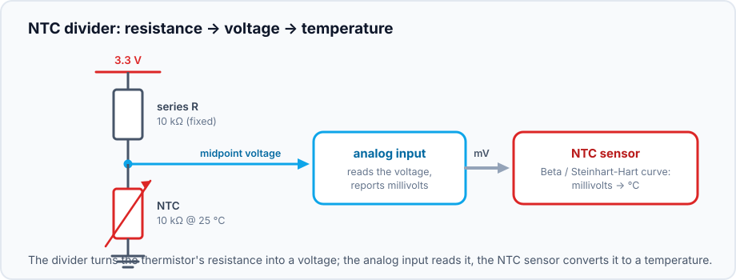
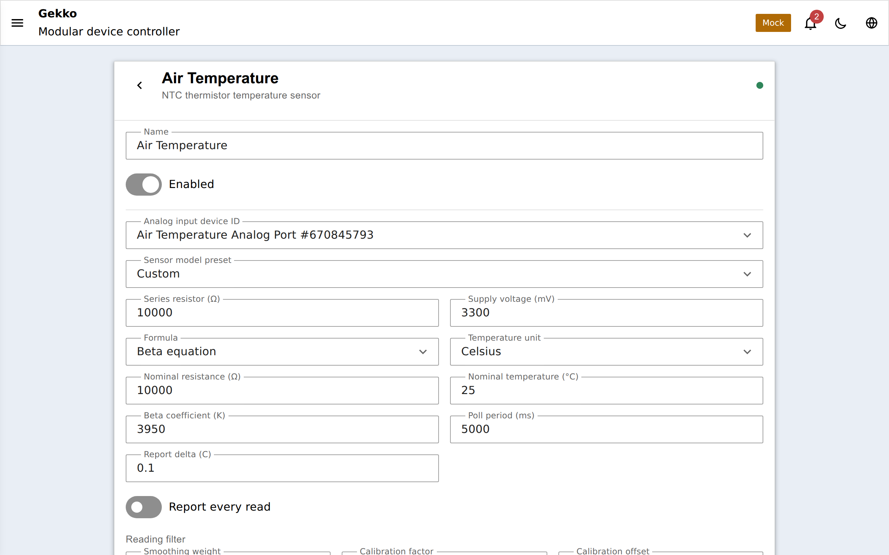

## Was ist ein NTC-Thermistor?

Ein NTC-Thermistor ist ein Widerstand, dessen Widerstand **sinkt, wenn er
waermer wird** (NTC = Negative Temperature Coefficient). Sie sind die
guenstigsten Temperatursensoren ueberhaupt - ein paar Cent - und gibt es als
Glaskugel, Epoxid- und wasserdichte Sondenform. Der Haken gegenueber einem
[DS18B20](/gekko/de/reference/devices/ds18b20/) ist, dass ein Thermistor
*analog* ist: Er aendert nur seinen Widerstand, also musst du diesen messen
und in Temperatur umrechnen. Gekko erledigt beides.

Gegenueber einem DS18B20 ist ein NTC guenstiger und kann physisch winzig oder
sehr schnell reagieren, ist aber out of the box weniger genau, braucht einen
Widerstand und einen ADC, und der Kabelwiderstand kann die Messung leicht
verschieben. Nimm einen DS18B20, wenn du Plug-and-Play-Genauigkeit willst;
nimm einen NTC, wenn du billig, klein oder schnell willst - oder wenn du
bereits einen [ADS1115](/gekko/de/reference/devices/analog-inputs/) mit freiem
Kanal hast.

## Verdrahtung: der Spannungsteiler

Du kannst Widerstand nicht direkt lesen - du liest eine Spannung. Darum kommt
der Thermistor in Reihe mit einem festen **Serienwiderstand** zwischen
Versorgung und Masse, und Gekko misst die Spannung am Mittelpunkt:

Wenn sich der Widerstand des NTC mit der Temperatur aendert, wandert die
Mittelpunkts-Spannung; Gekko rechnet diese Spannung zurueck in den Widerstand
des NTC (es kennt den Serienwiderstand und die Versorgung) und dann vom
Widerstand in Temperatur. Ein **10-kΩ**-Serienwiderstand zusammen mit einem
**10-kΩ-NTC (bei 25 °C)** ist die klassische Kombination und Gekkos Standard.

Dieser Mittelpunkt ist einfach eine analoge Spannung - der NTC-Sensor besitzt
also gar keinen ADC-Pin. Er haengt von einem **[Analogeingang](/gekko/de/reference/devices/analog-inputs/)**
ab, was bedeutet, dass du den Teiler einlesen kannst auf:

- den **eigenen ADC-Pin des ESP32** (`analog_port_input`) - am einfachsten,
  am wenigsten praezise;
- einen **ADS1115-Kanal** (`analog_input_channel` auf einem `ads1115_hub`) -
  die praezise Option und die, die einen guenstigen Thermistor wirklich brauchbar macht;
- einen **CD74HC4067-Kanal** - wenn viele Thermistoren einen ADC-Pin teilen.

## Einrichtung

1. Erstelle den Analogeingang, an den der Mittelpunkt des Teilers verdrahtet
   ist - siehe [Analogeingaenge](/gekko/de/reference/devices/analog-inputs/).
   Ein ADS1115-Kanal ist die empfohlene Wahl fuer stabile Werte.
2. Erstelle einen **`ntc_thermistor_temperature_sensor`** und waehle diesen
   Analogeingang als Abhaengigkeit.
3. Waehle ein **Preset**, das zu deinem Thermistor passt, oder trage die Werte
   von Hand ein.

### Presets sind nur eine Abkuerzung

Das Formular bietet ein paar gaengige Thermistor-Modelle:

| Preset | Serien-R | Nenn-R (25 °C) | Beta |
| --- | --- | --- | --- |
| Generic 10k B3950 | 10 kΩ | 10 kΩ | 3950 |
| EPCOS/TDK 10k B3435 | 10 kΩ | 10 kΩ | 3435 |
| Vishay 10k B3977 | 10 kΩ | 10 kΩ | 3977 |
| Semitec 100k B4267 | 100 kΩ | 100 kΩ | 4267 |

Ein Preset **fuellt nur die numerischen Felder vor** - nichts an der Auswahl
wird auf dem Geraet gespeichert. Wenn du danach einen Wert aenderst, ist das
immer sicher; das Preset "kaempft" nicht gegen deine Aenderungen. Nimm das
naechste passende und passe an, oder waehle *Custom* und trage die Daten aus
dem Datenblatt ein.

## Die zwei Kurven: Beta vs. Steinhart-Hart

Um Widerstand in Temperatur umzuwandeln, braucht man ein Modell der
Thermistor-Kurve. Gekko bietet beide Standardmodelle:

- **Beta-Gleichung** - `1/T = 1/T₀ + (1/β)·ln(R/R₀)`. Die Zwei-Punkt-Form, die
  jedes Datenblatt angibt: Nennwiderstand R₀ bei Nenn-Temperatur T₀ (meist
  10 kΩ bei 25 °C) plus ein einzelner **Beta**-Koeffizient. Ueber einen
  Aquarium-Bereich grob ±0,5-1 °C genau - fuer Heizer oder Kuehler mehr als
  genug. Das ist Standard und am einfachsten auszufuellen.
- **Steinhart-Hart-Gleichung** - `1/T = A + B·ln(R) + C·ln(R)³`. Drei
  Koeffizienten statt eines, ueber einen groesseren Bereich genauer, wenn man
  sie kennt (oder aus einer 3-Punkt-Widerstands/Temperatur-Tabelle fitten kann).
  Nur waehlen, wenn du A/B/C hast; sonst ist Beta die richtige Wahl.

Zwischen beiden umschalten kannst du mit dem **formula mode**-Selektor; das
Formular zeigt die Felder, die die gewaehlte Gleichung braucht.

## Kalibrierung und Glättung

Weil ein Thermistorwert von Toleranzen abhaengt (vom Thermistor selbst, vom
Serienwiderstand, vom ADC), nutzt der Sensor Gekkos Standard-
Sensoraufbereitung:

- einen **Kalibrier-Offset/Faktor**, um einen bekannten Fehler gegen ein
  Referenzthermometer abzugleichen;
- ein **Smoothing-Weight**, um das letzte bisschen ADC-Jitter zu dämpfen.

Lege ein Referenzthermometer neben die Sonde, lies beide ab und drehe den
Offset so nach, dass sie zusammenpassen - dieser Ein-Punkt-Abgleich entfernt
den groessten Teil des Fehlers eines guenstigen Thermistors.

## Beobachten

Der Sensor meldet seine Temperatur mit Gueltigkeitsflag - wenn sein
Analogeingang ungueltig wird (ein abgekoppelter Teiler, ein defekter I2C-Bus
hinter einem ADS1115), erscheint der Wert als *invalid*, nie als alter oder
falscher Wert. Klicke auf die Dashboard-Kachel fuer Livewert und Verlauf,
genauso wie beim DS18B20.

Die Temperatur speist alles andere in Gekko auf dieselbe Weise wie jeder
Temperatursensor:

- ein [Thermostat](/gekko/de/reference/devices/thermostat/) fuer Heizer oder
  Kuehler;
- [Display-Platzhalter](/gekko/de/guides/displays/) auf einem OLED/TFT;
- Home Assistant als read-only `sensor`-Entity auf
  [MQTT-Builds](/gekko/de/guides/mqtt-home-assistant/).

## Konfiguration

| Feld | Standard | Bedeutung |
| --- | --- | --- |
| `formulaMode` | `beta` | `beta` oder `steinhart_hart` |
| `seriesResistorOhms` | `10000` | Der feste Teilerwiderstand in Ohm |
| `supplyMilliVolts` | `3300` | Versorgungsspannung des Teilers (3,3 V Rail) |
| `nominalResistanceOhms` | `10000` | Thermistorwiderstand bei der Nenn-Temperatur (R₀) |
| `nominalTempCelsius` | `25` | Nenn-Temperatur (T₀) |
| `betaCoefficient` | `3950` | Beta-Wert (Beta-Modus) |
| `steinhartA` / `steinhartB` / `steinhartC` | `0` | Steinhart-Hart-Koeffizienten (Steinhart-Hart-Modus) |
| `unit` | `celsius` | Anzeigeeinheit |
| `pollMs` | `5000` | Wie oft gelesen wird |
| `reportDeltaCelsius` | `0.1` | Mindestaenderung, bevor ein neuer Wert gesendet wird |
| `reportAlways` | aus | Jeden Poll senden, unabhaengig vom Delta |

Temperatur aendert sich langsam - das Standard-Polling von 5 s mit kleinem
Report-Delta haelt WebSocket und Historie ruhig, ohne etwas Echtes zu verpassen.

Firmware-Interna, Kurvenmathematik und die Preset-Tabelle:
[`docs/analog-input.md`](https://github.com/yoreek/gekko/blob/master/docs/analog-input.md).
