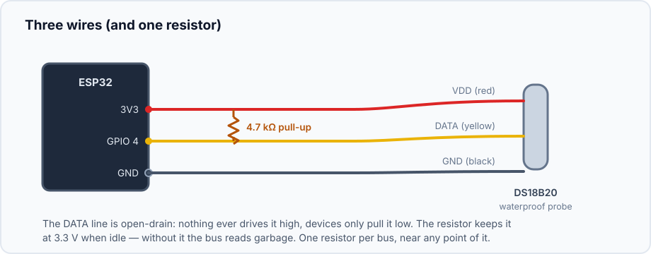
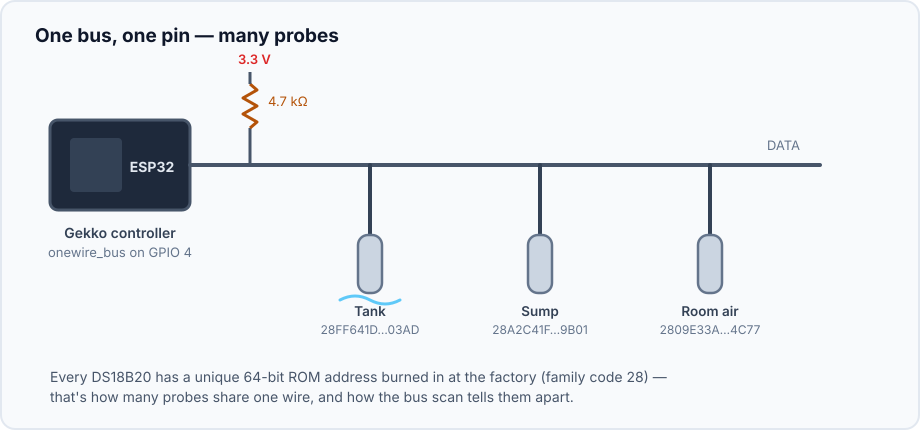
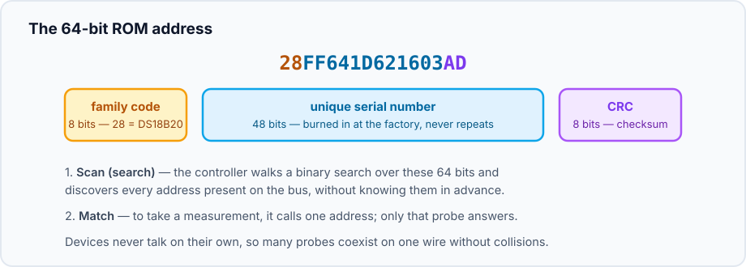

## Was ist 1-Wire?

1-Wire ist ein serieller Bus (urspruenglich von Dallas Semiconductor) mit
einer radikalen Idee: **eine gemeinsame Datenleitung fuer alles**. Der
Controller und beliebig viele Geraete - praktisch DS18B20-Temperatursonden -
haengen an demselben Draht, und jedes Geraet wird einzeln adressiert. Darum
kostet ein ganzes Aquarium voller Temperatursensoren genau **einen GPIO-Pin**.

In Gekko ist der Bus selbst ein Geraet: `onewire_bus`. Es besitzt den Pin,
fuehrt den Scan aus, und jeder [DS18B20-Sensor](/gekko/de/reference/devices/ds18b20/)
den du anlegst, haengt davon ab.

## Verdrahtung: drei Draehte und ein Widerstand

Die typische wasserdichte DS18B20-Sonde hat drei Adern:

| Ader | Uebliche Farbe | Verbinden mit |
| --- | --- | --- |
| VDD | rot | 3,3 V |
| DATA | gelb (oder weiss/blau) | dem Bus-GPIO |
| GND | schwarz | GND |

Der **4,7-kΩ-Pull-up-Widerstand** zwischen DATA und 3,3 V ist nicht optional.
Die Datenleitung ist *Open Drain*: Kein Geraet treibt sie jemals auf High - es
zieht sie nur auf Low und laesst wieder los. Der Widerstand bringt die Leitung
zwischen Bits auf 3,3 V zurueck; ohne ihn ist jede Messung Muell. Ein
Widerstand pro Bus, egal wie viele Sonden dran haengen.

:::tip
Die `onewire_bus`-Config hat einen **internal pull-up**-Schalter, der den
eingebauten ~45-kΩ-Widerstand des ESP32 nutzt. Das kann fuer eine Sonde an
einem kurzen Kabel reichen, ist aber viel schwaecher als der empfohlene
4,7-kΩ-Widerstand - fuer alles laenger als ein Breadboard den echten Widerstand
einbauen.
:::

Sonden mit "Adapter/Modul" haben den Widerstand oft schon auf der kleinen Platine
- dann keinen zweiten hinzufuegen.

## Viele Geraete auf einem Draht

Neue Sonden werden **parallel** an dieselben drei Leitungen angeschlossen -
DATA, 3,3 V und GND, wo es bequem ist. Eine Daisy Chain (Sonde zu Sonde
entlang eines Kabels) ist elektrisch am saubersten; kurze Stubs von einer
Hauptleitung sind auch in Ordnung. Strecken von mehreren Metern sind mit dem
4,7-kΩ-Pull-up normal.

## Adressen: wie Sonden Kollisionen vermeiden

Jedes 1-Wire-Geraet hat eine eindeutige **64-Bit-ROM-Adresse**:

Zwei Operationen machen den gemeinsamen Draht moeglich:

- **Search ("scan" im Portal)** - eine clevere binäre Eliminierung, die jede
  Adresse auf dem Bus entdeckt, ohne vorher eine davon zu kennen. Gekkos
  Bus-Geraet stellt das als **scan**-Befehl bereit; die Ergebnisse
  (Family Code, Adresse, CRC-Status) fliessen direkt in den DS18B20-
  Erstellungsdialog.
- **Match** - um mit genau einem Geraet zu sprechen, sendet der Controller
  zuerst seine volle Adresse; nur dieses Geraet antwortet. Geraete sprechen nie
  ungefragt, also gibt es keine Kollisionen - der Controller pollt immer.

Das erste Byte ist der **Family Code** - `28` bedeutet "DS18B20-
Temperatursensor". Der Scan zeigt alles, was er findet, und Gekko filtert
DS18B20-Kandidaten nach diesem Code.

## Konfiguration

| Feld | Standard | Bedeutung |
| --- | --- | --- |
| `gpioPin` | `4` | Der Datenpin des Busses |
| `internalPullup` | aus | Den schwachen internen Pull-up des ESP32 statt eines externen 4,7-kΩ-Widerstands nutzen |
| `enabled` | an | Das Deaktivieren des Busses blockiert jeden Sensor darauf (`dependency_blocked`) |

## Fehlerbehebung

- **Scan findet nichts** - zuerst den Pull-up pruefen, dann die Verdrahtung
  (VDD und DATA zu vertauschen ist der klassische Fehler; Sonden ueberleben
  das).
- **Sonde erscheint mit CRC-Flag** - schlechter Kontakt oder Stoerungen;
  Leitung kuerzen, Verbindungen verbessern, von Netzleitungen und
  Schaltnetzteilen fernhalten.
- **Zwei Sonden, aber nur eine Adresse sichtbar** - du hast gescannt, bevor
  die zweite Sonde angeschlossen war; den Scan erneut ausfuehren.
