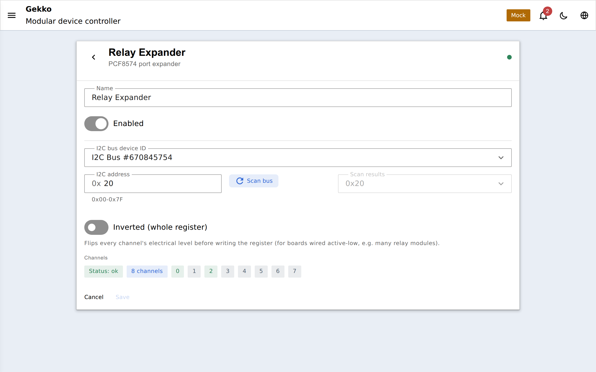
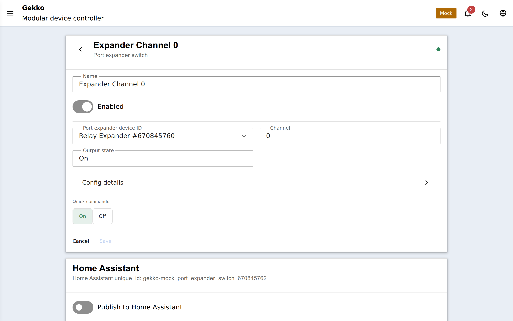

## Warum ein Portexpander?

Der ESP32 hat zwar viele GPIOs, aber ein volles Becken kann trotzdem die Pins
ausgehen lassen - jedes Relais, jeder MOSFET will einen Pin, und manche Pins
sind schon belegt (I2C-Bus, SPI-Display, die input-only ADC-Pins). Ein
**Portexpander** ist die guenstige Loesung: ein I2C-Chip, der dir **8 oder 16
zuszatzliche I/O-Pins ueber dieselben zwei Leitungen** gibt, die auch deine
anderen I2C-Geraete teilen. Einen Expander verdrahten und du hast einen ganzen
Block an Relaisausgaengen, ohne einen weiteren ESP32-Pin anzufassen.

Gekko unterstuetzt die beiden allgegenwaertigen Typen:

| Typ | Chip | Zusaetzliche Pins | Adressen |
| --- | --- | --- | --- |
| `pcf8574_expander` | PCF8574 | 8 | `0x20`-`0x27` |
| `pcf8575_expander` | PCF8575 | 16 | `0x20`-`0x27` |

Beide sind `port_expander`-Rollen-Hubs auf einem
[I2C-Bus](/gekko/de/reference/devices/i2c-bus/); der einzige Unterschied ist 8
vs. 16 Pins. Bis zu acht von jedem koennen einen Bus teilen, ihre Adressen
werden ueber die A0/A1/A2-Loetbruecken gesetzt.

## Hub und Kanaele

Genau wie bei den [ADS1115-/Multiplexer-Hubs](/gekko/de/reference/devices/analog-inputs/)
ist ein Expander ein **Hub**: Das Expander-Geraet besitzt den Chip, und jeder
Ausgangspin, den du tatsaechlich nutzt, ist ein separates
**`port_expander_switch`**-Geraet, das davon abhaengt.

Ein Zwei-Relais-PCF8574-Setup besteht also aus drei Geraeten: dem
`pcf8574_expander` und zwei `port_expander_switch`-Geraeten (Pin 0 und Pin 1),
die darauf zeigen. Jeder Schalter ist unabhaengig benannt, aktiviert und
steuerbar - und verhaelt sich genau wie ein
[GPIO-Schalter](/gekko/de/reference/devices/gpio-switch/), nur eben auf einem
Expander-Pin statt auf einem ESP32-Pin. Zwei Schalter koennen nicht denselben
Pin auf demselben Expander beanspruchen; Gekko lehnt den zweiten ab.

Weil ein `port_expander_switch` die **`switch`-Rolle bereitstellt**, steuert
alles, was einen Schalter steuert, auch ihn - ein
[Thermostat](/gekko/de/reference/devices/thermostat/), ein `auto_switch`, eine
[Dosierpumpe](/gekko/de/reference/devices/dosing-pump/). Diese Controller wissen
nicht und muessen nicht wissen, dass der Ausgang hinter einem Expander liegt.

## Einrichtung

1. Erstelle einen **[I2C-Bus](/gekko/de/reference/devices/i2c-bus/)** (falls noch
   keinen vorhanden) und nutze **Scan bus**, um zu bestaetigen, dass der
   Expander antwortet - meist bei `0x20`.
2. Erstelle einen **`pcf8574_expander`** (oder `pcf8575_expander`), waehle
   diesen Bus und setze seine Adresse.
3. Fuer jeden Ausgang erstellst du einen **`port_expander_switch`**, waehlt
   den Expander und die Pin-Nummer (0-7 bei PCF8574, 0-15 bei PCF8575).

Dann der Schalter selbst, mit denselben Optionen wie jeder GPIO-Schalter:

## Aktiv-low-Relaisboards

Die meisten billigen Relaisboards sind **aktiv-low** - das Relais schliesst,
wenn der Pin auf *Low* gezogen wird, nicht auf High. Es gibt zwei Stellen, an
denen man das korrigieren kann, und es lohnt sich, bewusst zu entscheiden:

- **Am Expander** - seine `inverted`-Option invertiert die elektrische Polaritaet
  des *gesamten Chips*. Nutze das, wenn das ganze Board aktiv-low ist.
- **Am Schalter** - seine `inverted`-Option invertiert **einen einzelnen Pin**.
  Nutze das, wenn nur einige Pins aktiv-low verdrahtet sind.

Wenn das stimmt, bedeutet "on" in Gekko, dass das Relais wirklich erregt ist.

## Konfiguration

### `pcf8574_expander` / `pcf8575_expander`

| Feld | Standard | Bedeutung |
| --- | --- | --- |
| `i2cAddress` | `0x20` | Chip-Adresse (`0x20`-`0x27` per A0/A1/A2-Jumper) |
| `inverted` | aus | Elektrischen Pegel aller Pins invertieren (aktiv-low-Boards) |
| `enabled` | an | Das Deaktivieren des Expanders gibt jeden Schalter darauf frei |

### `port_expander_switch`

| Feld | Standard | Bedeutung |
| --- | --- | --- |
| `channel` | `0` | Welcher Expander-Pin (0-7 auf PCF8574, 0-15 auf PCF8575) |
| `inverted` | aus | Elektrischen Pegel dieses einen Pins invertieren |
| `startupState` | aus | Ausgangszustand direkt nach dem Boot (wenn nicht wiederhergestellt wird) |
| `restorePreviousState` | aus | Den letzten Zustand vor dem Neustart wiederherstellen statt `startupState` zu verwenden |
| `safeState` | aus | Zustand, auf den bei Unverfuegbarkeit eines steuernden Geraets zurueckgefallen wird |
| `enabled` | an | Deaktivierte Schalter geben ihren Pin frei und melden nichts mehr |

## Bereitgestellt

Ein `port_expander_switch` stellt dieselben Rollen bereit wie ein GPIO-Schalter:

- **switch** - kann von Thermostat, Auto-Switch oder Dosierpumpe gesteuert werden;
- **condition** - sein Ein/Aus-Zustand kann einen Auto-Switch sperren.

Auf [MQTT-Builds](/gekko/de/guides/mqtt-home-assistant/) ist jeder Schalter in
Home Assistant als `switch`-Entity auffindbar. Der Expander selbst nicht - er
stellt Pins bereit, nicht eine eigene Steuerung.
