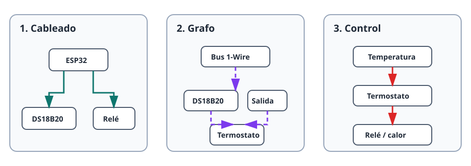

Gekko representa el hardware conectado como un grafo de dispositivos pequeños y
combinables. Observe el sistema desde tres perspectivas: cableado físico,
dependencias en Gekko y flujo de valores y órdenes durante la ejecución.

## 1. Cableado físico

El hardware se conecta a pines y buses del ESP32. En un control de temperatura,
un DS18B20 usa un pin 1-Wire y un relé usa un GPIO de salida. El calentador se
conecta al relé, nunca directamente al ESP32.

## 2. Dependencias de dispositivos

Cada función de hardware o control es una instancia. Un sensor depende de su
bus; un termostato depende de un sensor de temperatura y un interruptor
compatibles.



Gekko valida los roles compatibles al crear o editar. Si falta una dependencia,
el dispositivo informa `dependency_blocked` en lugar de actuar con valores viejos.

## 3. Flujo de control en ejecución

```text
Temperatura DS18B20 → decisión del termostato → orden On/Off → relé → calentador
```

El termostato compara la temperatura con el objetivo y la histéresis, y controla
el interruptor. Es un flujo de información y órdenes, no otro cable físico.

## Cree en el orden de dependencias

1. Cree buses y salidas de hardware.
2. Cree sensores o canales que dependan de ellos.
3. Espere el estado `ready` de cada dispositivo.
4. Cree dispositivos de control y automatización.
5. Pruebe el funcionamiento normal y el estado seguro sin una dependencia.

Consulte [Dispositivos y dependencias](/gekko/es/guides/devices-and-dependencies/)
y el proyecto completo [Termostato con relé](/gekko/es/projects/thermostat-with-relay/).
