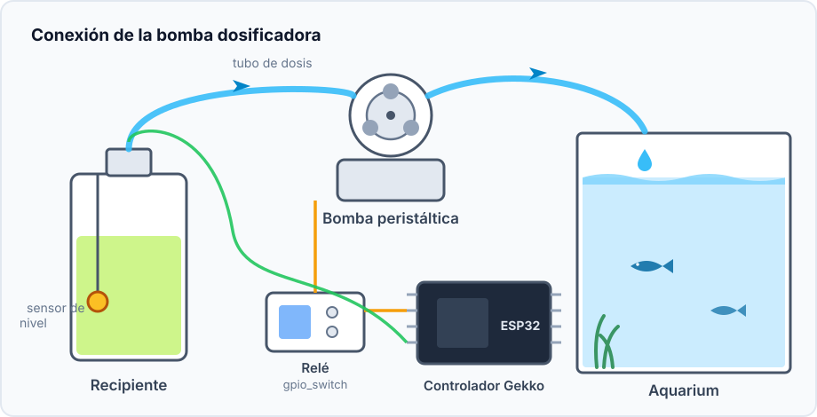
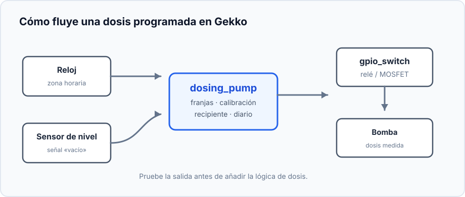
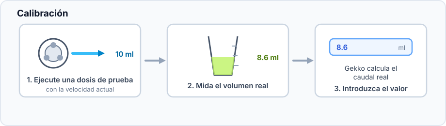
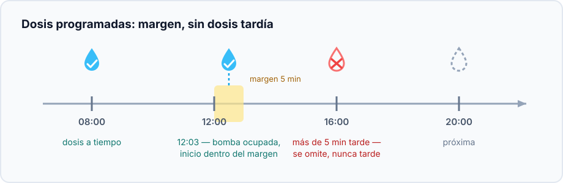
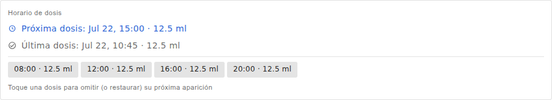
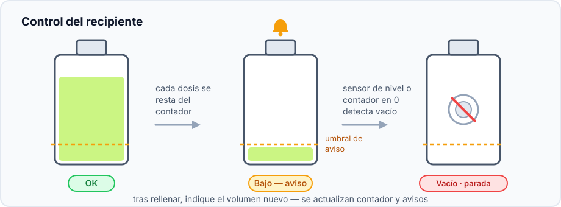

Este proyecto añade pequeñas cantidades medidas de líquido a horas elegidas:
para aditivos de acuario, fertilizante u otra solución que se beneficia de
varias dosis pequeñas y repetibles en lugar de una sola grande.

## Resultado

```text
Reloj → dosis programadas → dosing_pump
                            ├→ interruptor GPIO → bomba
                            └→ contador del recipiente y diario
```

## Hardware y seguridad



- ESP32, bomba peristáltica de baja tensión y relé o MOSFET adecuado para ella.
- Tubo, recipiente y cilindro graduado o balanza para calibrar.
- Interruptor de flotador opcional dentro del recipiente.

> Haga las primeras pruebas con agua limpia en un cilindro graduado, no con una
> cantidad desconocida de aditivo en el acuario. No alimente el motor desde un
> GPIO del ESP32.

## Grafo de dispositivos y orden



1. Configure la zona horaria y espere una hora NTP correcta, o añada un RTC
   DS3231.
2. Cree un [`gpio_switch`](/gekko/es/reference/devices/gpio-switch/) para el
   relé o MOSFET; su estado seguro debe apagar el motor.
3. Con agua y un cilindro graduado, active y desactive brevemente la salida
   GPIO. Compruebe que el motor se detiene.
4. Si hace falta, cree y pruebe el sensor de nivel.
5. Cree `dosing_pump`: seleccione interruptor, sensor, capacidad y umbral.

## Calibre el caudal real



La longitud y altura del tubo, además del desgaste, cambian el caudal. Calibre
con el tubo instalado definitivamente; el líquido de prueba sale realmente del
recipiente.

## Añada el primer horario



Primero añada una dosis pequeña para unos minutos después. La bomba debe
funcionar una vez y detenerse. Una dosis antigua perdida no se recupera, para
evitar una dosis acumulada peligrosa tras un reinicio.

## Ejemplo de horario guardado



El ejemplo tiene cuatro franjas de 12,5 ml: 08:00, 12:00, 16:00 y 20:00; en
total 50 ml al día. Solo muestra la estructura: los análisis de agua y la
instrucción del aditivo determinan la cantidad. Seleccione una franja para
omitir solo su siguiente ejecución.

## Vigile el recipiente



Rellene antes del umbral de aviso e introduzca el nuevo valor con **Set volume**.
El sensor de nivel protege adicionalmente contra marcha en seco si el contador
es impreciso. Durante los primeros días revise análisis y diario de dosis.

## Problemas habituales

- **La dosis no empieza:** revise reloj, zona horaria, modo automático y estado
  de recipiente vacío.
- **El volumen es incorrecto:** calibre de nuevo con el recorrido de tubo final.
- **El motor funciona pero no hay líquido:** cebe el tubo con agua y revise
  entrada, dobleces y recorrido.
- **El motor no se detiene:** apague inmediatamente la salida GPIO y revise el
  relé y su estado seguro antes de usar la automatización.

Todos los ajustes están en la [referencia de la bomba dosificadora](/gekko/es/reference/devices/dosing-pump/).
