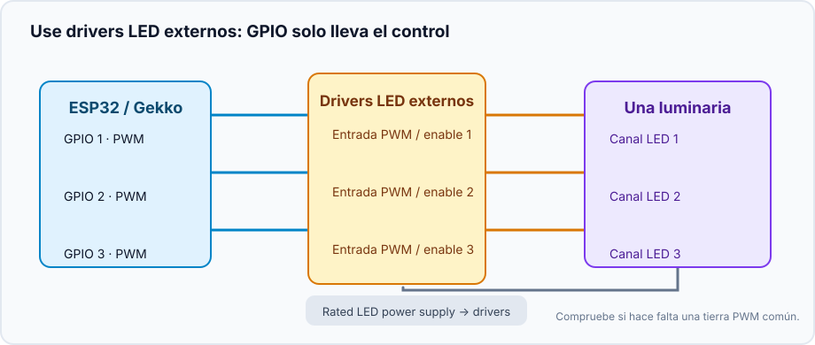
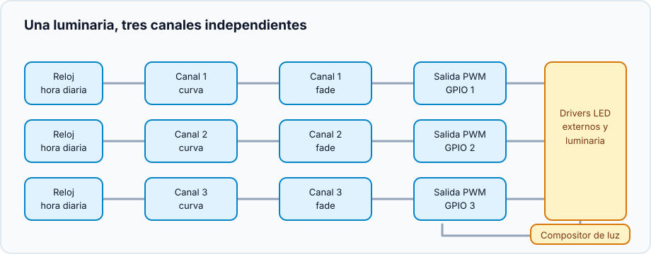
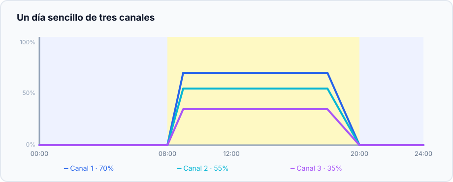

Este proyecto reúne canales LED regulables independientes en una luminaria. Los
canales pueden ser líneas LED u otras cargas controladas por PWM: usted define
sus nombres y niveles. Gekko controla el ritmo diario; el driver LED o la etapa
MOSFET suministra la potencia.

## Resultado

```text
Reloj → curvas de canal → transiciones suaves → salidas PWM → drivers LED → luminaria
                                      └──────── compositor ────────┘
```

Cada canal sigue su propia curva y un compositor da a toda la luminaria el modo
común **Off**, **Manual** o **Scheduled**.

## Hardware y seguridad



- Un ESP32 y un GPIO PWM apropiado por canal.
- Un driver LED con entrada PWM/enable documentada, o una etapa MOSFET apta
  para la carga LED y su fuente de alimentación.
- Una fuente de alimentación independiente y correctamente dimensionada. **No**
  conecte una línea LED directamente a un GPIO del ESP32.
- Comparta tierra solo si la documentación del driver exige una referencia PWM
  común. Compruebe tensión, polaridad y aislamiento antes de cablear.

Pruebe primero un canal a nivel manual bajo y confirme la dirección de
regulación antes de conectar los demás.

## Cree el grafo de dispositivos



Para cada canal físico:

1. Cree un [`analog_output`](/gekko/es/reference/devices/analog-outputs/) para
   el GPIO, por ejemplo «PWM canal 1».
2. Añada un `fade_analog_output` que apunte a esa salida PWM.
3. Añada un `scheduled_analog_output` que apunte al fade.
4. Repita para los demás canales y cree un `analog_output_composer` («Luz
   principal») que incluya todos los scheduled outputs.

El compositor es el punto normal de control; añádalo al panel en vez de las
salidas PWM individuales.

## Dibuje un primer día sencillo

| Hora | Canal 1 | Canal 2 | Canal 3 | Significado |
| --- | ---: | ---: | ---: | --- |
| 00:00 | 0% | 0% | 0% | noche / apagado |
| 08:00 | 0% | 0% | 0% | empieza la rampa |
| 09:00 | 35% | 20% | 10% | mañana suave |
| 12:00 | 70% | 55% | 35% | nivel diurno |
| 18:00 | 70% | 55% | 35% | mantener |
| 20:00 | 0% | 0% | 0% | termina la rampa |



Estos porcentajes son solo un ejemplo de curva, no una recomendación de
intensidad. Empiece por debajo del objetivo y cambie una variable cada vez.

## Compruebe la luminaria

1. Elija **Manual** en el compositor y ponga todos los canales a un valor bajo.
2. Vuelva a **Off**: todos deben quedar a cero.
3. Elija **Scheduled** y programe una rampa para unos minutos después.
4. Reinicie el controlador o quite temporalmente la hora válida: las salidas
   programadas deben ir a cero, no conservar la intensidad anterior.

Más adelante habrá un perfil guardable y aclimatación guiada; por ahora el
compositor mantiene juntas las curvas existentes.

## Problemas habituales

- **Un canal está invertido:** compruebe la lógica de regulación del driver.
- **La luz salta:** el scheduled output debe apuntar al `fade_analog_output`.
- **La luminaria queda oscura:** revise reloj, modo, fuente y entrada enable.
- **Solo cambia un canal:** todos los scheduled outputs deben estar en el compositor.

Detalles: [Analog outputs & light composer](/gekko/es/reference/devices/analog-outputs/).
