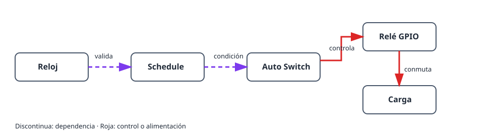

Este proyecto enciende y apaga una carga a horas elegidas. El relé físico se
separa de la regla temporal: un **schedule** decide si una ventana está activa
y un **Auto Switch** aplica esa condición a la salida de relé GPIO.

## Resultado

```text
Reloj y zona horaria → schedule → Auto Switch → relé GPIO → carga
```

## Hardware y seguridad

- Placa ESP32 y módulo de relé adecuado para la carga.
- Una carga de prueba de baja tensión, como un LED, para la primera comprobación.

> No conecte tensión de red directamente al ESP32. Use un relé o contactor
> cerrado y correctamente dimensionado, y siga las normas locales de seguridad.

## Grafo de dispositivos y orden de creación



1. Configure la zona horaria y espere un reloj válido mediante NTP, o añada un
   RTC DS3231. Hasta entonces el schedule permanece deliberadamente no válido.
2. Cree un [`gpio_switch`](/gekko/es/reference/devices/gpio-switch/) para el
   relé y defina un estado seguro que deje la carga sin alimentación.
3. Conmute manualmente ese GPIO con la carga de prueba de baja tensión.
4. Cree un [`schedule`](/gekko/es/reference/devices/schedule/) con una regla
   diaria sencilla, por ejemplo 09:00–09:10, **Always on**.
5. Cree un `auto_switch`: el GPIO como destino **switch**, el schedule como
   **condition** y el modo **Auto**.

Auto Switch combina las condiciones con AND. Con esta sola condición, el relé
solo está encendido durante el horario activo. Los modos manuales ignoran las
condiciones; vuelva a Auto después de probar.

## Comprobación segura

1. Confirme que hora y zona horaria coinciden con la instalación.
2. Cree una ventana corta unos minutos por delante y observe el estado y la
   próxima transición.
3. Compruebe que Auto Switch enciende la carga de prueba al inicio y la apaga
   al final.
4. En una prueba segura cambie la hora o desconecte la sincronización. El
   schedule debe quedar no válido o inactivo y el relé volver al estado seguro.

## Problemas habituales

- **El relé no se enciende:** confirme el modo **Auto** y que el schedule está
  activo.
- **El schedule no es válido:** configure zona horaria y NTP o use DS3231.
- **La lógica está invertida:** pruebe primero el GPIO; active la inversión
  solo si el relé es activo en nivel bajo.
- **La hora difiere una hora:** revise zona horaria y horario de verano, no
  las reglas individuales.

Consulte [Schedules & automation](/gekko/es/guides/schedules-and-automation/) para ver las reglas completas.
