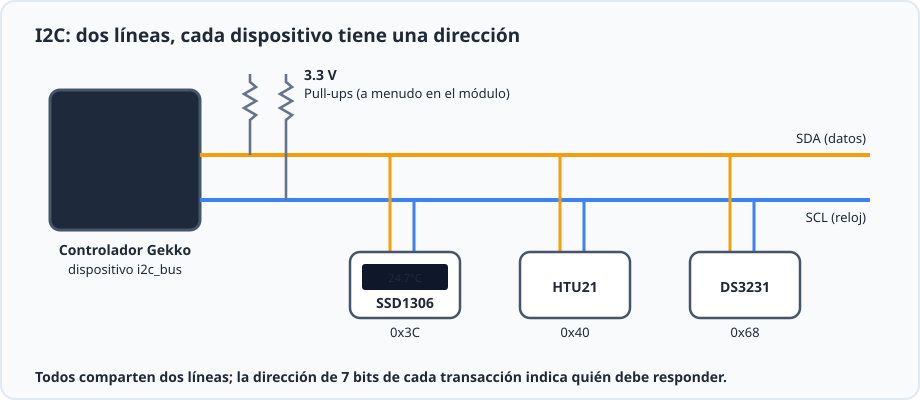
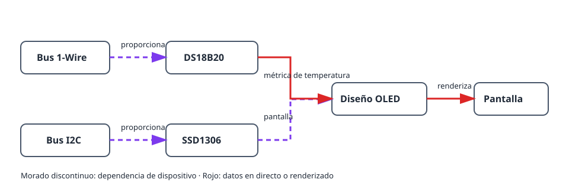
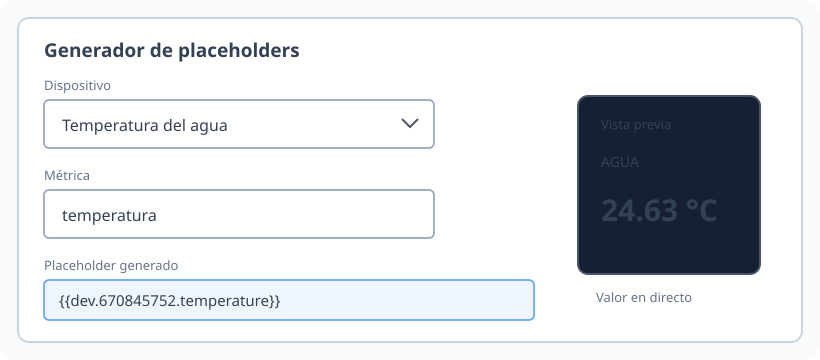
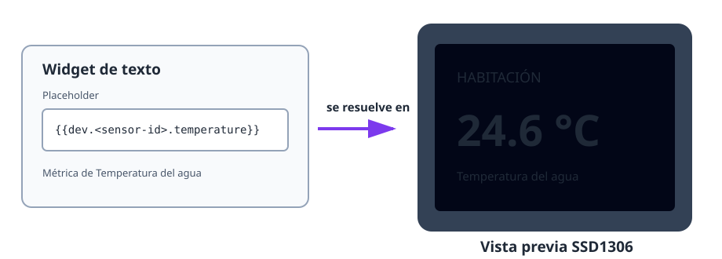

Este proyecto convierte un sensor de temperatura que ya funciona en una pequeña
pantalla de estado. Usa dos buses independientes: 1-Wire para el DS18B20 e I2C
para el OLED SSD1306. El diseño de la pantalla usa después la métrica en directo
del sensor.

## Resultado

```text
DS18B20 → métrica de temperatura → diseño OLED → pantalla en directo
                   ↑
          Bus 1-Wire      Bus I2C → pantalla SSD1306
```

## Hardware

- Placa ESP32 y DS18B20 con una resistencia pull-up de 4,7 kΩ entre DATA y 3V3.
- Pantalla OLED SSD1306 I2C, normalmente en la dirección `0x3C`.
- Cableado I2C del ESP32 a la pantalla: SDA, SCL, 3V3 y GND.



Mantenga separado el cableado del sensor y de la pantalla: el DS18B20 usa DATA
de 1-Wire, mientras que el OLED usa SDA y SCL de I2C.

## Grafo de dispositivos y orden de creación



1. Cree y compruebe un [`onewire_bus`](/gekko/es/reference/devices/onewire-bus/),
   escanéelo y cree después un
   [`ds18b20_temperature_sensor`](/gekko/es/reference/devices/ds18b20/).
2. Cree un [`i2c_bus`](/gekko/es/reference/devices/i2c-bus/) para los pines SDA
   y SCL del OLED. Escanéelo si desconoce la dirección de la pantalla.
3. Cree una pantalla `ssd1306` en ese bus, con su dirección detectada y el
   panel correcto.
4. Espere hasta que tanto el sensor como la pantalla estén `ready`. Abra la
   pantalla, seleccione **Diseñar** y cree un widget de texto.
5. Use el generador de placeholders para insertar la métrica de temperatura.
   Por ejemplo:

   ```text
   Habitación {{dev.<sensor-id>.temperature | fixed:1}} °C
   ```

El placeholder se convierte en una dependencia real de la pantalla. Gekko
puede advertir antes de borrar el sensor si el diseño todavía usa su métrica.



## Compruebe la pantalla



1. Compruebe la vista previa del diseñador antes de guardarla en la pantalla.
2. Confirme que el OLED muestra la misma temperatura que la página del sensor.
3. Caliente o enfríe ligeramente la sonda y confirme que cambia el valor mostrado.
4. Desconecte el sensor en una prueba segura. Su placeholder debe quedar vacío
   o no disponible sin impedir que se dibuje el resto del diseño.

## Problemas habituales

- **El OLED está en blanco:** compruebe alimentación, cableado SDA/SCL, dirección
  I2C y el panel configurado.
- **Falta el valor del sensor:** espere a que el sensor alcance `ready` y use el
  generador de placeholders en vez de escribir un ID de dispositivo supuesto.
- **El texto se corta:** use la vista previa del diseñador, texto más pequeño o
  una segunda página; no dependa de un ancho fijo de carácter.
- **No se puede borrar un sensor:** elimine o reemplace primero su placeholder
  del diseño de pantalla.

Para el flujo completo de diseño, consulte [Pantallas y diseñador de diseño](/gekko/es/guides/displays/).
