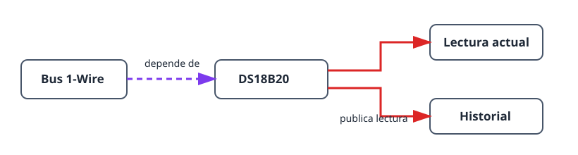

Este proyecto crea la cadena de sensor útil más pequeña: una sonda DS18B20 en
un bus 1-Wire. Enseña el mismo orden de dependencias que usan sistemas mayores
y ofrece una temperatura en directo con historial. Así puede comprobar el
cableado y la ubicación de la sonda antes de añadir un termostato u otra
automatización.

## Resultado

```text
Sonda DS18B20 → bus 1-Wire → lectura de temperatura e historial
```

## Hardware

- Placa ESP32.
- Sonda DS18B20.
- Resistencia pull-up de 4,7 kΩ entre la línea DATA de la sonda y 3V3.


No deje DATA flotante: sin la resistencia pull-up el bus puede detectar la
sonda de forma intermitente o informar valores no válidos.

## Grafo de dispositivos y orden de creación



1. Cree un [`onewire_bus`](/gekko/es/reference/devices/onewire-bus/) en el GPIO
   conectado a la línea DATA de la sonda.
2. Abra el bus y ejecute **Scan**. Confirme que aparece la sonda esperada.
3. Cree un
   [`ds18b20_temperature_sensor`](/gekko/es/reference/devices/ds18b20/) a
   partir de la dirección encontrada.
4. Espere a que el sensor tenga estado `ready`, ábralo y compruebe la lectura
   en directo y el gráfico del historial.

El escaneo vincula el sensor a una dirección ROM única de 64 bits. Puede usar
varias sondas en un bus, pero debe crear una instancia de sensor por cada
dirección descubierta.

## Compruebe la lectura

1. Compare la temperatura mostrada con un termómetro fiable después de que la
   sonda se estabilice en el mismo lugar.
2. Mueva brevemente la sonda entre entornos más cálidos y más fríos y confirme
   que el valor y el historial reaccionan en la dirección esperada.
3. En una instalación de prueba segura, desconecte la sonda. El sensor debe
   quedar no disponible o en error, sin seguir presentando el valor anterior
   como lectura actual.

## Problemas habituales

- **El escaneo no encuentra sondas:** compruebe DATA, 3V3, GND y la pull-up de
  4,7 kΩ.
- **La temperatura salta:** compruebe el cable y la ubicación de la sonda antes
  de añadir suavizado o calibración.
- **Se ha elegido la sonda equivocada:** repita el escaneo y use la dirección
  ROM mostrada; no identifique sondas solo por el color del cable o su posición.

Cuando la lectura sea fiable, úsela como dependencia de temperatura en el
[termostato con relé](/gekko/es/projects/thermostat-with-relay/).
