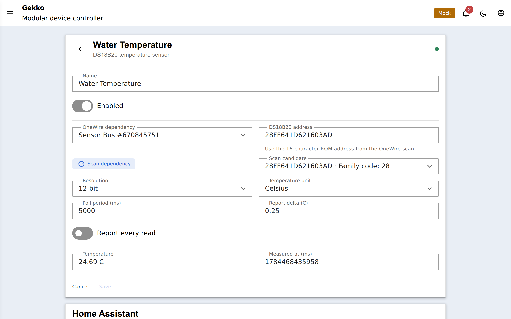
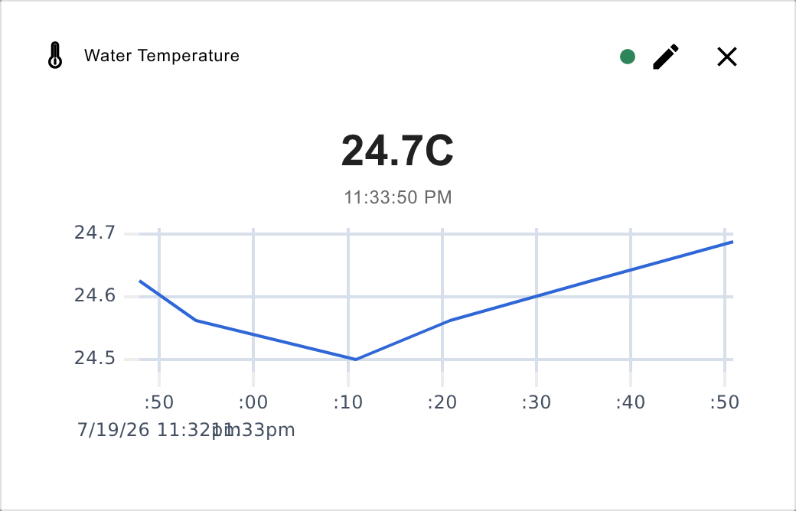

## ¿Qué es un DS18B20?

El DS18B20 es *el* sensor de temperatura por excelencia para aficionados: una
sonda digital, de unos pocos dólares, en una funda impermeable de acero
inoxidable, con una precisión de aproximadamente ±0,5 °C. Que sea digital es
importante: la temperatura se mide dentro del sensor y viaja como datos, así
que la longitud del cable y la resistencia de contacto no sesgan la lectura
como sucede con los sensores analógicos. Cada sonda también lleva una
dirección única grabada de fábrica, lo que permite que **muchas sondas
compartan un cable**: agua del tanque, sump, aire de la habitación, todo en un
solo GPIO.

El cableado, la resistencia pull-up y cómo funciona el direccionamiento se
explican en la [página del bus 1-Wire](/gekko/es/reference/devices/onewire-bus/)
- léela primero si el bus es nuevo para ti.

:::note[¿DS18B20 o NTC?]
Prefiere un DS18B20 cuando quieras precisión plug-and-play sin piezas
adicionales: escanea, se identifica solo y lee en °C directamente. Usa un
[termistor NTC](/gekko/es/reference/devices/ntc-thermistor/) cuando quieras el
sensor más barato posible, una sonda físicamente pequeña o de respuesta rápida,
o cuando ya tengas un [input analógico](/gekko/es/reference/devices/analog-inputs/)
de sobra.
:::

## Configurarlo: escanea, no escribas

1. Crea un dispositivo **bus 1-Wire** en el GPIO al que van conectadas tus
   sondas.
2. Crea un dispositivo **DS18B20**, selecciona ese bus como dependencia y
   pulsa **Scan dependency**: Gekko busca en el bus y lista cada sonda que
   encuentra. Elige tu sonda en la lista de *scan candidate*; su dirección se
   rellena automáticamente.

Un DS18B20 sano escanea con **código de familia 28**, una dirección hex de
16 caracteres y sin bandera CRC.

:::tip[¿Qué sonda es cuál?]
Si hay varias sondas en el bus, escanea una vez, luego calienta una sonda con
la mano y observa cuál cambia: etiqueta el cable y repite. Hazlo antes de
atar nada con bridas.
:::

## Verlo: valores vivos y gráficas

El sensor reporta su temperatura con una bandera de validez: una sonda
desconectada o con fallo de CRC aparece como *invalid*, nunca como un número
antiguo. Haz clic en su tarjeta del panel y obtendrás el valor en vivo con una
gráfica histórica:

La misma lectura alimenta todo lo demás en Gekko:

- un [termostato](/gekko/es/reference/devices/thermostat/) que controla un
  calentador o un enfriador;
- [marcadores de pantalla](/gekko/es/guides/displays/) como
  `{{dev.<id>.temperature | fixed:1}}` en un OLED;
- Home Assistant como entidad `sensor` de solo lectura en
  [compilaciones MQTT](/gekko/es/guides/mqtt-home-assistant/).

## Configuración

| Campo | Valor por defecto | Significado |
| --- | --- | --- |
| `address` | — | La dirección ROM de la sonda: tómala del escaneo |
| `resolution` | `12` | 9-12 bits: 12 = pasos de 0,0625 °C pero conversiones de ~750 ms; 9 = más grueso y rápido |
| `unit` | `celsius` | Unidad de visualización |
| `pollMs` | `5000` | Cada cuánto leer la sonda |
| `reportDeltaCelsius` | `0.01` | Cambio mínimo antes de enviar una nueva lectura |
| `reportAlways` | off | Enviar cada lectura sin importar el delta |

La temperatura del agua cambia despacio: el sondeo por defecto de 5 s con un
delta de reporte pequeño mantiene tranquilas la WebSocket y el historial sin
perder nada real.
