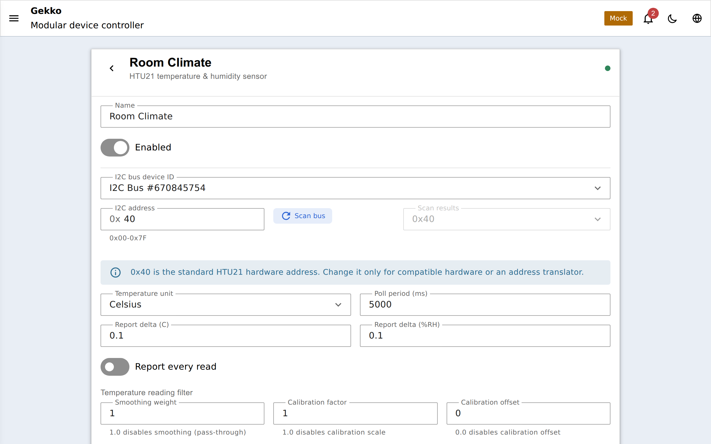

## ¿Qué es un HTU21?

El HTU21 (y sus parientes casi idénticos SHT21 / Si7021) es un diminuto sensor
I2C que reporta **dos** cosas a la vez: **temperatura del aire** (±0,3 °C) y
**humedad relativa** (±2 % RH). Viene en una pequeña placa del tamaño de una
uñita, por lo que es la opción ideal para el *aire* alrededor de un montaje y
no para el agua que hay dentro: clima de una habitación sobre un acuario,
humedad en un terrario o vivario, aire en una carpa de cultivo o en una
incubadora.

Donde un [DS18B20](/gekko/es/reference/devices/ds18b20/) es una sonda
impermeable con cable para la *temperatura del agua*, el HTU21 es un sensor de
placa para *aire* y además mide humedad, cosa que el DS18B20 no puede hacer.

## Cableado: es un dispositivo I2C

El HTU21 vive en el [bus I2C](/gekko/es/reference/devices/i2c-bus/) como
cualquier otro periférico I2C: SDA, SCL, 3,3 V, GND, con las pull-ups casi
siempre ya montadas en la placa. Su dirección es fija en **`0x40`** (sin
puentes), así que solo puedes tener **un** HTU21 por bus; para un segundo
sensor de aire necesitas un segundo bus I2C en otros pines.

## Configurarlo

1. Crea un **[bus I2C](/gekko/es/reference/devices/i2c-bus/)** en tus pines
   SDA/SCL (si aún no tienes uno) y usa **Scan bus** para confirmar que el
   sensor responde en `0x40`.
2. Crea un dispositivo **`htu21`** y selecciona ese bus como dependencia.

Y ya está: no hay nada que calibrar para empezar. El dispositivo reporta al
instante temperatura y humedad, cada una con su propia bandera de validez: un
sensor desconectado o un bus enfermo aparece como *invalid*, nunca como un
número viejo.

## Dos lecturas de un solo dispositivo

A diferencia de la mayoría de sensores, un HTU21 produce dos valores vivos:

- **Temperatura** - proporciona el rol `temperature_sensor`, así que puede
  gobernar un [termostato](/gekko/es/reference/devices/thermostat/) (por
  ejemplo, una manta térmica de terrario), alimentar
  [marcadores de pantalla](/gekko/es/guides/displays/) y aparecer en Home
  Assistant.
- **Humedad** - se reporta como porcentaje para el panel, las pantallas y Home
  Assistant.

En [compilaciones MQTT](/gekko/es/guides/mqtt-home-assistant/) ambos aparecen en
Home Assistant - un sensor `temperature` y un sensor `humidity` - a partir del
mismo dispositivo.

## Calibración

Como temperatura y humedad son mediciones independientes, cada una tiene su
propia condición: un offset/factor de calibración para ajustar contra una
referencia y un peso de suavizado para amortiguar el jitter. Ajustar la
humedad (contra un higrómetro calibrado o una referencia de prueba con sal) no
afecta a la temperatura, y viceversa.

## Configuración

| Campo | Valor por defecto | Significado |
| --- | --- | --- |
| `i2cAddress` | `0x40` | Dirección fija del HTU21: normalmente déjala así |
| `unit` | `celsius` | Unidad de visualización de la temperatura |
| `pollMs` | `5000` | Cada cuánto leer el sensor |
| `reportDeltaCelsius` | `0.1` | Cambio mínimo de temperatura antes de enviar una nueva lectura |
| `reportDeltaHumidity` | `0.1` | Cambio mínimo de humedad antes de enviar una nueva lectura |
| `reportAlways` | off | Enviar en cada lectura sin importar los deltas |
| `enabled` | on | Los dispositivos deshabilitados dejan de reportar |

La temperatura y la humedad del aire cambian despacio: el sondeo por defecto
de 5 s con pequeños deltas mantiene tranquilas la WebSocket y las gráficas sin
perder nada real.

## Proporciona

- **temperature_sensor** - su temperatura puede gobernar un termostato o
  bloquear un auto switch.
