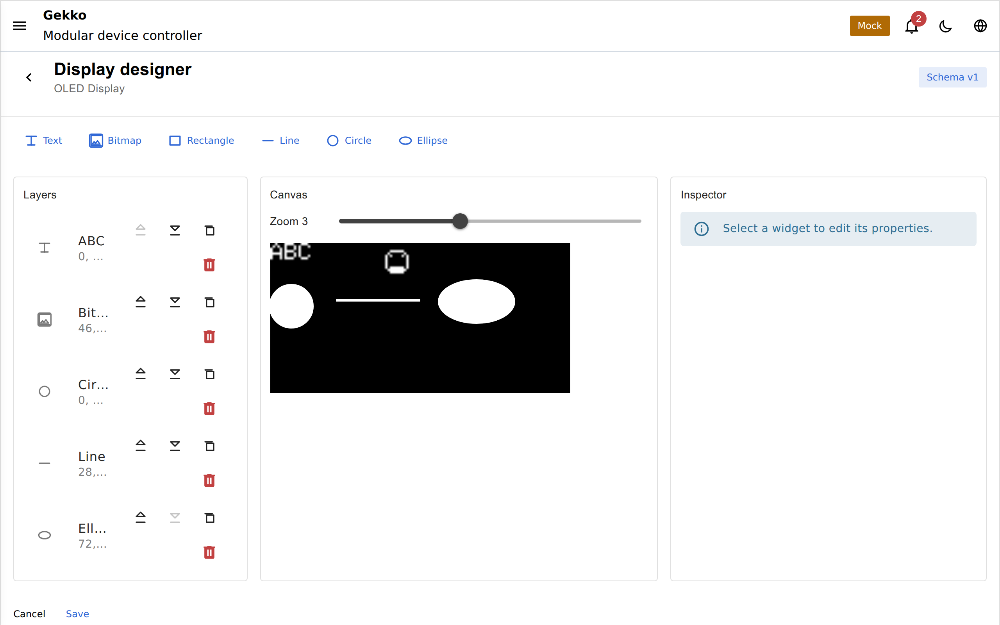
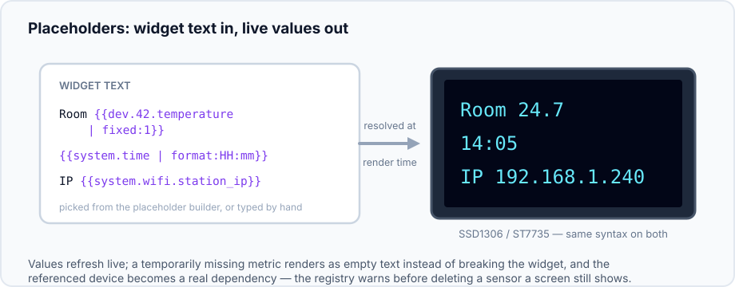

Gekko pilote des écrans OLED I2C **SSD1306** et des écrans TFT SPI **ST7735**,
et le portail inclut un **concepteur visuel de mise en page** — vous composez
ce que l'écran affiche à partir de pages et de widgets, en direct dans le
navigateur, avec un aperçu.

## Configuration d'un affichage

1. Créez d'abord le périphérique bus : un
   [**bus I2C**](/gekko/fr/reference/devices/i2c-bus/) (broches SDA/SCL) pour le
   SSD1306, ou un [**bus SPI**](/gekko/fr/reference/devices/spi-bus/) pour le
   ST7735.
2. Créez le périphérique d'affichage et sélectionnez ce bus comme dépendance
   (plus l'adresse I2C ou les broches de contrôle du TFT).
3. Ouvrez le périphérique et cliquez sur **Design** pour entrer dans le
   concepteur de mise en page.



## Pages et widgets

Une mise en page est un ensemble de **pages** ; chaque page contient des
**widgets** positionnés (texte et plus). Le concepteur affiche un aperçu en
direct rendu avec les mêmes polices et métriques que le firmware, donc ce que
vous voyez est ce que le panneau dessine. Les mises en page sont enregistrées
sur l'appareil et incluses dans les
[lots de sauvegarde](/gekko/fr/guides/backup-restore/).

## Valeurs en direct : espaces réservés de métriques

Les widgets texte peuvent mélanger du texte statique avec des
**espaces réservés** résolus au moment du rendu. Construire un écran d'état, ce
n'est qu'écrire quelques lignes de texte modèle :



Vous n'avez pas besoin de mémoriser la syntaxe — le **générateur d'espaces
réservés** du concepteur liste toutes les métriques disponibles de chaque
périphérique avec une valeur d'aperçu en direct, et insère l'espace réservé
pour vous. Les espaces réservés typés sont validés à chaque frappe. Quelques
exemples :

```text
Room {{dev.670845748.temperature | fixed:1}}
IP {{system.wifi.station_ip}}
Now {{system.time | format:HH:mm}}
Up {{system.uptime}}
```

Formes d'espaces réservés :

- `{{dev.<deviceId>.<metricKey>}}` — une métrique de n'importe quel
  périphérique (température, état, …). Le concepteur dispose d'un générateur
  d'espaces réservés listant tout ce qui est disponible.
- `{{system.<metricKey>}}` — des métriques système telles que `time` (horloge
  murale) et `uptime` (temps écoulé depuis le démarrage).
- `{{system.wifi.<metricKey>}}` — des métriques WiFi telles que `station_ip`.

Les filtres optionnels viennent ensuite après `|` :

| Filter | Example | Effect |
| --- | --- | --- |
| `fixed:N` | `{{dev.123.temperature \| fixed:1}}` | Formatage décimal avec N chiffres |
| `format:pattern` | `{{system.time \| format:EEEE HH:mm}}` | Modèle date/heure (`YYYY MM DD HH mm ss EEEE`; texte `[literal]` entre crochets) |
| `upper` / `lower` / `trim` | `{{system.wifi.station_ip \| upper}}` | Transformations de texte |

Un espace réservé impossible à résoudre est rendu comme `N/A` au lieu de
casser tout le widget, donc un capteur temporairement absent ne vide jamais
votre écran — il affiche `N/A` à cet endroit.

Les périphériques référencés par les espaces réservés deviennent de vraies
dépendances du registre pour l'affichage — le registre vous avertira avant de
supprimer un capteur encore affiché.
