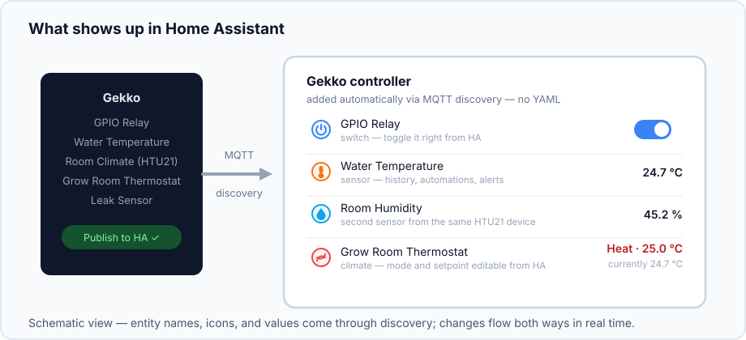
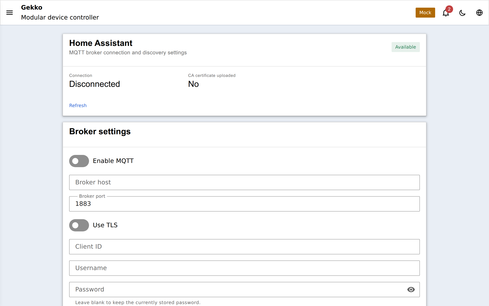
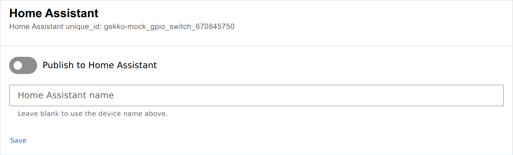

Gekko prend en charge la **découverte MQTT de Home Assistant** : connectez-le
une seule fois à votre broker MQTT, puis publiez n'importe quel périphérique
avec un simple interrupteur — il apparaît alors tout seul dans Home Assistant,
avec le bon type d'entité, le bon nom et la bonne icône. Pas de YAML, pas de
configuration manuelle d'entité.

## Ce que vous obtenez

Chaque périphérique Gekko publié devient une entité HA native, et le contrôle
fonctionne dans les deux sens en temps réel :

| Gekko device | In Home Assistant | You can |
| --- | --- | --- |
| Interrupteur GPIO / expanseur de ports / automatique | `switch` | le basculer depuis n'importe quel tableau de bord HA, l'utiliser dans des automatisations |
| Sortie analogique (fade / scheduled) | `light` (luminosité) | la faire varier depuis HA, l'intégrer à des scènes |
| Pixel strip | `light` (luminosité) | contrôler l'alimentation et la luminosité d'un ruban adressable |
| Pixel effect solid | `light` (RGB) | choisir la couleur du ruban depuis la roue chromatique de HA |
| Pixel effect alert | `binary_sensor` | savoir depuis HA si l'alerte clignote actuellement |
| DS18B20, thermistance NTC | `sensor` | tracer l'historique, déclencher des automatisations sur la température |
| HTU21 | deux `sensor`s (température + humidité) | idem, indépendamment |
| Capteur binaire | `binary_sensor` | alertes fuite/porte via les notifications HA |
| Thermostat | `climate` | changer le mode et la consigne depuis la carte thermostat de HA |

Votre éclairage d'aquarium peut donc rejoindre les scènes HA, le capteur de
fuite peut envoyer une notification sur le téléphone, et le thermostat
apparaît à côté des contrôles climatiques de la maison — pendant que tout
continue à fonctionner localement sur l'ESP32 même si HA est hors ligne.

## Mise en place

1. **Connectez le broker (une fois).** Sur la page **MQTT / Home Assistant**
   du portail, saisissez l'hôte, le port et les identifiants de votre broker
   (TLS pris en charge), puis activez **Enable MQTT**. Les changements de
   réglages s'appliquent avec une reconnexion propre — pas de redémarrage.
   MQTT ne se connecte qu'une fois l'appareil passé en mode station sur votre
   WiFi, jamais en mode AP de configuration.

   

2. **Assurez-vous que HA utilise le même broker** avec la découverte activée
   dans son intégration MQTT (le défaut).

3. **Publiez les périphériques.** La page de chaque périphérique pris en charge
   a une carte **Home Assistant** — activez **Publish to Home Assistant**,
   donnez éventuellement un nom spécifique à HA, puis enregistrez :

   

   Quelques secondes plus tard, le périphérique apparaît dans HA sous
   **Settings → Devices & services → MQTT**, groupé sous votre contrôleur
   Gekko. Le dé-publier le retire aussi proprement.

## Une option à la compilation

La prise en charge MQTT est compilée à la demande (`-DWITH_HOME_ASSISTANT` dans
`platformio.ini`) — un firmware sans cette option ne contient aucun code MQTT,
ce qui compte sur les cartes 4 Mo. Le portail explique clairement la
différence :

- le chip **Available / Not available** sur la page MQTT indique si cette
  *build* possède la fonctionnalité ;
- le switch **Enable MQTT** indique au firmware s'il doit réellement se
  connecter maintenant.

Sur les builds sans la fonctionnalité, la page MQTT affiche une note
explicative et les cartes HA par périphérique ne sont pas rendues.

Pour l'architecture complète (schéma des topics, adaptateurs, certificats TLS),
voir [`docs/mqtt-home-assistant.md`](https://github.com/yoreek/gekko/blob/master/docs/mqtt-home-assistant.md)
dans le dépôt.
