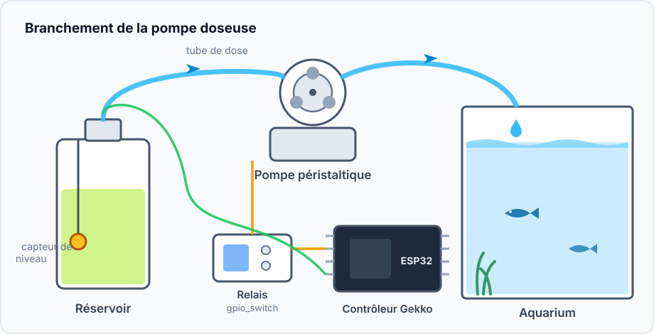
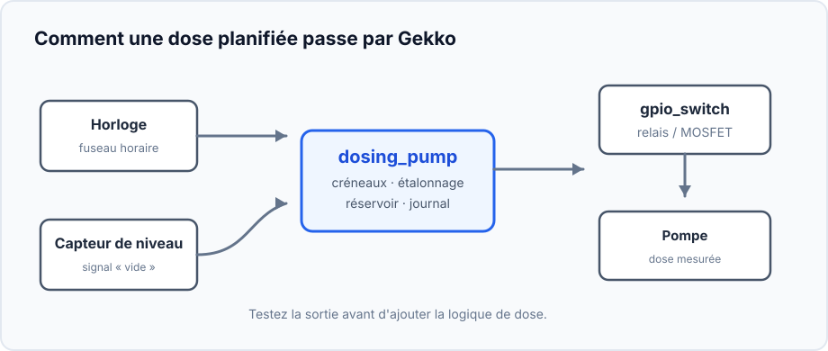
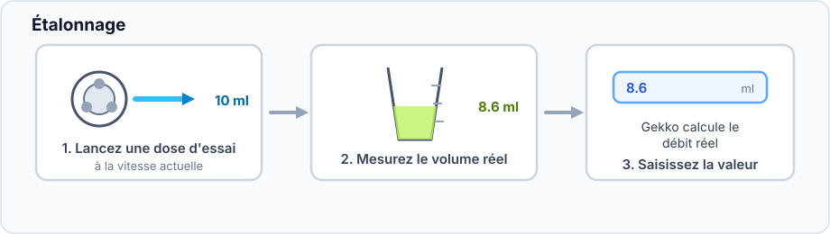
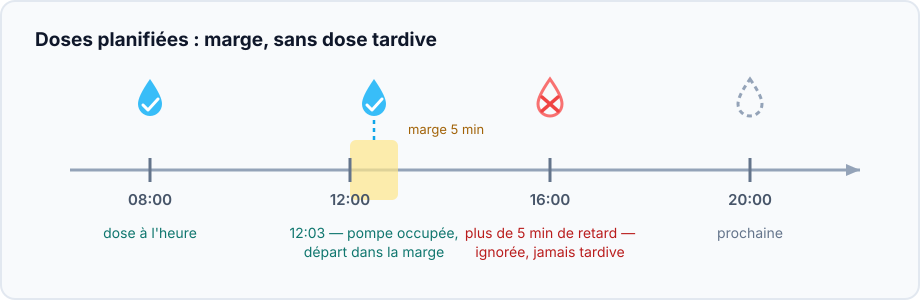
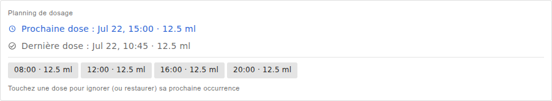
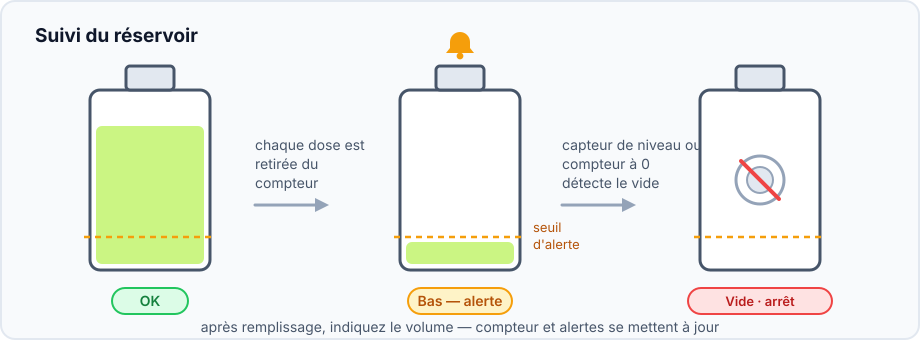

Ce projet ajoute de petites quantités mesurées de liquide à des heures choisies :
additifs d'aquarium, engrais ou toute solution qui bénéficie de plusieurs petites
doses répétables plutôt que d'une seule grande.

## Résultat

```text
Horloge → créneaux de dose → dosing_pump
                             ├→ interrupteur GPIO → pompe
                             └→ compteur du réservoir et journal
```

## Matériel et sécurité



- ESP32, pompe péristaltique basse tension et relais ou MOSFET adapté.
- Tube, réservoir et éprouvette graduée ou balance pour l'étalonnage.
- Flotteur facultatif dans le réservoir.

> Faites les premiers essais avec de l'eau propre dans une éprouvette, jamais
> avec une quantité inconnue d'additif dans l'aquarium. N'alimentez jamais le
> moteur directement depuis un GPIO de l'ESP32.

## Graphe des appareils et ordre



1. Réglez le fuseau horaire et attendez une heure NTP correcte, ou ajoutez un
   RTC DS3231.
2. Créez un [`gpio_switch`](/gekko/fr/reference/devices/gpio-switch/) pour le
   relais ou MOSFET ; son état sûr doit couper le moteur.
3. Avec de l'eau et une éprouvette, activez puis coupez brièvement la sortie
   GPIO et vérifiez l'arrêt du moteur.
4. Créez et testez le capteur de niveau si nécessaire.
5. Créez `dosing_pump` : choisissez interrupteur, capteur, capacité et seuil.

## Étalonnez le débit réel



La longueur et la hauteur du tube, ainsi que l'usure, changent le débit.
Étalonnez avec le tube installé définitivement : le liquide d'essai quitte bien
le réservoir.

## Ajoutez le premier horaire



Ajoutez d'abord une petite dose quelques minutes plus tard. La pompe doit
fonctionner une fois puis s'arrêter. Une dose ancienne manquée n'est jamais
rattrapée : cela évite une dose cumulée dangereuse après un redémarrage.

## Exemple d'horaire enregistré



L'exemple comporte quatre créneaux de 12,5 ml : 08:00, 12:00, 16:00 et 20:00,
soit 50 ml par jour. Il montre seulement la structure : les tests d'eau et la
notice de l'additif déterminent le volume. Sélectionnez un créneau pour ne
sauter que sa prochaine exécution.

## Surveillez le réservoir



Remplissez avant le seuil d'alerte et saisissez la nouvelle valeur avec **Set
volume**. Le capteur de niveau protège aussi contre la marche à sec si le
compteur est imprécis. Les premiers jours, vérifiez les tests et le journal.

## Problèmes fréquents

- **La dose ne démarre pas :** vérifiez horloge, fuseau, mode automatique et
  état vide.
- **Le volume est faux :** étalonnez à nouveau avec le chemin de tube final.
- **Le moteur tourne sans liquide :** amorcez le tube et contrôlez entrée,
  pincements et cheminement.
- **Le moteur ne s'arrête pas :** coupez immédiatement le GPIO et vérifiez le
  relais ainsi que son état sûr.

Tous les réglages sont dans la [référence de la pompe doseuse](/gekko/fr/reference/devices/dosing-pump/).
