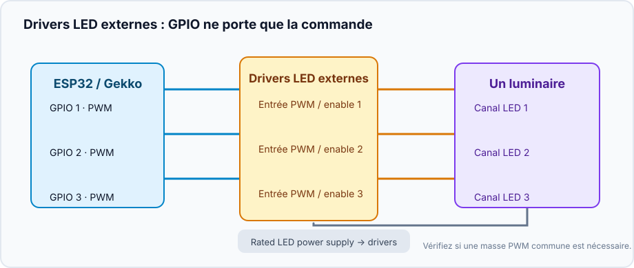
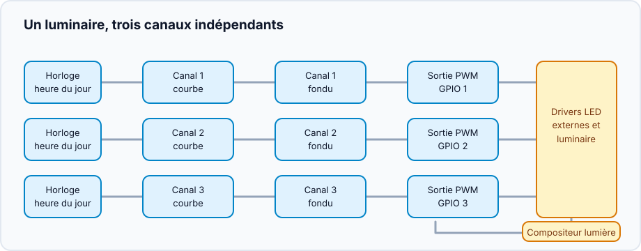
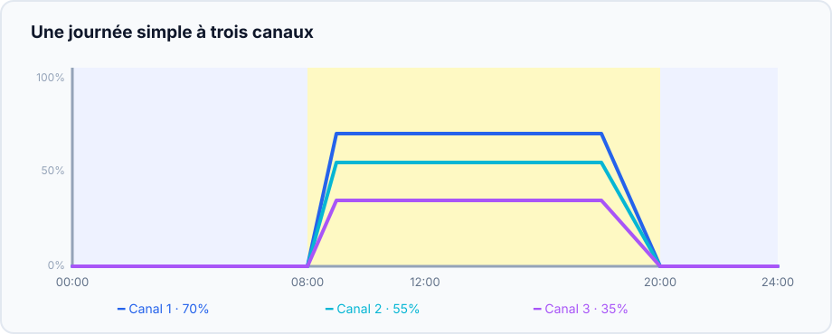

Ce projet réunit des canaux LED réglables indépendants dans un luminaire. Les
canaux peuvent être des lignes LED ou toute charge pilotée par PWM : vous
choisissez leurs noms et leurs niveaux. Gekko gère le rythme quotidien ; le
driver LED ou l'étage MOSFET fournit la puissance.

## Résultat

```text
Horloge → courbes → transitions douces → sorties PWM → drivers LED → luminaire
                              └──────── compositeur ────────┘
```

Chaque canal suit sa courbe et un compositeur donne au luminaire le mode commun
**Off**, **Manual** ou **Scheduled**.

## Matériel et sécurité



- Un ESP32 et un GPIO PWM adapté par canal.
- Un driver LED à entrée PWM/enable documentée, ou un étage MOSFET adapté à la
  charge LED et à son alimentation.
- Une alimentation séparée, correctement dimensionnée. Ne branchez **jamais**
  une ligne LED directement sur un GPIO ESP32.
- Masse commune uniquement si la documentation du driver exige une référence
  PWM commune. Vérifiez tension, polarité et isolation avant le câblage.

Testez d'abord un canal à faible niveau manuel, puis les autres.

## Créez le graphe d'appareils



Pour chaque canal physique :

1. Créez un [`analog_output`](/gekko/fr/reference/devices/analog-outputs/) pour
   son GPIO.
2. Ajoutez un `fade_analog_output` ciblant cette sortie PWM.
3. Ajoutez un `scheduled_analog_output` ciblant le fade.
4. Répétez, puis créez un `analog_output_composer` contenant tous les
   scheduled outputs.

Utilisez le compositeur comme commande quotidienne, plutôt que les sorties PWM
individuelles.

## Tracez un premier jour simple

| Heure | Canal 1 | Canal 2 | Canal 3 | Sens |
| --- | ---: | ---: | ---: | --- |
| 00:00 | 0% | 0% | 0% | nuit / arrêt |
| 08:00 | 0% | 0% | 0% | début de rampe |
| 09:00 | 35% | 20% | 10% | matin doux |
| 12:00 | 70% | 55% | 35% | niveau diurne |
| 18:00 | 70% | 55% | 35% | maintien |
| 20:00 | 0% | 0% | 0% | fin de rampe |



Ces valeurs illustrent une courbe, pas une intensité prescrite. Commencez sous
la cible et modifiez une seule variable à la fois.

## Vérifiez le luminaire

1. Choisissez **Manual**, réglez tous les canaux à faible valeur et vérifiez
   chaque canal et la température des drivers.
2. Revenez à **Off** : tous les canaux doivent être à zéro.
3. Choisissez **Scheduled** et programmez une rampe quelques minutes plus tard.
4. Redémarrez le contrôleur ou retirez temporairement l'heure valide : les
   sorties planifiées doivent revenir à zéro.

Un profil enregistrable et une acclimatation guidée seront ajoutés plus tard.

## Problèmes courants

- **Canal inversé :** vérifiez la logique de gradation du driver.
- **La lumière saute :** le scheduled output doit cibler le `fade_analog_output`.
- **Luminaire noir :** vérifiez horloge, mode, alimentation et entrée enable.

Voir [Analog outputs & light composer](/gekko/fr/reference/devices/analog-outputs/).
