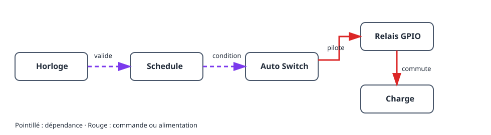

Ce projet allume et éteint une charge à des heures choisies. Le relais physique
est séparé de la règle horaire : un **schedule** indique si une plage est
active, et un **Auto Switch** applique cette condition à la sortie relais GPIO.

## Résultat

```text
Horloge et fuseau → schedule → Auto Switch → relais GPIO → charge
```

## Matériel et sécurité

- Carte ESP32 et module relais adapté à la charge.
- Charge de test basse tension, par exemple une LED.

> Ne raccordez jamais le secteur directement à l’ESP32. Utilisez un relais ou
> contacteur fermé et correctement dimensionné, et respectez les règles locales.

## Graphe des appareils et ordre de création



1. Réglez le fuseau horaire et attendez une heure plausible par NTP, ou ajoutez
   une RTC DS3231. Jusque-là, le schedule reste volontairement non valide.
2. Créez un [`gpio_switch`](/gekko/fr/reference/devices/gpio-switch/) pour le
   relais et choisissez un état sûr sans alimentation de la charge.
3. Actionnez manuellement ce GPIO avec la charge de test basse tension.
4. Créez un [`schedule`](/gekko/fr/reference/devices/schedule/) avec une règle
   quotidienne simple, par exemple 09:00–09:10, **Always on**.
5. Créez un `auto_switch` : GPIO comme cible **switch**, schedule comme
   **condition**, puis choisissez le mode **Auto**.

Auto Switch combine les conditions par ET. Avec cette seule condition, le
relais est allumé seulement pendant la plage active. Les modes manuels ignorent
les conditions ; revenez à Auto après les essais.

## Vérification sûre

1. Vérifiez l’heure et le fuseau de l’installation.
2. Créez une courte plage quelques minutes plus tard et observez l’état et la
   prochaine transition.
3. Vérifiez qu’Auto Switch allume la charge de test au début et l’éteint à la
   fin.
4. En essai sûr, modifiez l’heure ou coupez la synchronisation. Le schedule
   doit devenir non valide ou inactif et le relais revenir à l’état sûr.

## Problèmes courants

- **Le relais ne s’allume pas :** vérifiez le mode **Auto** et que le schedule
  est actif.
- **Le schedule est non valide :** réglez fuseau et NTP, ou configurez DS3231.
- **La logique est inversée :** testez d’abord le GPIO ; inversez-le seulement
  pour un relais actif à l’état bas.
- **Décalage d’une heure :** vérifiez fuseau et heure d’été, pas les règles.

Voir [Schedules & automation](/gekko/fr/guides/schedules-and-automation/) pour le détail des règles.
