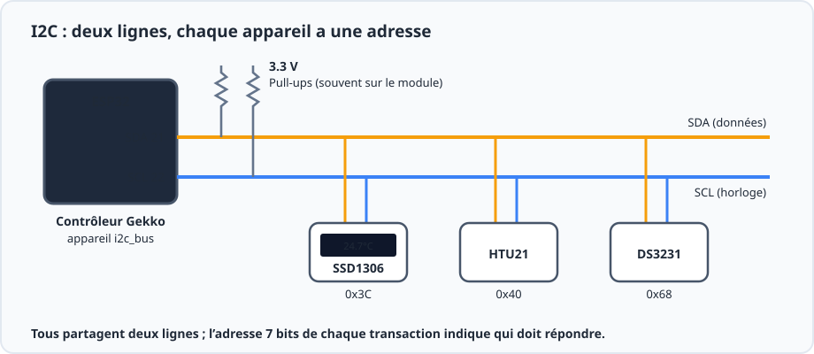
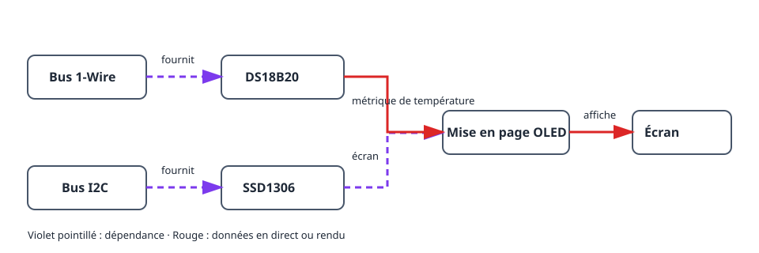
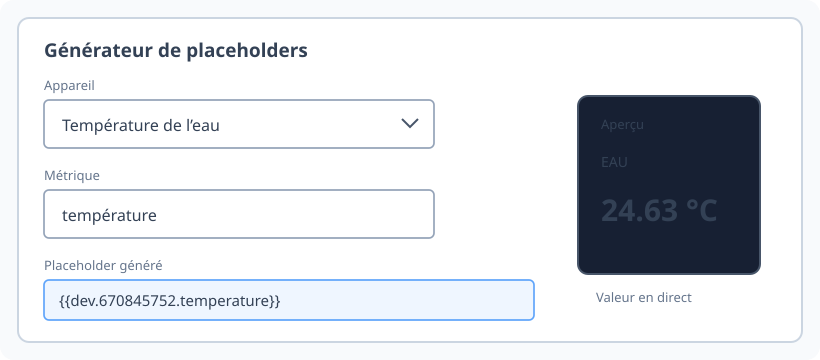
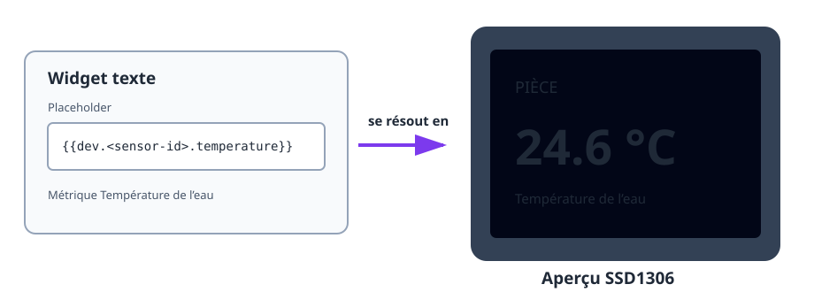

Ce projet transforme un capteur de température fonctionnel en petit écran
d’état. Il utilise deux bus indépendants : 1-Wire pour le DS18B20 et I2C pour
l’OLED SSD1306. La mise en page de l’écran référence ensuite la métrique en
direct du capteur.

## Résultat

```text
DS18B20 → métrique de température → mise en page OLED → écran en direct
                   ↑
          Bus 1-Wire      Bus I2C → écran SSD1306
```

## Matériel

- Carte ESP32 et DS18B20 avec résistance de tirage de 4,7 kΩ entre DATA et 3V3.
- Écran OLED SSD1306 I2C, généralement à l’adresse `0x3C`.
- Câblage I2C de l’ESP32 vers l’écran : SDA, SCL, 3V3 et GND.



Gardez le câblage du capteur et de l’écran séparé : le DS18B20 utilise DATA
1-Wire, alors que l’OLED utilise SDA et SCL I2C.

## Graphe des appareils et ordre de création



1. Créez et vérifiez un [`onewire_bus`](/gekko/fr/reference/devices/onewire-bus/),
   lancez un scan puis créez un
   [`ds18b20_temperature_sensor`](/gekko/fr/reference/devices/ds18b20/).
2. Créez un [`i2c_bus`](/gekko/fr/reference/devices/i2c-bus/) pour les broches
   SDA et SCL de l’OLED. Scannez-le si l’adresse de l’écran est inconnue.
3. Créez un écran `ssd1306` sur ce bus, avec son adresse détectée et les bonnes
   dimensions.
4. Attendez que le capteur et l’écran soient tous deux `ready`. Ouvrez l’écran,
   sélectionnez **Concevoir**, puis créez un widget texte.
5. Utilisez le générateur de placeholders pour insérer la métrique de
   température. Par exemple :

   ```text
   Pièce {{dev.<sensor-id>.temperature | fixed:1}} °C
   ```

Le placeholder devient une véritable dépendance de l’écran. Gekko peut alors
avertir avant la suppression du capteur tant que la mise en page utilise sa
métrique.



## Vérifiez l’écran



1. Vérifiez l’aperçu du concepteur avant de l’enregistrer sur l’écran.
2. Confirmez que l’OLED affiche la même température que la page du capteur.
3. Réchauffez ou refroidissez légèrement la sonde et vérifiez que la valeur
   affichée change.
4. Débranchez le capteur dans un essai sûr. Son placeholder doit devenir vide
   ou indisponible sans empêcher le reste de la mise en page de s’afficher.

## Problèmes courants

- **L’OLED est vide :** vérifiez l’alimentation, SDA/SCL, l’adresse I2C et les
  dimensions configurées.
- **La valeur du capteur manque :** attendez que le capteur soit `ready` et
  utilisez le générateur de placeholders au lieu de saisir un ID supposé.
- **Le texte est coupé :** utilisez l’aperçu du concepteur, un texte plus petit
  ou une seconde page ; ne vous fiez pas à une largeur de caractère fixe.
- **Un capteur ne peut pas être supprimé :** supprimez ou remplacez d’abord son
  placeholder dans la mise en page de l’écran.

Pour le flux complet, consultez [Écrans et concepteur de mise en page](/gekko/fr/guides/displays/).
