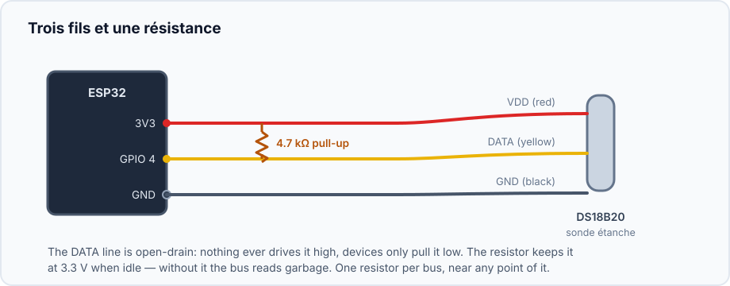
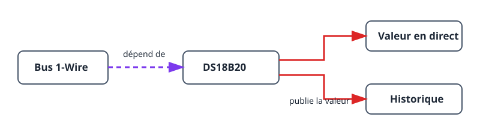

Ce projet construit la plus petite chaîne de capteur utile : une sonde DS18B20
sur un bus 1-Wire. Il suit le même ordre de dépendances que les systèmes plus
grands et fournit une température en direct avec son historique. Vous pouvez
ainsi valider le câblage et l’emplacement avant d’ajouter un thermostat ou une
autre automatisation.

## Résultat

```text
Sonde DS18B20 → bus 1-Wire → température en direct et historique
```

## Matériel

- Carte ESP32.
- Sonde DS18B20.
- Résistance de tirage de 4,7 kΩ entre DATA de la sonde et 3V3.



Ne laissez pas DATA flottante : sans résistance de tirage, le bus peut détecter
la sonde de façon intermittente ou produire des valeurs non valides.

## Graphe des appareils et ordre de création



1. Créez un [`onewire_bus`](/gekko/fr/reference/devices/onewire-bus/) sur le
   GPIO relié à DATA.
2. Ouvrez le bus et lancez **Scan**. Vérifiez que la sonde attendue apparaît.
3. Créez un
   [`ds18b20_temperature_sensor`](/gekko/fr/reference/devices/ds18b20/) avec
   l’adresse trouvée.
4. Attendez l’état `ready`, puis contrôlez la valeur en direct et le graphique
   d’historique.

Le scan lie le capteur à une adresse ROM unique de 64 bits. Plusieurs sondes
peuvent partager un bus, mais chaque adresse découverte demande sa propre
instance de capteur.

## Vérifier la mesure

1. Après stabilisation au même endroit, comparez la valeur affichée à un
   thermomètre fiable.
2. Déplacez brièvement la sonde entre un milieu plus chaud et plus froid :
   valeur et historique doivent évoluer dans le sens attendu.
3. Dans une installation d’essai sûre, débranchez la sonde. Le capteur doit
   devenir indisponible ou en erreur, sans conserver l’ancienne valeur comme
   mesure actuelle.

## Problèmes courants

- **Le scan ne trouve aucune sonde :** vérifiez DATA, 3V3, GND et la résistance
  de 4,7 kΩ.
- **La température saute :** vérifiez câble et emplacement avant d’ajouter
  lissage ou étalonnage.
- **La mauvaise sonde est choisie :** relancez le scan et utilisez l’adresse
  ROM affichée, pas seulement la couleur ou la position du câble.

Quand la mesure est fiable, utilisez-la comme dépendance de température du
[thermostat avec relais](/gekko/fr/projects/thermostat-with-relay/).
