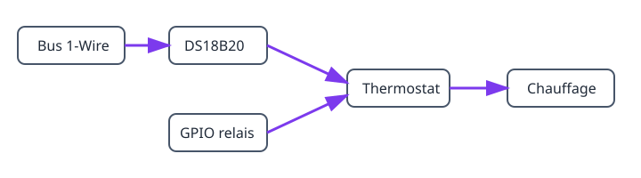

## Résultat

```text
DS18B20 → thermostat → relais → chauffage ou refroidisseur
```

## Matériel

- ESP32 ; DS18B20 avec pull-up 4,7 kΩ entre DATA et 3V3 ; relais adapté à la charge.

> Ne raccordez jamais une charge secteur directement à l’ESP32.

## Graphe et ordre de création



1. Créez [`onewire_bus`](/gekko/fr/reference/devices/onewire-bus/), lancez **Scan**, puis créez le [`ds18b20_temperature_sensor`](/gekko/fr/reference/devices/ds18b20/).
2. Créez un [`gpio_switch`](/gekko/fr/reference/devices/gpio-switch/) pour le relais et définissez l’état hors tension comme état sûr.
3. Testez le relais, puis créez un [`thermostat`](/gekko/fr/reference/devices/thermostat/) avec le capteur et l’interrupteur.

Attendez `ready` pour les dépendances avant de créer le thermostat.

## Réglages et vérification

Avec une consigne de 25,0 °C et une hystérésis de 0,5 °C, le chauffage s’allume sous 24,5 °C et s’éteint à 25,0 °C. Vérifiez les quatre appareils, comparez la température à un thermomètre fiable, testez le relais puis débranchez le capteur dans un essai sûr : la sortie doit revenir à l’état sûr.
