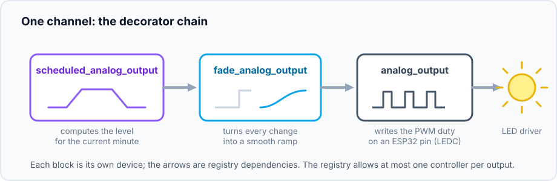
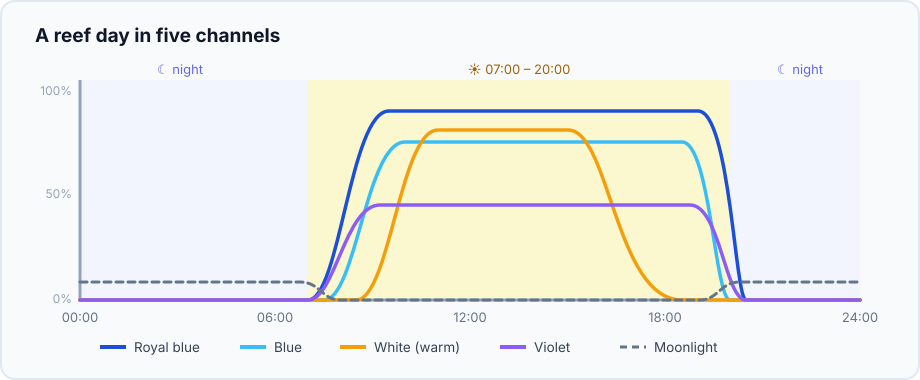
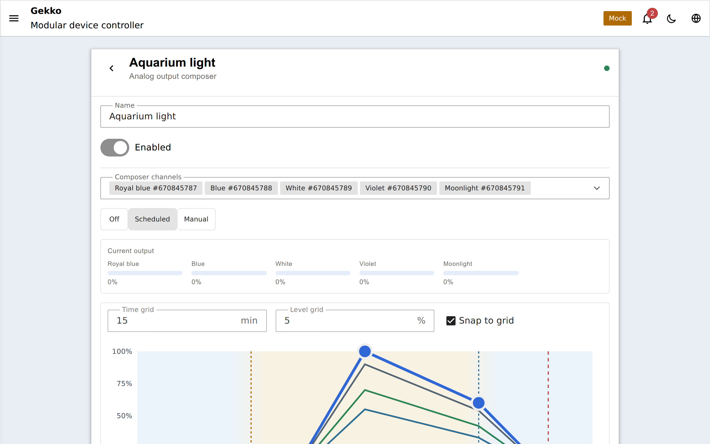

## Pourquoi des sorties dimmables ?

Un interrupteur on/off convient à un chauffage — mais une lampe ne devrait pas
passer brutalement de 0 à 100 % à 9 h du matin. Un bon éclairage d'aquarium
(ou de terrarium, ou de serre) :

- **monte et descend progressivement** — lever et coucher du soleil, pas un
  interrupteur ; les poissons réagissent visiblement aux transitions brusques,
  les coraux non plus n'apprécient pas ;
- **change d'intensité dans la journée** — un pic à midi, des matinées et
  soirées plus douces ;
- **mélange plusieurs canaux de couleur** — les luminaires récifaux ont souvent
  des chaînes LED séparées bleu royal, bleu, blanc, violet et clair de lune,
  chacune avec sa propre courbe journalière.

Gekko modélise cela avec quatre types de périphériques qui s'assemblent comme
des blocs. Chaque niveau est un pourcentage (0–100 %) dans le portail et
l'API ; la partie matérielle est une broche PWM (LEDC) ESP32 pilotant l'entrée
de gradation d'un driver LED, un module MOSFET ou n'importe quelle charge PWM.

## Les blocs de construction

| Type | What it does |
| --- | --- |
| `analog_output` | Le canal PWM matériel sur une broche |
| `fade_analog_output` | Lisse chaque changement en rampe progressive |
| `scheduled_analog_output` | Pilote sa cible selon une courbe journalière |
| `analog_output_composer` | Regroupe plusieurs canaux en un seul luminaire |

Une sortie fade ou scheduled prend exactement une dépendance de rôle
`analog_output` et *fournit le même rôle elle-même*, donc elles se
superposent :

- **Fade** — `maxStep` (pourcentage par pas) et `stepIntervalMs` définissent la
  vitesse de rampe ; le défaut ≈1 % toutes les 200 ms transforme tout
  changement, y compris un déplacement manuel du curseur, en transition douce.
- **Scheduled** — jusqu'à 10 points `(time, level)` par jour, interpolés entre
  les points. Modes : **Off**, **Manual** (niveau fixe), **Scheduled**
  (suivre la courbe). Sans horloge valide, la sortie retombe à zéro au lieu de
  conserver un niveau obsolète.

Le registre impose qu'une sortie n'ait **au plus qu'un seul contrôleur** — on
ne peut pas câbler accidentellement deux programmes sur le même canal.

## Exemple complet : un éclairage d'aquarium à cinq canaux

L'objectif — une journée qui ressemble à ceci :

Les bleus montent d'abord et retombent en dernier (les coraux photosynthétisent
principalement en bleu), le blanc chaud remplit les heures de midi, le violet
ajoute un effet fluorescent, et un faible canal clair de lune brille la nuit.
Pour le construire :

1. Créez cinq périphériques **`analog_output`**, un par broche de driver LED :
   "Royal blue LEDC", "Blue LEDC", "White LEDC", "Violet LEDC", "Moonlight
   LEDC".
2. Enveloppez chacun dans un **`fade_analog_output`** ("Royal blue fade" →
   cible "Royal blue LEDC", …) pour que les changements de canal ne sautent
   jamais.
3. Enveloppez chaque fade dans un **`scheduled_analog_output`** ("Royal blue
   schedule" → cible "Royal blue fade", …) et dessinez la courbe journalière de
   ce canal.
4. Créez un seul **`analog_output_composer`** "Aquarium light" et ajoutez les
   cinq sorties programmées comme ses canaux.

Le compositeur se comporte alors comme *l*'éclairage :

- **Un seul mode pour tout le luminaire** — basculer le compositeur entre Off /
  Manual / Scheduled pousse ce mode à tous les canaux et les maintient
  synchronisés si l'un diverge. Off met tout à zéro.
- **Un seul éditeur** — toutes les courbes de canaux sur un seul graphe,
  éditées en place par glisser-déposer des points (clic droit pour
  insérer/supprimer, option de snap 15 min / 5 %, sous-couche lever/coucher de
  soleil pour repère) ; le mode manuel affiche un curseur par canal.
- **Une seule carte de tableau de bord** — épinglez le compositeur pour un
  aperçu compact du planning multi-canaux.

Le compositeur n'est utile que lorsque plusieurs canaux doivent agir comme un
seul luminaire — une lampe à canal unique se contente des étapes 1–3 avec une
seule chaîne. Sautez la couche fade si les rampes ne vous importent pas.

## Runtime et contrôle

Les quatre types rapportent leur niveau en direct (les fades rapportent aussi
la cible et indiquent s'ils sont encore en transition). Un curseur du tableau
de bord ou la commande `setOutput` pilote directement un canal ; les
changements de mode passent par `setMode`. Sur les
[builds MQTT](/gekko/fr/guides/mqtt-home-assistant/), les canaux sont
découvrables dans Home Assistant. Internals :
[`docs/analog-output.md`](https://github.com/yoreek/gekko/blob/master/docs/analog-output.md).
