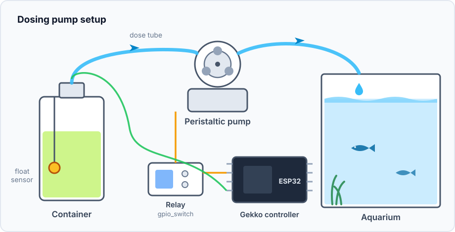
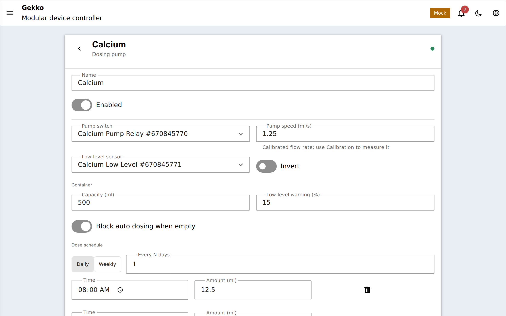
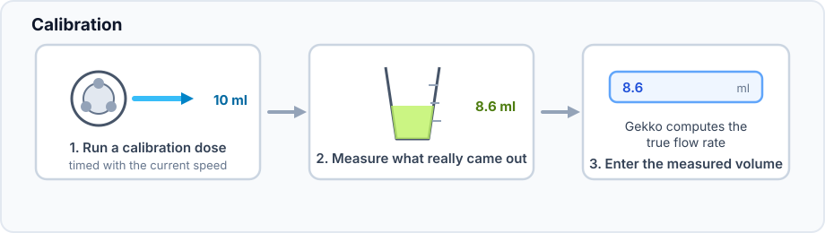
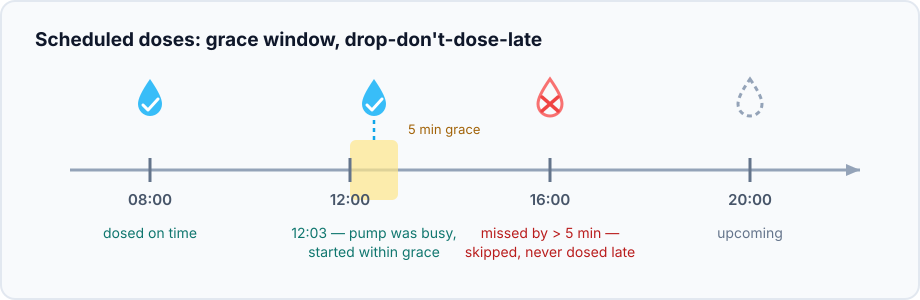
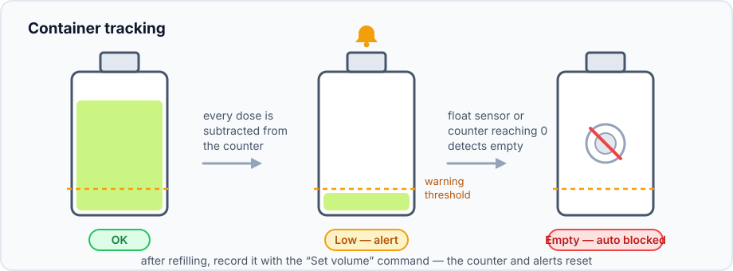

## Qu'est-ce qu'une pompe de dosage ?

Une pompe de dosage est une pompe liquide lente et précise. Le type le plus
courant est **péristaltique** : un petit moteur comprime un tube souple en
silicone avec des rouleaux, poussant quelques millilitres par seconde. Comme
le liquide ne touche jamais que le tube, la pompe ne peut pas le contaminer —
et comme le débit est stable, *le temps de fonctionnement se traduit
directement en millilitres*.

Les aquariophiles (et les jardiniers) les utilisent là où un liquide doit être
ajouté **peu et souvent** :

- **Bacs récifaux** — calcium, alcalinité (KH), magnésium, oligo-éléments. Les
  coraux les consomment en continu ; des micro-doses quotidiennes gardent la
  chimie de l'eau bien plus stable qu'une grosse correction hebdomadaire.
- **Bacs plantés** — engrais liquide quotidien au lieu de "quand j'y pense".
- **Bassins/serres** — tampon pH, nutriments.

Le dosage manuel signifie éprouvettes, calendrier et jours oubliés inévitables.
Une pompe de dosage automatisée fait le même travail tous les jours à la même
minute — c'est cette régularité qui est le but.

## Les pièces, et comment Gekko les relie

Vous avez besoin de quatre pièces bon marché, et chacune correspond à un
périphérique Gekko :

| Hardware | Gekko device | Role |
| --- | --- | --- |
| Pompe péristaltique + carte relais/MOSFET (fil orange ci-dessus) | `gpio_switch` (ou `port_expander_switch`) | La sortie que le périphérique pompe active ou coupe |
| La pompe de dosage elle-même (logique) | `dosing_pump` | Possède le planning, la calibration, le réservoir et l'historique |
| Bouteille/canister avec la solution | — (suivi par la config `dosing_pump`) | Ce depuis quoi vous dosez |
| Flotteur optionnel dans la bouteille (fil vert ci-dessus) | `binary_sensor` | Indique à Gekko que la bouteille est vide, indépendamment du compteur |

Plusieurs pompes ? Créez une chaîne par liquide — un meuble récifal typique
en a deux ou trois (par ex. calcium, alcalinité, magnésium) côte à côte,
chacun avec sa propre bouteille et son propre planning.

## Mise en route

1. Créez un **interrupteur GPIO** sur la broche qui pilote le relais de la
   pompe (voir [votre premier périphérique](/gekko/fr/getting-started/first-device/) —
   c'est le même flux).
2. Créez éventuellement un **capteur binaire** pour le flotteur.
3. Créez le périphérique **pompe de dosage** : choisissez l'interrupteur comme
   *pump switch*, le capteur comme *low-level sensor* (inversible par lien),
   réglez la capacité du conteneur et le seuil d'avertissement, puis ajoutez
   des créneaux de dose au planning.

## Calibrez avant de lui faire confiance

Gekko convertit les millilitres en secondes de fonctionnement via un seul
nombre — le débit de la pompe (`ml/s`). La longueur du tube, son diamètre et la
hauteur de refoulement le modifient tous, donc mesurez-le une fois avec votre
vrai montage :

Les sessions de calibration sont exclues des statistiques et de l'historique,
mais le liquide distribué **est** retiré du conteneur — il a bien quitté la
bouteille. Si vous connaissez déjà le débit, un mode direct permet de le saisir
tel quel.

## Planification : comment les doses se déclenchent

Le planning contient les créneaux de dose (heure + quantité) et un motif de
jours — tous les N jours, ou des jours de semaine spécifiques. Le périphérique
l'évalue avec sa propre horloge, donc
[donnez-lui une source de temps fiable](/gekko/fr/reference/devices/schedule/#heure-et-horloge).
Le total journalier est volontairement découpé en plusieurs petites doses — la
stabilité, encore.

Deux politiques sont importantes :

- **Fenêtre de grâce.** Un créneau peut démarrer jusqu'à 5 minutes en retard —
  par exemple si une dose manuelle ou une calibration occupait la pompe à la
  minute prévue.
- **Sauter, ne pas rattraper en retard.** Un créneau manqué de plus que la
  fenêtre de grâce est *sauté*, jamais différé. Après un redémarrage, une
  horloge synchronisée en milieu de journée ou une longue calibration, vous
  n'obtiendrez **pas** de rafale de doses rattrapées — pour la chimie de l'eau,
  une rafale tardive est pire qu'une micro-dose manquée.

Également par créneau : **skip next** supprime exactement une occurrence à
venir (jour de changement d'eau, vacances), et le toggle **auto** bloque tout
le planificateur tandis que les doses manuelles continuent de fonctionner.

Une fois démarrée, une dose s'exécute entièrement sur l'appareil — le portail
ne fait qu'envoyer la commande. Vous pouvez fermer le navigateur en plein
dosage ; le firmware temporise l'exécution, coupe la pompe et inscrit la
quantité distribuée. Une seule exécution peut être active à la fois (manuelle,
programmée ou calibration — aucune n'en préempte une autre), et tout ce qui
met l'appareil hors service coupe de force le moteur.

## Suivi du conteneur

Indiquez à Gekko la capacité de la bouteille et il compte chaque millilitre :

- Sous le **seuil d'avertissement**, le portail affiche une alerte (cloche +
  toast) — il est temps de préparer un nouveau lot.
- **Vide** — compteur à zéro, ou flotteur déclenché — déclenche une alerte
  critique, et avec **block auto dosing when empty** activé, les doses
  programmées s'arrêtent au lieu de faire tourner la pompe à sec.
- **`daysLeft`** projette combien de temps le volume restant tient au rythme de
  consommation quotidien moyen du planning.
- Après remplissage, enregistrez-le avec la commande **Set volume**.

## Journal des doses

Chaque dose programmée ou manuelle est ajoutée à un journal embarqué — plus de
90 jours d'historique à un débit de dosage typique, stocké sur une partition
flash dédiée pour survivre aux mises à jour du firmware et du portail. La page
du périphérique le trace ; `GET /api/dosejournal?deviceId=<id>&periodDays=<n>`
le sert brut. Le journal est un anneau de taille fixe par pompe : les anciens
enregistrements tournent d'eux-mêmes, et l'historique d'une pompe ne peut
jamais étouffer celui d'une autre.

## Commandes (REST)

| Command | Payload | Effect |
| --- | --- | --- |
| `startDose` | `amountMl`, `logging` | Dose manuelle (`logging:false` = session de calibration) |
| `stopDose` | — | Arrêter maintenant, enregistrer la quantité réelle |
| `setVolume` | `volumeMl` | Rechargement / correction du conteneur |
| `skipNext` | `doseIndex`, `skip` | Sauter une occurrence à venir d'un créneau |
| `setMode` | `auto` / `manual` | Activer/désactiver le planificateur |

Modèle d'exécution complet et internals du journal :
[`docs/dosing-pump.md`](https://github.com/yoreek/gekko/blob/master/docs/dosing-pump.md).
