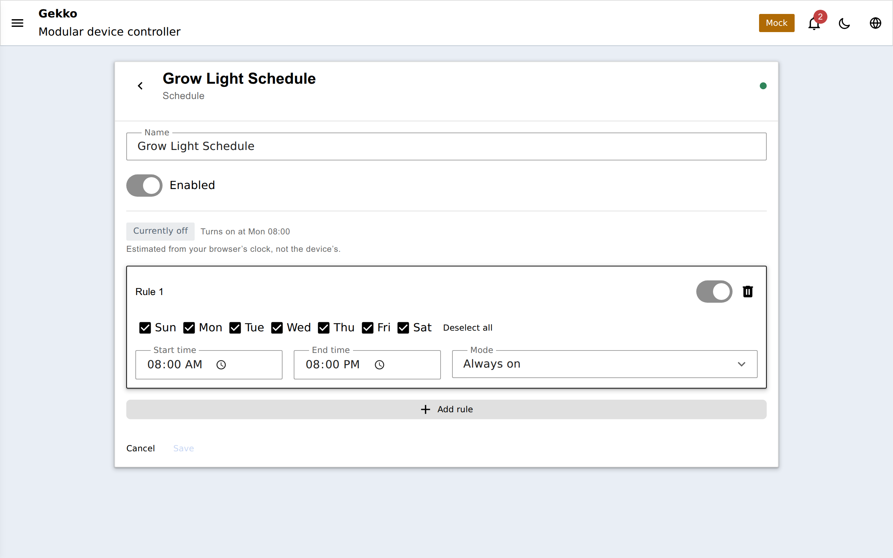

`schedule` contient un ensemble de règles temporelles et répond à une seule
question : *ce programme est-il actif maintenant ?* Il n'a pas de sortie
propre — attachez-le comme condition à un [interrupteur automatique](/gekko/fr/guides/schedules-and-automation/)
(ou au scheduling d'une pompe de dosage) pour déclencher une action.

## Dépendances

Aucune. Ce sont les autres périphériques qui dépendent du programme, pas
l'inverse.

## Configuration

Jusqu'à **4 règles**, reliées par un OU — le programme est actif quand
n'importe quelle règle activée correspond. Chaque règle :

| Field | Meaning |
| --- | --- |
| Jours de semaine | Quels jours la règle s'applique |
| Heure de début / fin | Fenêtre active, en minutes de la journée (précision minute — il n'y a pas de secondes) |
| Mode | **Toujours actif** — actif sur toute la fenêtre ; **Intervalle** — découpe la fenêtre en N tranches égales, actives durant les M premières minutes de chacune |

Le mode intervalle couvre les tâches périodiques : par ex. une fenêtre 08:00–20:00 avec 12 intervalles et une durée de 5 minutes fait fonctionner une pompe de circulation 5 minutes chaque heure.

## Heure et horloge

Les règles sont évaluées par rapport à l'horloge et au fuseau horaire de
l'appareil (avec DST géré automatiquement). Tant que l'horloge n'est pas
plausible — synchro NTP ou RTC DS3231 présente — le programme se signale
comme non valide et les périphériques dépendants gardent leurs sorties en
état sûr.

L'éditeur du portail affiche un aperçu on/off et la prochaine transition,
calculés dans votre navigateur à partir des mêmes règles ; c'est indiqué comme
une estimation parce que l'horloge et le fuseau de votre navigateur peuvent
différer de ceux de l'appareil.

## Fournit

- **condition** — pour les interrupteurs automatiques et les automatisations
  chaînées.
- **schedule** — pour les périphériques qui consomment les programmes
  directement.
