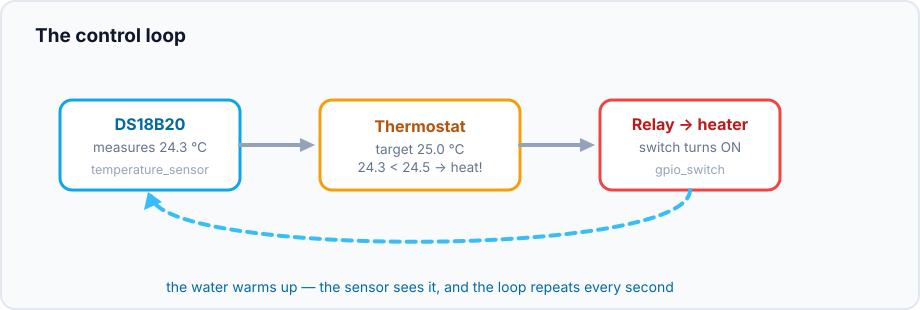
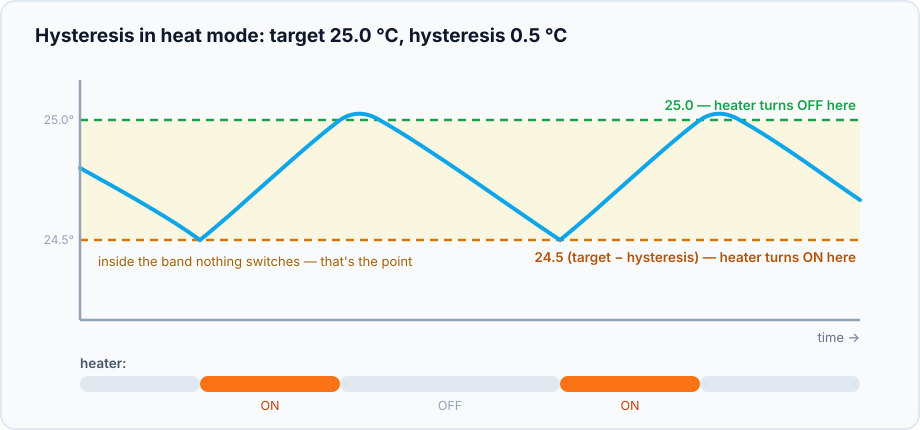
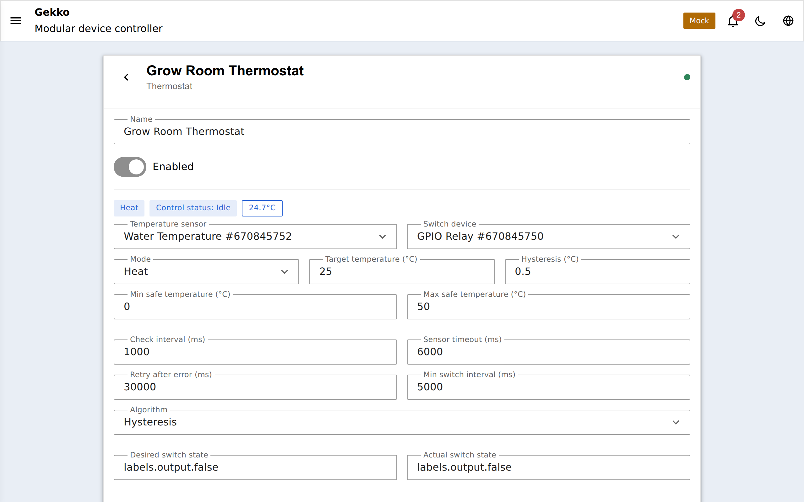

## Ce qu'il fait

Un thermostat ferme la boucle entre un capteur de température et un
interrupteur : *si l'eau est trop froide, on allume le chauffage ; une fois
qu'elle est assez chaude, on l'éteint*. Dans Gekko, cela correspond à un
périphérique `thermostat` relié à deux autres :

Cela fonctionne aussi pour le refroidissement — le mode **cool** pilote un
refroidisseur ou un ventilateur avec la même logique inversée, et **off**
laisse la sortie au repos.

## Hystérésis : pourquoi ça ne claque pas sans arrêt

Un naïf « on en dessous de 25,0, off au-dessus de 25,0 » ferait vibrer le
relais des dizaines de fois par minute quand la mesure oscille autour du
point de consigne. La solution est une **bande morte** — l'hystérésis :

Avec une cible à 25,0 °C et une hystérésis de 0,5 °C en mode chauffage :

- le chauffage s'allume quand la température descend à **24,5** (cible −
  hystérésis) ;
- il reste allumé jusqu'à ce que la température atteigne **25,0**, puis
  s'éteint ;
- entre les deux, rien ne bascule — la température est laissée à dériver à
  travers la bande.

Hystérésis plus grande = moins de cycles relais mais variation plus large ;
plus petite = contrôle plus serré mais davantage de commutations. Pour un
chauffage d'aquarium, 0,3–0,5 °C est une plage raisonnable. En plus, le
**min switch interval** (défaut 5 s) impose une limite dure entre deux
changements de sortie — assurance bon marché pour les relais, indispensable
pour les refroidisseurs à compresseur, qui ne doivent pas être court-cyclés.

## Garde-fous

Le thermostat suppose que des choses vont parfois mal se passer et échoue vers
« chauffage off » :

- **Safe range** (`minSafeCelsius` / `maxSafeCelsius`) — une lecture en dehors
  de cette plage est traitée comme une panne (capteur tombé hors de l'eau,
  fil coupé à une valeur fixe) : la sortie passe à son état sûr et le statut
  affiche `out_of_range`.
- **Sensor timeout** — aucune nouvelle lecture dans `sensorTimeoutMs`
  (bus mort, capteur désactivé) stoppe aussi le chauffage : `sensor_timeout`.
- **Retry back-off** — après une erreur, le thermostat attend
  `retryAfterErrorMs` avant d'essayer à nouveau, au lieu de marteler un capteur
  cassé chaque seconde.
- Le **safe state** du propre interrupteur couvre la panne inverse — si le
  thermostat lui-même est désactivé ou supprimé, l'
  [interrupteur revient](/gekko/fr/reference/devices/gpio-switch/) à l'état que
  vous avez configuré là-bas.

## Mise en place

1. Créez le [capteur DS18B20](/gekko/fr/reference/devices/ds18b20/) (ou NTC/HTU21).
2. Créez l'[interrupteur](/gekko/fr/reference/devices/gpio-switch/) qui pilote le
   relais du chauffage. Les chauffages sont un cas où il faut penser à
   `safeState: off` et `startupState: off`.
3. Créez le **thermostat** : choisissez le capteur et l'interrupteur, puis
   définissez le mode, la cible et l'hystérésis.

## Configuration

| Field | Default | Meaning |
| --- | --- | --- |
| `mode` | `heat` | `heat`, `cool` ou `off` |
| `targetCelsius` | `25` | Le point de consigne |
| `hysteresisCelsius` | `0.5` | La bande morte en dessous (heat) ou au-dessus (cool) de la cible |
| `minSafeCelsius` / `maxSafeCelsius` | `0` / `50` | Limites de panne pour la lecture du capteur |
| `checkIntervalMs` | `1000` | Période de la boucle de contrôle |
| `sensorTimeoutMs` | `6000` | Âge max d'une lecture avant `sensor_timeout` |
| `minSwitchIntervalMs` | `5000` | Temps minimum entre deux changements de sortie |
| `retryAfterErrorMs` | `30000` | Pause avant de réessayer après une erreur |

## Runtime et Home Assistant

Le runtime rapporte la température courante, l'état de sortie et un statut —
`heating`, `cooling`, `idle`, `sensor_timeout`, `out_of_range`,
`dependency_blocked` — affichés avec des icônes dans le portail et enregistrés
dans le journal des événements de périphériques. Sur les
[builds MQTT](/gekko/fr/guides/mqtt-home-assistant/), le thermostat apparaît dans
Home Assistant comme une entité `climate` complète (mode, consigne,
température actuelle, action), et les changements de consigne depuis HA sont
validés par rapport à la plage sûre.
