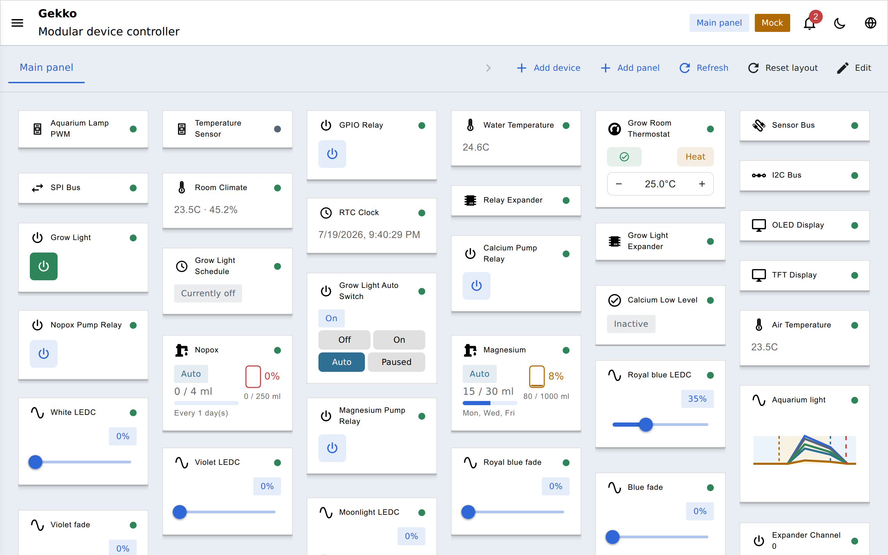
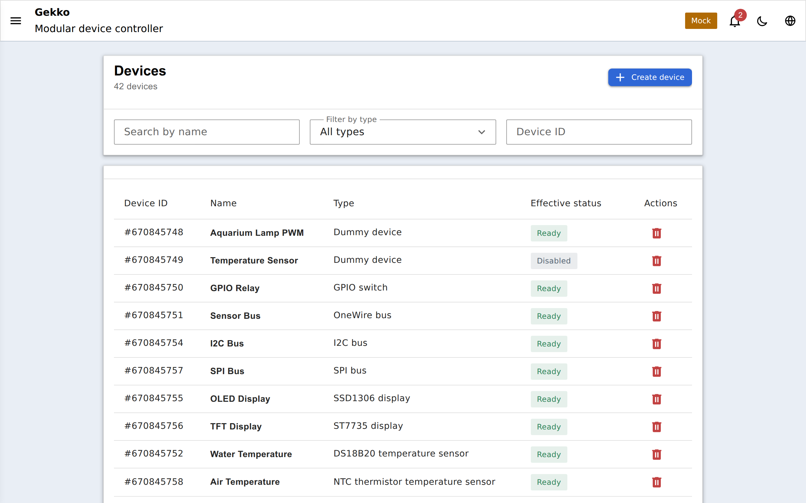

Everything in Gekko is managed from the web portal the device serves from its
own flash. Open the device's IP address in any browser on the same network.

## Dashboard

The landing page. Compose it from panels and widgets bound to your devices —
switch toggles, sensor readings, thermostat state — arranged the way you want.
Values update live over a WebSocket connection, no refresh needed.

## Devices

The heart of the portal: the list of every device instance you have created,
with its type, status, and live output.

From here you can:

- **Add a device** — pick a type from the catalog, fill in its settings, and
  wire up its dependencies (which bus it sits on, which switch it drives).
- **Open a device** — a detail page with its configuration, live runtime state,
  and type-specific controls (calibration for dosing pumps, rule editor for
  schedules, layout designer for displays).
- **Enable/disable or delete** a device. Deleting is dependency-aware: the
  registry will not let you remove an I2C bus that a display still depends on.

## Device events

A journal of notable device events — state changes, errors, dependency
problems — so you can see what happened while you were away.

## Panels

Manage the dashboard panels and the widgets pinned to them.

## Settings pages

- **Controller board** — pick your exact ESP32 board/chip model. Set this
  before wiring or configuring any pin-owning device: it determines which
  GPIOs the pin picker offers and their roles (ADC, strapping, input-only,
  reserved).
- **WiFi** — network scan, credentials, and provisioning options.
- **Time** — timezone, NTP, and the DS3231 RTC if you added one.
- **MQTT / Home Assistant** — broker settings and discovery, on builds
  [compiled with the feature](/gekko/guides/mqtt-home-assistant/).
- **OTA** — firmware upload, on builds [compiled with Web OTA](/gekko/guides/ota-updates/).
- **System** — version info, [backup & restore](/gekko/guides/backup-restore/),
  and maintenance actions.

## Language

The portal auto-detects your browser language and can be switched manually
between English, Ukrainian, Russian, German, Spanish, French, and Italian —
the choice is remembered per browser.
