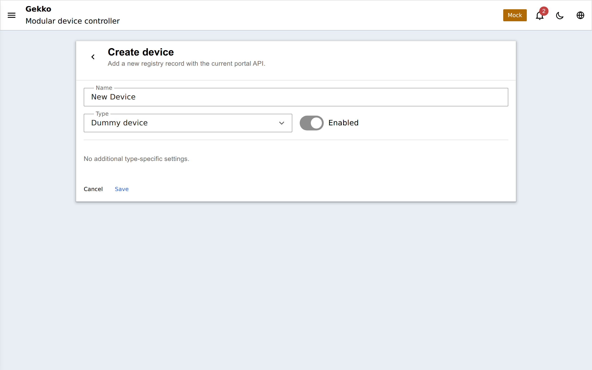
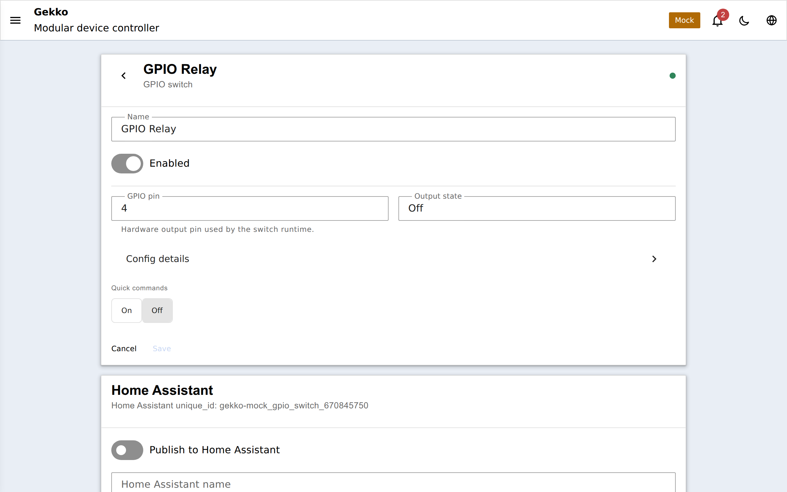

import { Steps } from '@astrojs/starlight/components';

Aggiungiamo il dispositivo più semplice possibile — uno **switch GPIO** — e
controlliamolo dalla dashboard. Uno switch GPIO pilota un solo pin di uscita:
una scheda relè, un modulo MOSFET o semplicemente il LED della scheda per un
primo test.

<Steps>

1. Apri **Devices** nel portale e fai clic sul pulsante add-device.

   

2. Scegli **GPIO Switch** dal catalogo.

3. Compila le impostazioni:

   

   - **Name** — quello che vuoi, per esempio `Test LED`.
   - **GPIO pin** — il pin a cui è collegato il carico (GPIO 2 pilota il LED
     onboard su molte dev board).
   - **Inverted** — attivalo se la tua scheda relè è active-low (molto comune).
   - **Startup state** e **Restore previous state** — cosa deve fare l'uscita
     subito dopo un reboot: uno stato fisso, oppure ciò che era prima della
     perdita di alimentazione.
   - **Safe state** — lo stato a cui torna l'uscita se il dispositivo che la
     controlla diventa indisponibile.

4. Salva. Il dispositivo appare nella lista, raggiunge **ready** e mostra un
   toggle on/off live — cliccalo e il tuo relè scatta.

5. Fissalo alla dashboard: apri **Panels**, aggiungi un widget switch per il
   tuo nuovo dispositivo e posizionalo dove vuoi. Da quel momento è a un tap
   dalla pagina iniziale.

</Steps>

## Dove andare da qui

- Collega una **sonda di temperatura DS18B20**: crea un
  [bus 1-Wire](/gekko/it/reference/devices/onewire-bus/) su un GPIO libero,
  scansiona il bus e aggiungi la [sonda](/gekko/it/reference/devices/ds18b20/)
  trovata.
- Metti lo switch su un [programma](/gekko/it/reference/devices/schedule/) con un
  [auto switch](/gekko/it/guides/schedules-and-automation/).
- Mantieni stabile la temperatura con un
  [thermostat](/gekko/it/reference/devices/thermostat/) che pilota il tuo switch.
- Mostra tutto su un OLED con il
  [display designer](/gekko/it/guides/displays/).
