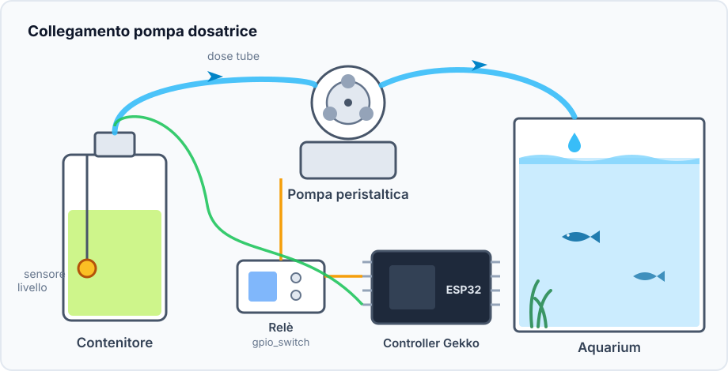
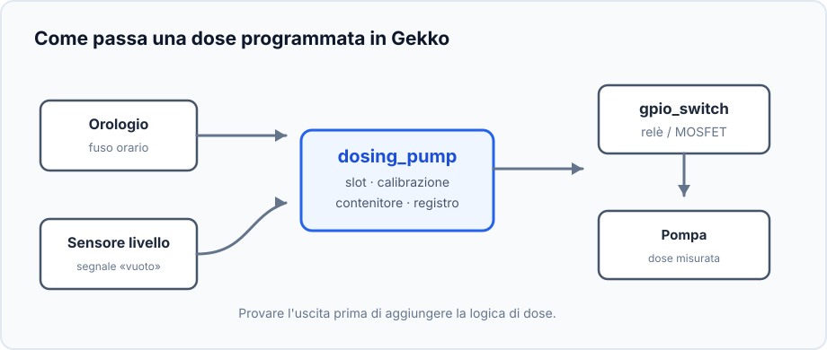
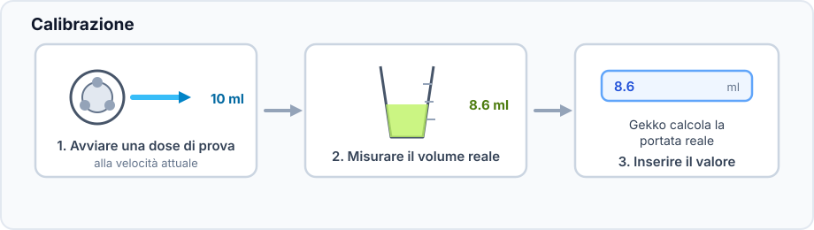
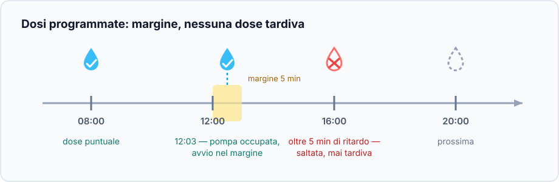
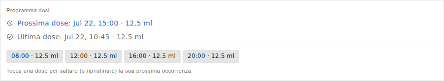
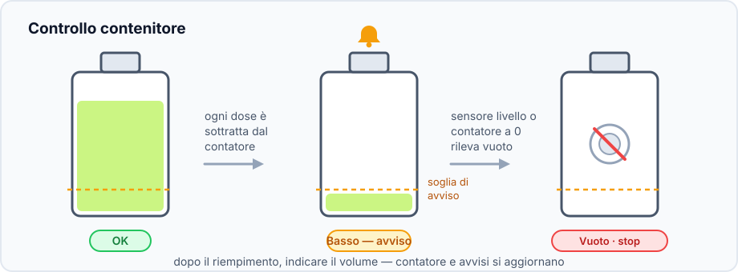

Questo progetto aggiunge piccole quantità misurate di liquido a orari scelti,
per additivi dell'acquario, fertilizzante o altre soluzioni.

## Risultato

```text
Orologio → slot dose → dosing_pump
                       ├→ interruttore GPIO → pompa
                       └→ contatore contenitore e registro
```

## Hardware e sicurezza



- ESP32, pompa peristaltica a bassa tensione e relè o MOSFET adatto.
- Tubo, contenitore e cilindro graduato oppure bilancia per la calibrazione.
- Interruttore a galleggiante opzionale nel contenitore.

> Eseguire i primi test con acqua pulita in un cilindro graduato, non con una
> quantità sconosciuta di additivo nell'acquario. Non alimentare il motore da
> un GPIO dell'ESP32.

## Grafo dei dispositivi e ordine



1. Impostare il fuso orario e attendere un orario NTP corretto, oppure aggiungere
   un RTC DS3231.
2. Creare un [`gpio_switch`](/gekko/it/reference/devices/gpio-switch/) per relè
   o MOSFET, con stato sicuro che spegne il motore.
3. Con acqua e cilindro graduato, attivare brevemente l'uscita GPIO e verificare
   che il motore si fermi.
4. Creare e testare il sensore di livello se serve.
5. Creare `dosing_pump`: selezionare interruttore, sensore, capacità e soglia.

## Calibrare la portata reale



Lunghezza, altezza del tubo e usura cambiano la portata. Calibrare con il tubo
installato definitivamente: il liquido di prova esce davvero dal contenitore.

## Aggiungere il primo programma



Aggiungere prima una dose piccola tra alcuni minuti. La pompa deve funzionare
una volta e fermarsi. Una dose persa non viene recuperata, per evitare una dose
accumulata pericolosa dopo un riavvio.

## Esempio di programma salvato



L'esempio ha quattro slot da 12,5 ml: 08:00, 12:00, 16:00 e 20:00, cioè 50 ml
al giorno. Mostra solo la struttura: test dell'acqua e istruzioni dell'additivo
determinano il volume. Selezionare uno slot per saltare solo la prossima dose.

## Controllare il contenitore



Riempire prima della soglia di avviso e inserire il nuovo valore con **Set
volume**. Il sensore di livello protegge anche dalla marcia a secco. Nei primi
giorni controllare test e registro delle dosi.

## Problemi comuni

- **La dose non parte:** controllare orologio, fuso, modalità automatica e stato vuoto.
- **Volume errato:** calibrare di nuovo con il percorso tubo finale.
- **Il motore gira senza liquido:** adescare il tubo e controllare ingresso e pieghe.
- **Il motore non si ferma:** spegnere subito il GPIO e controllare relè e stato sicuro.

Vedere la [referenza della pompa dosatrice](/gekko/it/reference/devices/dosing-pump/) per tutti i dettagli.
