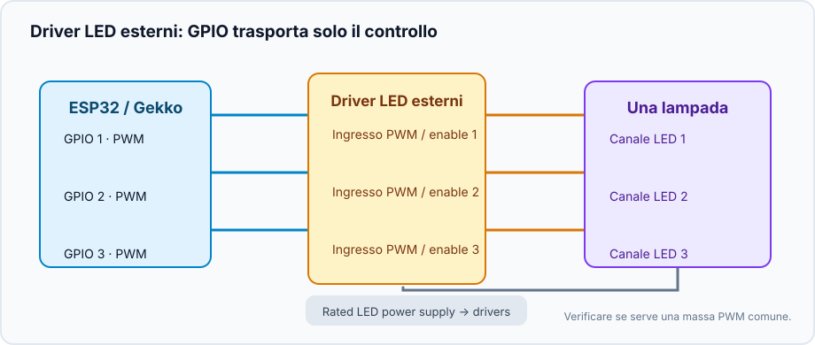
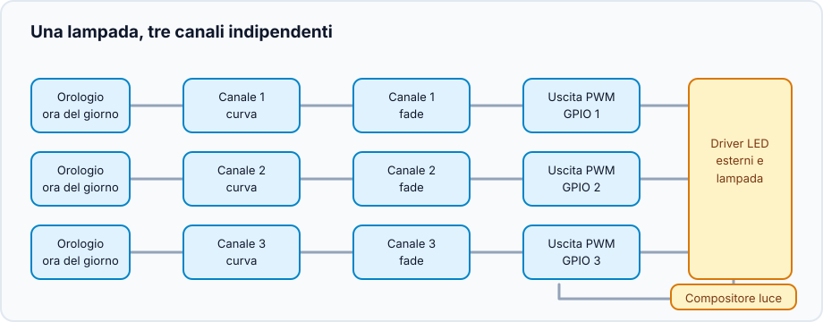
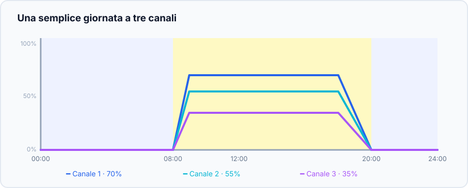

Questo progetto riunisce canali LED dimmerabili indipendenti in una lampada. I
canali possono essere linee LED o altri carichi PWM: nomi e livelli sono scelti
dall'utente. Gekko gestisce il ritmo quotidiano; driver LED o stadio MOSFET
forniscono la potenza.

## Risultato

```text
Orologio → curve canali → transizioni morbide → uscite PWM → driver LED → lampada
                                  └──────── compositore ────────┘
```

Ogni canale segue la propria curva; un compositore dà all'intera lampada la
modalità comune **Off**, **Manual** o **Scheduled**.

## Hardware e sicurezza



- ESP32 e un GPIO PWM adatto per ogni canale.
- Driver LED con ingresso PWM/enable documentato, oppure stadio MOSFET adatto
  al carico LED e all'alimentatore.
- Alimentatore separato e dimensionato correttamente. Non collegare **mai**
  una linea LED direttamente a un GPIO ESP32.
- Massa comune solo se richiesta dal driver; verificare tensione, polarità e
  isolamento prima del cablaggio.

Provare prima un solo canale a basso valore manuale.

## Creare il grafo dispositivi



1. Creare un [`analog_output`](/gekko/it/reference/devices/analog-outputs/) per
   ogni GPIO.
2. Aggiungere un `fade_analog_output` diretto a quell'uscita PWM.
3. Aggiungere un `scheduled_analog_output` diretto al fade.
4. Ripetere e creare un `analog_output_composer` con tutti gli scheduled
   outputs. Usarlo come controllo quotidiano invece delle uscite singole.

## Disegnare un primo giorno

| Ora | Canale 1 | Canale 2 | Canale 3 |
| --- | ---: | ---: | ---: |
| 00:00 | 0% | 0% | 0% |
| 08:00 | 0% | 0% | 0% |
| 09:00 | 35% | 20% | 10% |
| 12:00 | 70% | 55% | 35% |
| 18:00 | 70% | 55% | 35% |
| 20:00 | 0% | 0% | 0% |



Le percentuali sono solo un esempio di curva, non un valore prescritto.

## Verificare la lampada

1. Scegliere **Manual** e impostare tutti i canali a valore basso.
2. Tornare a **Off**: tutti devono essere a zero.
3. Provare una rampa **Scheduled** pochi minuti nel futuro.
4. Riavviare il controller: senza un orologio valido le uscite programmate
   devono tornare a zero.

Un profilo salvabile e l'acclimatazione guidata saranno aggiunti in seguito.

Dettagli: [Analog outputs & light composer](/gekko/it/reference/devices/analog-outputs/).
