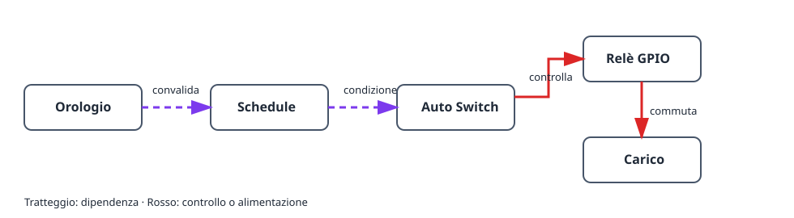

Questo progetto accende e spegne un carico a orari scelti. Il relè fisico è
separato dalla regola temporale: uno **schedule** decide se una finestra è
attiva e un **Auto Switch** applica la condizione all’uscita relè GPIO.

## Risultato

```text
Orologio e fuso orario → schedule → Auto Switch → relè GPIO → carico
```

## Hardware e sicurezza

- Scheda ESP32 e modulo relè adatto al carico.
- Un carico di prova a bassa tensione, ad esempio un LED.

> Non collegare mai la tensione di rete direttamente all’ESP32. Usa un relè o
> contattore chiuso e dimensionato correttamente e rispetta le norme locali.

## Grafo dei dispositivi e ordine di creazione



1. Imposta il fuso orario e attendi un orologio valido tramite NTP, oppure
   aggiungi una RTC DS3231. Fino ad allora lo schedule resta volutamente non
   valido.
2. Crea un [`gpio_switch`](/gekko/it/reference/devices/gpio-switch/) per il
   relè e imposta uno stato sicuro senza alimentazione del carico.
3. Comanda manualmente il GPIO con il carico di prova a bassa tensione.
4. Crea uno [`schedule`](/gekko/it/reference/devices/schedule/) con una regola
   giornaliera semplice, per esempio 09:00–09:10, **Always on**.
5. Crea un `auto_switch`: GPIO come destinazione **switch**, schedule come
   **condition**, quindi scegli la modalità **Auto**.

Auto Switch combina le condizioni con AND. Con questa sola condizione il relè è
acceso soltanto nella finestra attiva. Le modalità manuali ignorano le
condizioni; torna ad Auto dopo la prova.

## Verifica sicura

1. Conferma che ora e fuso corrispondano all’installazione.
2. Crea una breve finestra tra pochi minuti e osserva stato e prossima
   transizione.
3. Verifica che Auto Switch accenda il carico di prova all’inizio e lo spenga
   alla fine.
4. In una prova sicura modifica l’ora o disconnetti la sincronizzazione. Lo
   schedule deve diventare non valido o inattivo e il relè tornare allo stato
   sicuro.

## Problemi comuni

- **Il relè non si accende:** controlla la modalità **Auto** e che lo schedule
  sia attivo.
- **Lo schedule non è valido:** configura fuso e NTP oppure DS3231.
- **La logica è invertita:** prova prima il GPIO; abilita l’inversione solo per
  un relè attivo basso.
- **L’ora differisce di un’ora:** controlla fuso e ora legale, non le singole
  regole.

Consulta [Schedules & automation](/gekko/it/guides/schedules-and-automation/) per i dettagli delle regole.
