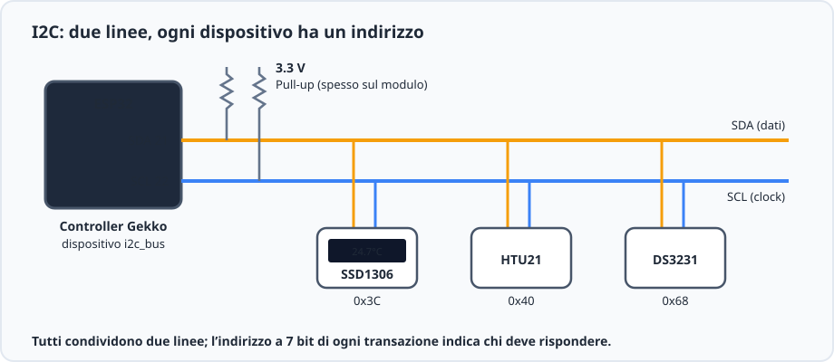
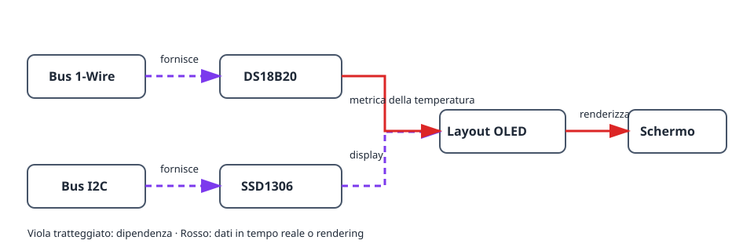
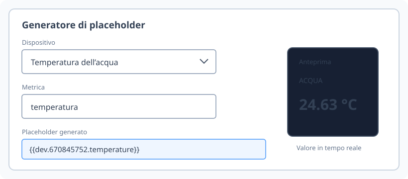
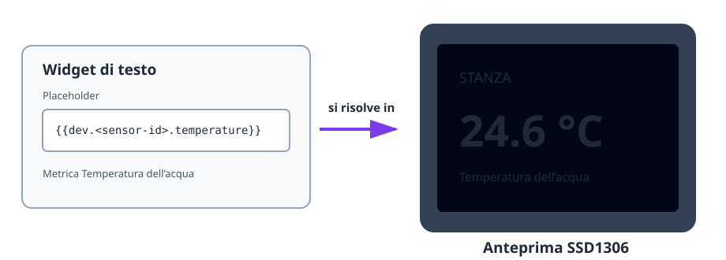

Questo progetto trasforma un sensore di temperatura funzionante in un piccolo
schermo di stato. Usa due bus indipendenti: 1-Wire per il DS18B20 e I2C per
l’OLED SSD1306. Il layout dello schermo usa poi la metrica in tempo reale del
sensore.

## Risultato

```text
DS18B20 → metrica della temperatura → layout OLED → schermo in tempo reale
                   ↑
          Bus 1-Wire      Bus I2C → display SSD1306
```

## Hardware

- Scheda ESP32 e DS18B20 con resistenza pull-up da 4,7 kΩ tra DATA e 3V3.
- Display OLED SSD1306 I2C, in genere all’indirizzo `0x3C`.
- Cablaggio I2C dall’ESP32 al display: SDA, SCL, 3V3 e GND.



Mantieni separati i cablaggi di sensore e display: il DS18B20 usa DATA 1-Wire,
mentre l’OLED usa SDA e SCL I2C.

## Grafo dei dispositivi e ordine di creazione



1. Crea e verifica un [`onewire_bus`](/gekko/it/reference/devices/onewire-bus/),
   esegui la scansione e poi crea un
   [`ds18b20_temperature_sensor`](/gekko/it/reference/devices/ds18b20/).
2. Crea un [`i2c_bus`](/gekko/it/reference/devices/i2c-bus/) per i pin SDA e
   SCL dell’OLED. Esegui la scansione se l’indirizzo del display è sconosciuto.
3. Crea un display `ssd1306` su quel bus, con l’indirizzo rilevato e il
   pannello giusto.
4. Attendi che sensore e display siano entrambi `ready`. Apri il display,
   seleziona **Progetta** e crea un widget di testo.
5. Usa il generatore di placeholder per inserire la metrica della temperatura.
   Per esempio:

   ```text
   Stanza {{dev.<sensor-id>.temperature | fixed:1}} °C
   ```

Il placeholder diventa una vera dipendenza del display. Gekko può quindi
avvisare prima di eliminare il sensore quando il layout usa ancora la sua
metrica.



## Verifica lo schermo



1. Controlla l’anteprima del progettista prima di salvarla sul display.
2. Conferma che l’OLED mostri la stessa temperatura della pagina del sensore.
3. Riscalda o raffredda leggermente la sonda e verifica che il valore mostrato cambi.
4. Scollega il sensore in una prova sicura. Il suo placeholder deve diventare
   vuoto o non disponibile senza impedire il disegno del resto del layout.

## Problemi comuni

- **L’OLED è vuoto:** controlla alimentazione, cablaggio SDA/SCL, indirizzo I2C
  e il pannello configurato.
- **Manca il valore del sensore:** attendi che il sensore raggiunga `ready` e
  usa il generatore di placeholder invece di digitare un ID presunto.
- **Il testo è tagliato:** usa l’anteprima del progettista, testo più piccolo o
  una seconda pagina; non usare una larghezza fissa di carattere.
- **Un sensore non può essere eliminato:** rimuovi o sostituisci prima il suo
  placeholder dal layout del display.

Per il flusso completo del layout, consulta [Display e progettista del layout](/gekko/it/guides/displays/).
