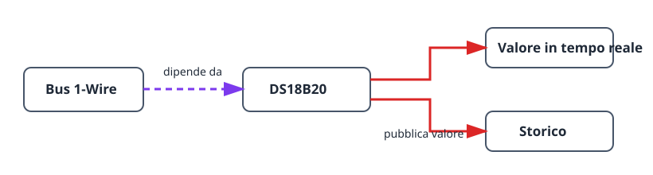

Questo progetto realizza la catena di sensori utile più piccola: una sonda
DS18B20 su un bus 1-Wire. Mostra lo stesso ordine delle dipendenze dei sistemi
più grandi e fornisce una temperatura in tempo reale con storico. In questo
modo puoi verificare cablaggio e posizione della sonda prima di aggiungere un
termostato o un’altra automazione.

## Risultato

```text
Sonda DS18B20 → bus 1-Wire → temperatura in tempo reale e storico
```

## Hardware

- Scheda ESP32.
- Sonda DS18B20.
- Resistenza di pull-up da 4,7 kΩ tra la linea DATA della sonda e 3V3.


Non lasciare DATA flottante: senza pull-up il bus può rilevare la sonda in modo
intermittente o mostrare valori non validi.

## Grafo dei dispositivi e ordine di creazione



1. Crea un [`onewire_bus`](/gekko/it/reference/devices/onewire-bus/) sul GPIO
   collegato alla linea DATA della sonda.
2. Apri il bus ed esegui **Scan**. Verifica che compaia la sonda prevista.
3. Crea un
   [`ds18b20_temperature_sensor`](/gekko/it/reference/devices/ds18b20/) con
   l’indirizzo trovato.
4. Attendi lo stato `ready`, poi apri il sensore e verifica il valore in tempo
   reale e il grafico dello storico.

La scansione associa il sensore a un indirizzo ROM univoco a 64 bit. Più sonde
possono condividere un bus, ma ogni indirizzo rilevato richiede una propria
istanza di sensore.

## Verifica della lettura

1. Dopo la stabilizzazione nello stesso punto, confronta il valore mostrato con
   un termometro affidabile.
2. Sposta brevemente la sonda tra ambienti più caldi e più freddi: valore e
   storico devono reagire nella direzione prevista.
3. In un impianto di prova sicuro, scollega la sonda. Il sensore deve diventare
   non disponibile o andare in errore, senza continuare a mostrare il vecchio
   valore come lettura corrente.

## Problemi comuni

- **La scansione non trova sonde:** controlla DATA, 3V3, GND e il pull-up da
  4,7 kΩ.
- **La temperatura salta:** controlla cavo e posizione della sonda prima di
  aggiungere filtraggio o calibrazione.
- **È selezionata la sonda sbagliata:** ripeti la scansione e usa l’indirizzo
  ROM mostrato, non solo colore del cavo o posizione fisica.

Quando la lettura è affidabile, usala come dipendenza della temperatura per il
[termostato con relè](/gekko/it/projects/thermostat-with-relay/).
