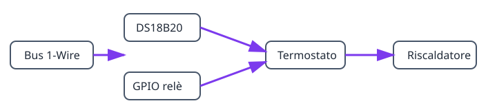

## Risultato

```text
DS18B20 → termostato → relè → riscaldatore o raffreddatore
```

## Hardware

- ESP32, DS18B20 con pull-up da 4,7 kΩ tra DATA e 3V3, relè adatto al carico.

> Non collegare mai un carico di rete direttamente all’ESP32.

## Grafo e ordine di creazione



1. Creare [`onewire_bus`](/gekko/it/reference/devices/onewire-bus/), eseguire **Scan** e creare il [`ds18b20_temperature_sensor`](/gekko/it/reference/devices/ds18b20/).
2. Creare [`gpio_switch`](/gekko/it/reference/devices/gpio-switch/) per il relè e impostare lo stato senza energia come sicuro.
3. Provare manualmente il relè, poi creare [`thermostat`](/gekko/it/reference/devices/thermostat/) con sensore e interruttore come dipendenze.

Attendere `ready` per le dipendenze. Con obiettivo 25,0 °C e isteresi 0,5 °C il riscaldatore si accende sotto 24,5 °C e si spegne a 25,0 °C. In una prova sicura scollegare il sensore: l’uscita deve tornare allo stato sicuro.
