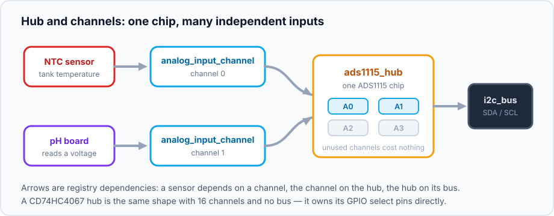
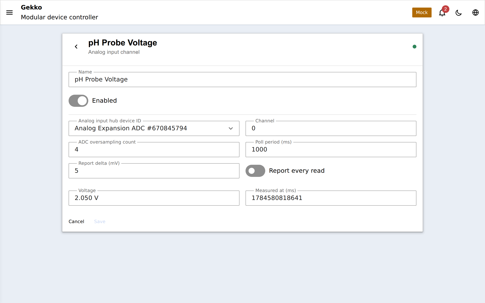
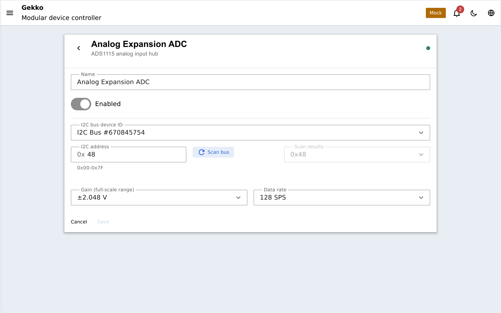
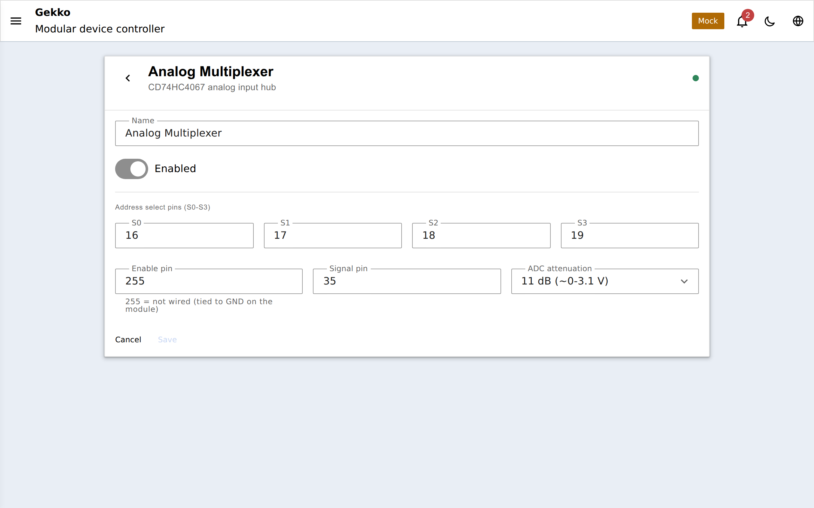

## Perché ingressi analogici?

Molti sensori per acquario e serra non parlano un protocollo digitale — danno
semplicemente una **tensione** che cambia con ciò che misurano: un termistore
NTC, una scheda sonda pH o ORP, una sonda TDS/EC, una fotoresistenza, una
sonda umidità del suolo, un sensore di pressione o livello acqua. Per leggerli
serve qualcosa che trasformi quella tensione in un numero — un **ADC**
(convertitore analogico-digitale).

Gekko separa *da dove arriva la tensione* (l'hardware ADC) da *cosa significa
il numero* (temperatura, pH, livello). Questa pagina riguarda la prima metà —
i quattro tipi di dispositivo che producono una lettura di tensione grezza. I
sensori che interpretano quella lettura, come il
[termistore NTC](/gekko/it/reference/devices/ntc-thermistor/), dipendono da uno
di questi e aggiungono i calcoli.

Ogni dispositivo analog-input riporta la stessa cosa: una lettura in
**millivolt** (il valore autorevole) più un codice ADC grezzo per la
diagnostica, con un flag di validità. Un ingresso scollegato o invalido
appare come *invalid*, mai come uno zero finto.

## I tre modi per ottenere una lettura

| Type | Hardware | Channels | Depends on |
| --- | --- | --- | --- |
| `analog_port_input` | L'ADC nativo dell'ESP32 | 1 (il suo pin) | — |
| `ads1115_hub` | ADC I2C a 16 bit ADS1115 | 4 | un [bus I2C](/gekko/it/reference/devices/i2c-bus/) |
| `cd74hc4067_hub` | Multiplexer analogico CD74HC4067 | 16 | — (possiede i pin GPIO) |

Quale scegliere:

- **`analog_port_input`** — l'opzione senza parti extra. L'ESP32 ha già un
  ADC; questo legge direttamente uno dei suoi pin. Va bene per una lettura
  approssimativa (una fotoresistenza, un galleggiante grezzo) dove ±qualche
  percento non conta. L'ADC on-chip è solo a 12 bit e leggermente non lineare,
  e metà dei suoi pin smettono di funzionare appena il Wi-Fi è attivo (vedi le
  note più sotto).
- **`ads1115_hub`** — quando la precisione conta. L'ADS1115 è un ADC I2C a 16
  bit con programmable gain amplifier, quindi un segnale piccolo (l'output di
  una scheda pH, un termistore preciso) viene misurato in modo pulito e
  ripetibile. Quattro canali per chip, e fino a quattro chip su un bus
  (indirizzi `0x48`–`0x4B`).
- **`cd74hc4067_hub`** — quando ti servono *molti* canali economici. Il
  CD74HC4067 è un switch analogico a 16 vie: collega uno dei 16 ingressi a un
  singolo pin condiviso, che poi mandi a qualsiasi ADC (di default l'ADC
  dell'ESP32). Sedici sonde umidità suolo o livelli su un solo pin ADC — ma
  condividono comunque la precisione dell'ADC on-chip e vengono letti uno alla
  volta.

## Hub e canali

L'ingresso port ESP32 è standalone — *è* una singola lettura, quindi lo
crei e punti un sensore a quello.

I due chip multi-canale funzionano diversamente, e rispecchiano il
[pattern dell'espansore porte](/gekko/it/guides/devices-and-dependencies/): il
dispositivo **hub** possiede il chip e i suoi pin, e ogni canale che usi
davvero è un dispositivo separato **`analog_input_channel`** che dipende
dall'hub.

Quindi una configurazione ADS1115 con due sonde = tre dispositivi:
`ads1115_hub`, e due dispositivi `analog_input_channel` (canale 0 e canale 1)
che lo puntano. Ogni canale è nominato, abilitato e campionato in modo
indipendente — e ogni canale può essere letto dal proprio sensore. Esiste un
**solo** tipo di canale per entrambe le famiglie di hub: un canale non nomina
mai il chip concreto, chiede solo all'hub "channel N", quindi un
`analog_input_channel` funziona allo stesso modo sia che l'hub sia un ADS1115
(canali 0–3) sia un CD74HC4067 (canali 0–15). Il form di creazione limita il
numero di canale a quello che hai realmente selezionato.

Un dispositivo canale è volutamente piccolo — nomina solo hub e numero di
canale, poi campiona e riporta millivolt:

Due canali non possono reclamare lo stesso numero sullo stesso hub — Gekko
rifiuta il secondo, come rifiuta due switch di espansore sullo stesso pin.

## Configurazione di un ADS1115

1. Crea un **[bus I2C](/gekko/it/reference/devices/i2c-bus/)** sui pin SDA/SCL
   (se non ne hai già uno) e usa **Scan bus** per confermare che l'ADS1115
   risponda — di solito a `0x48`.
2. Crea un **`ads1115_hub`**, seleziona quel bus e imposta indirizzo e gain.
3. Per ogni ingresso cablato, crea un **`analog_input_channel`**, seleziona
   l'hub e scegli il numero di canale (0–3 = A0–A3 dell'ADS1115).
4. Collega un sensore (o guarda semplicemente i millivolt del canale) a ogni
   canale.

Il **gain** determina il range di ingresso e quindi la risoluzione. Scegli il
range più piccolo che copre comodamente il tuo segnale — un range minore
spalma i 16 bit su meno volt, quindi ogni step è più fine:

| Gain | Full-scale range | Use when |
| --- | --- | --- |
| `fsr6144` | ±6,144 V | Mai necessario a 3,3 V — clippa il range codice |
| `fsr4096` | ±4,096 V | Un segnale che può arrivare al rail completo 3,3 V |
| `fsr2048` | ±2,048 V | **Default** — buono per la maggior parte dei segnali 0–2 V |
| `fsr1024` | ±1,024 V | Segnali piccoli sotto ~1 V |
| `fsr0512` | ±0,512 V | |
| `fsr0256` | ±0,256 V | Segnali molto piccoli |

:::caution[Non superare l'alimentazione]
L'ADS1115 può *rappresentare* fino a ±6,144 V in codice, ma non devi mai
portare su un canale più della tensione di alimentazione del chip (VDD, cioè
3,3 V qui). L'impostazione del gain sceglie solo come il range codice si
mappa sui volt — non protegge l'ingresso.
:::

## Configurazione di un multiplexer CD74HC4067

Il CD74HC4067 non richiede un bus. Ha quattro **address pin** (S0–S3) che
Gekko pilota per selezionare quale dei 16 ingressi è collegato al pin
**SIG** condiviso, che cabli a un pin ADC (di default un pin ADC ESP32):

1. Collega S0–S3 a quattro GPIO, SIG a un pin compatibile ADC, e
   opzionalmente EN a un GPIO (collega EN a GND se non lo cabli).
2. Crea un **`cd74hc4067_hub`**, inserisci i quattro pin di selezione, il pin
   SIG e la sua attenuazione.
3. Crea un **`analog_input_channel`** per ogni ingresso, selezionando hub e
   canale 0–15.

Poiché tutti i 16 canali passano da un solo pin ADC ESP32, condividono la
precisione di quell'ADC e la restrizione Wi-Fi sui pin qui sotto — il
multiplexer compra quantità di canali, non precisione. Le letture sono
sequenziali: Gekko commuta le linee di address, aspetta un tick che il mux si
stabilizzi, poi campiona, quindi la scansione di molti canali è naturalmente
cadenzata e non istantanea.

## Note sull'ADC ESP32 (port input & SIG del CD74HC4067)

`analog_port_input` e il pin SIG del CD74HC4067 usano l'ADC on-chip
dell'ESP32, che ha due cose da sapere:

- **Usa pin ADC1 con il Wi-Fi.** I GPIO **32–39** sono ADC1 e restano attivi
  mentre il Wi-Fi gira; i pin ADC2 no — il Wi-Fi si prende ADC2, quindi una
  lettura lì si blocca o restituisce spazzatura. I GPIO **34–39** sono solo
  input (niente pull-up interni), ed è esattamente ciò che vuoi per un
  ingresso sensore. Il pin di default è **34**.
- **L'attenuazione definisce il range di ingresso.** L'ADC grezzo misura solo
  fino a circa 1,1 V; l'attenuazione scala tensioni più grandi dentro quella
  finestra. Usa la più ampia (`11db`, default) salvo che il segnale sia davvero
  piccolo:

  | Attenuation | Usable input range |
  | --- | --- |
  | `0db` | ~0 – 0,95 V |
  | `2_5db` | ~0 – 1,3 V |
  | `6db` | ~0 – 1,75 V |
  | `11db` | ~0 – 3,1 V (**default**, full-range) |

Per qualsiasi cosa in cui la tensione esatta conta, preferisci un ADS1115 —
l'ADC on-chip è comodo, non preciso.

## Smussamento e reporting

Ogni lettura analogica è la media di diversi campioni ADC presi in sequenza,
che riduce il rumore prima ancora che il valore venga riportato. Quanto spesso
campiona e con quanta aggressività invia update è configurabile per
dispositivo/canale — la stessa idea del delta di report dei sensori di
temperatura, così un segnale grezzo jittery non inonda il WebSocket o i grafici
storici.

## Configurazione

### `analog_port_input`

| Field | Default | Meaning |
| --- | --- | --- |
| `gpioPin` | `34` | Il pin ADC da leggere (usa ADC1: 32–39, con Wi-Fi attivo) |
| `attenuation` | `11db` | Range di ingresso — vedi la tabella sopra |
| `adcSamples` | `8` | Campioni mediati per lettura (1–32) |
| `pollMs` | `1000` | Ogni quanto leggere |
| `reportDeltaMilliVolts` | `10` | Variazione minima prima di inviare una nuova lettura |
| `reportAlways` | off | Invia ogni poll indipendentemente dal delta |

### `ads1115_hub`

| Field | Default | Meaning |
| --- | --- | --- |
| `i2cAddress` | `0x48` | Indirizzo ADS1115 (`0x48`–`0x4B` dal pin ADDR) |
| `gain` | `fsr2048` | Full-scale range / PGA — vedi la tabella gain |
| `dataRateSps` | `128` | Campioni al secondo: `8`–`860`; più alto = più veloce ma più rumoroso |

### `cd74hc4067_hub`

| Field | Default | Meaning |
| --- | --- | --- |
| `selectPins` | `[16, 17, 18, 19]` | I quattro GPIO di address S0–S3 |
| `sigPin` | `34` | Pin ADC a cui va la uscita SIG condivisa (ADC1 con Wi-Fi attivo) |
| `sigAttenuation` | `11db` | Range di ingresso per quel pin ADC — vedi la tabella attenuazione |
| `enablePin` | unused | GPIO EN opzionale; lascia vuoto e collega EN a GND |

### `analog_input_channel`

| Field | Default | Meaning |
| --- | --- | --- |
| `channel` | `0` | Quale canale dell'hub (0–3 su ADS1115, 0–15 su CD74HC4067) |
| `adcSamples` | `4` | Campioni mediati per lettura (1–32) |
| `pollMs` | `1000` | Ogni quanto leggere |
| `reportDeltaMilliVolts` | `10` | Variazione minima prima di inviare una nuova lettura |
| `reportAlways` | off | Invia ogni poll indipendentemente dal delta |

## Dove va la lettura

Un ingresso analogico da solo è solo una tensione sulla dashboard — utile per
un controllo rapido, ma di solito serve per alimentare un sensore:

- un **[termistore NTC](/gekko/it/reference/devices/ntc-thermistor/)**
  trasforma la lettura in temperatura, che può poi guidare un
  [thermostat](/gekko/it/reference/devices/thermostat/);
- i millivolt compaiono nei
  [display placeholders](/gekko/it/guides/displays/) per un OLED/TFT;
- sulle [build MQTT](/gekko/it/guides/mqtt-home-assistant/) ogni input foglia
  (l'ingresso port e ogni canale) è scopribile in Home Assistant come sensore
  `voltage`. Gli hub non lo sono — forniscono canali, non una lettura propria.

Internals firmware:
[`docs/analog-input.md`](https://github.com/yoreek/gekko/blob/master/docs/analog-input.md).
