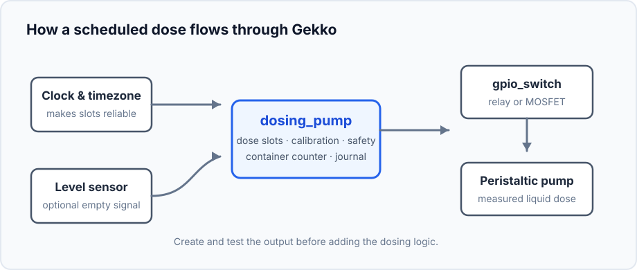
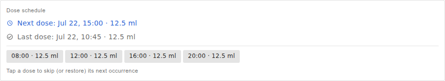

This project adds a small measured amount of liquid at chosen times. It is
suited to aquarium supplements, fertiliser, or any other liquid that benefits
from several small, repeatable doses instead of one large addition.

## What you will build

```text
Reliable clock → dose slots → dosing pump → GPIO switch → peristaltic pump
                                         ↘ container counter and dose journal
```

The dosing pump device translates millilitres into motor run time. It also
knows how much liquid remains in the container and records completed doses.

## Hardware and safety


- ESP32 controller, a low-voltage peristaltic pump, and a relay or MOSFET
  module rated for that pump.
- Dosing tube, a container, and a measuring cylinder or scale for calibration.
- Optional float switch in the container for an independent empty indication.

> For the first tests, pump clean water into a measuring cylinder — never an
> unknown amount of supplement into the aquarium. Do not power a pump directly
> from an ESP32 GPIO pin.

## Create the device graph



1. Set the controller timezone and wait for a plausible clock from NTP, or add
   a DS3231 RTC. Scheduled doses need reliable time.
2. Create a [`gpio_switch`](/gekko/reference/devices/gpio-switch/) for the
   relay or MOSFET that powers the pump. Choose a safe default that leaves the
   motor off.
3. With water and a measuring cylinder, manually turn the GPIO switch on and
   off briefly. Confirm the motor direction and that it stops when switched
   off.
4. Optionally add a float switch as a binary sensor. Test both its normal and
   empty states before relying on it.
5. Create the `dosing_pump`: select the pump switch, optional low-level
   sensor, container capacity, and warning threshold. Enable blocking of
   automatic doses when the container is empty if that is appropriate for the
   installation.

## Calibrate the real flow rate


Tubing length, height, and pump wear affect flow. Run a calibration dose with
the final tube arrangement, measure the collected volume, then enter that
result in the pump settings. Calibration liquid still leaves the container, so
use water for the test and set the container volume correctly afterwards.

## Add a safe first schedule

1. Create one small dose slot a few minutes ahead, using an amount you can
   easily measure.
2. Wait for the slot and verify that the pump runs once, then stops.
3. Check the recorded dose amount and the reduced container volume.
4. Add the remaining daily slots only after the measured result matches the
   intended amount.


The scheduler may start a dose within a five-minute grace window. An older
missed slot is skipped rather than run late, preventing a catch-up burst after
a restart or a long calibration. Use **Skip next** for a water-change day;
manual doses remain available when automatic dosing is disabled.

## Example: a saved schedule in the portal



The example has four daily slots of 12.5 ml: 08:00, 12:00, 16:00, and 20:00.
Together they make a 50 ml daily target. These values are only an example of
how slots add up — use the amount established by your water tests and additive
instructions, not this number.

The card shows the next and most recent run. Select a slot to skip just its
next occurrence, for example on a water-change day. Use one pump and tube per
liquid; follow the product instructions for timing and compatibility rather
than mixing solutions or copying a dose from another aquarium.

## Watch the container


Refill the container before its warning threshold and use **Set volume** to
record the new amount. The optional float sensor can detect an empty container
even when the counter is inaccurate. Review the dose journal after the first
few days: it is the quickest way to spot a missed schedule or unexpected
manual dose.

## Common problems

- **The dose never starts:** check the clock, timezone, automatic dosing mode,
  and whether the container is marked empty.
- **The volume is wrong:** recalibrate with the installed tube path; a test at
  a different height can produce a different result.
- **The pump runs but liquid does not move:** prime the tube with water and
  check for a loose inlet, blocked tube, or reversed tubing route.
- **The motor does not stop:** immediately turn the GPIO switch off, then
  check relay wiring and its safe state before using automatic doses.

For all settings and command details, see the
[Dosing pump reference](/gekko/reference/devices/dosing-pump/).
