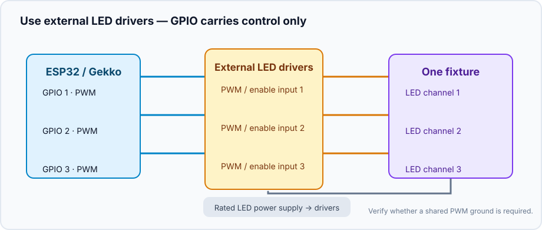
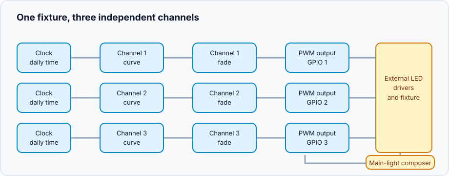
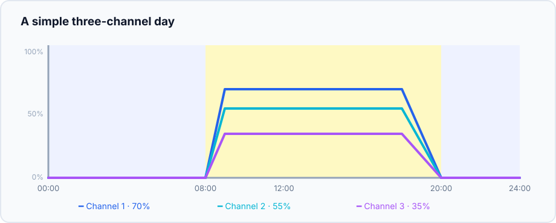

This project turns independently dimmable LED channels into one light fixture.
The channels can be any mix of LEDs or other PWM-controlled loads: name and
tune them for your hardware. Gekko controls the daily rhythm; the LED driver
or MOSFET stage supplies the electrical power.

## What you will build

```text
Clock → channel curves → smooth fades → PWM outputs → LED drivers → fixture
                                  └──────── composer ────────┘
```

Each channel follows its own curve, while one composer gives the whole fixture
a shared **Off**, **Manual**, or **Scheduled** mode.

## Hardware and safety



- ESP32 controller and one suitable PWM-capable GPIO for each channel.
- An LED driver with a documented PWM/enable dimming input, or a MOSFET stage
  designed for the LED load and its power supply.
- A separate, correctly rated power supply for the LEDs. Do **not** power an
  LED string from an ESP32 GPIO pin.
- A common ground only when the driver documentation requires a shared
  low-voltage PWM reference. Check the driver's input voltage, polarity, and
  isolation before wiring it.

Start with one channel at a low manual level. Confirm that its brightness
changes in the expected direction before connecting the remaining channels.

## Create the device graph



For every physical channel, create this chain:

1. Create an [`analog_output`](/gekko/reference/devices/analog-outputs/) for
   its GPIO. Give it a hardware-oriented name such as “Channel 1 PWM”.
2. Add a `fade_analog_output` targeting that PWM output. This keeps manual
   changes and scheduled transitions gentle.
3. Add a `scheduled_analog_output` targeting the fade. Name it after the
   visible channel, for example “Channel 1 curve”.
4. Repeat for the other channels, then create one
   `analog_output_composer` — for example, “Main light” — and add the
   scheduled outputs to it.

The composer is the normal control point. Put it on the dashboard instead of
controlling the individual PWM outputs during daily use.

## Draw a simple first day

Use a small number of points first. A safe, easy-to-check starting shape is:

| Time | Channel 1 | Channel 2 | Channel 3 | Meaning |
| --- | ---: | ---: | ---: | --- |
| 00:00 | 0% | 0% | 0% | night / off |
| 08:00 | 0% | 0% | 0% | begin ramp |
| 09:00 | 35% | 20% | 10% | gentle morning |
| 12:00 | 70% | 55% | 35% | daytime level |
| 18:00 | 70% | 55% | 35% | hold level |
| 20:00 | 0% | 0% | 0% | finish ramp |



These percentages are only a curve example, not a brightness prescription.
Begin below the final intended level, observe the fixture and its inhabitants,
then change one variable at a time. Avoid long bright periods just because a
channel has headroom.

## Verify the fixture

1. In the composer, select **Manual** and set every channel to a low value.
   Check that each physical channel responds and no driver overheats.
2. Return it to **Off**. Every channel must go to zero.
3. Select **Scheduled** and temporarily place a ramp a few minutes ahead.
   Watch each channel rise, hold, and fade out according to its curve.
4. Restart the controller or temporarily make the clock unavailable. Confirm
   the scheduled outputs resolve safely to zero rather than keeping an old
   bright state.

Once the simple curve is reliable, rename channels to match the fixture and
refine their individual levels. A reusable saved lighting profile and guided
acclimation will be added later; for now, the composer keeps the existing
channel curves together.

## Common problems

- **One channel is inverted:** check the driver's dimming convention. Some
  inputs interpret a low PWM duty cycle as bright.
- **The fixture jumps instead of fading:** verify that the scheduled output
  targets a `fade_analog_output`, not the raw PWM output.
- **The whole fixture stays dark:** check the controller clock, composer mode,
  external LED power supply, and the driver's enable input.
- **Only one channel changes:** make sure every scheduled output is included
  in the composer and that it targets the matching fade/output chain.

For device settings and curve-editor details, see
[Analog outputs & light composer](/gekko/reference/devices/analog-outputs/).
