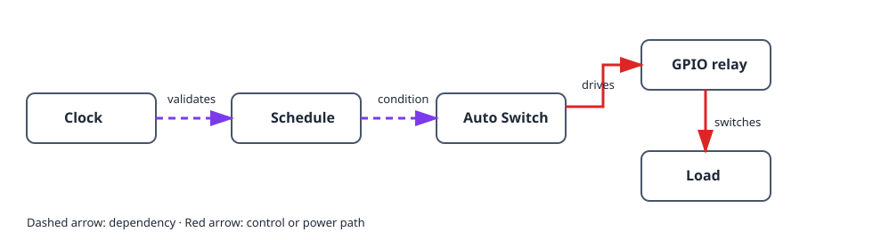

This project turns a load on and off at chosen times. It separates the physical
relay from the clock rule: a **schedule** decides whether a time window is
active, while an **auto switch** applies that condition to a GPIO relay output.

## What you will build

```text
Clock and timezone → schedule → auto switch → GPIO relay → load
```

## Hardware and safety

- ESP32 board and relay module suitable for the load.
- A low-voltage test load, such as an LED, for first verification.

> Do not connect mains voltage directly to the ESP32. Use an enclosed,
> correctly rated relay or contactor and follow local electrical-safety rules.

## Device graph and creation order



1. Set the controller timezone and wait for a plausible clock from NTP, or add
   a DS3231 RTC. Until then, a schedule deliberately remains invalid.
2. Create a [`gpio_switch`](/gekko/reference/devices/gpio-switch/) for the
   relay. Set its safe state to leave the load unpowered.
3. Manually switch that GPIO device on and off with the low-voltage test load.
4. Create a [`schedule`](/gekko/reference/devices/schedule/) with a simple
   daily rule, for example 09:00–09:10, **Always on**.
5. Create an `auto_switch`: select the GPIO switch as its **switch** target,
   the schedule as its **condition**, and choose **Auto** mode.

The Auto Switch combines all conditions with AND. With this single condition,
the relay is on only while the schedule is active. Manual On and Off modes
override the conditions; return to Auto after testing.

## Verify safely

1. Confirm that the clock time and timezone match the installation.
2. Use a short time window a few minutes ahead, then save and watch the
   schedule state and next transition.
3. Verify that Auto Switch turns the test load on at the start and off at the
   end of the window.
4. Change the controller time or disconnect time sync in a safe test setup.
   The schedule must become invalid or inactive and the relay must return to
   its safe off state.

## Common problems

- **The relay never turns on:** confirm the Auto Switch is in **Auto**, not Off
  or a manual override, and that the schedule is currently active.
- **The schedule is invalid:** set the timezone and wait for NTP, or configure
  a DS3231 RTC.
- **The relay logic is reversed:** verify the relay with the GPIO switch first;
  enable GPIO inversion only if the module is active-low.
- **The time is wrong by an hour:** check the selected timezone and daylight
  saving setting rather than altering individual rules.

For full rule details, see [Schedules & automation](/gekko/guides/schedules-and-automation/).
