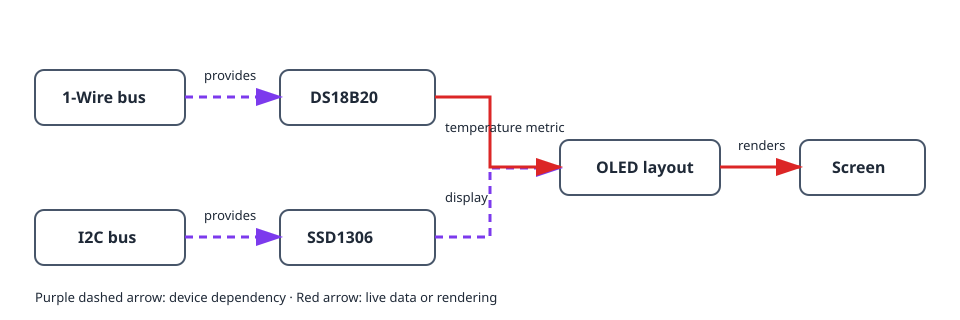
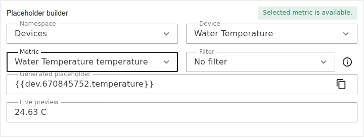
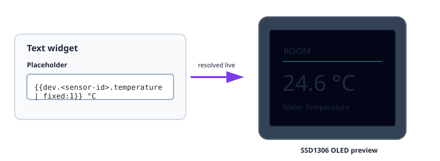

This project turns a working temperature sensor into a small status screen. It
uses two independent buses: 1-Wire for the DS18B20 and I2C for the SSD1306
OLED. The display layout then refers to the sensor's live metric.

## What you will build

```text
DS18B20 → temperature metric → OLED layout → live screen
                 ↑
        1-Wire bus     I2C bus → SSD1306 display
```

## Hardware

- ESP32 board and DS18B20 with its 4.7 kΩ DATA-to-3V3 pull-up resistor.
- SSD1306 I2C OLED display, usually at address `0x3C`.
- I2C wiring from the ESP32 to the display: SDA, SCL, 3V3 and GND.


Keep the sensor and display wiring separate: the DS18B20 uses 1-Wire DATA,
while the OLED uses I2C SDA and SCL.

## Device graph and creation order



1. Create and verify a [`onewire_bus`](/gekko/reference/devices/onewire-bus/),
   scan it, then create a
   [`ds18b20_temperature_sensor`](/gekko/reference/devices/ds18b20/).
2. Create an [`i2c_bus`](/gekko/reference/devices/i2c-bus/) for the OLED's SDA
   and SCL pins. Scan it if the display address is unknown.
3. Create an `ssd1306` display on that bus, with its scanned address and the
   correct panel selected.
4. Wait until both the temperature sensor and display are `ready`. Open the
   display, select **Design**, and create a text widget.
5. Use the placeholder builder to insert the temperature metric. For example:

   ```text
   Room {{dev.<sensor-id>.temperature | fixed:1}} °C
   ```

The placeholder becomes a real display dependency. Gekko can then warn before
the sensor is deleted while the layout still uses its metric.



## Verify the screen



1. Check the designer preview before saving it to the display.
2. Confirm the OLED shows the same temperature as the sensor page.
3. Warm or cool the probe slightly and confirm the displayed value changes.
4. Disconnect the sensor in a safe test setup. Its placeholder should become
   empty or unavailable without preventing the rest of the layout from drawing.

## Common problems

- **The OLED is blank:** verify power, SDA/SCL wiring, the I2C address, and the
  configured panel.
- **The sensor value is missing:** wait for the sensor to reach `ready` and use
  the placeholder builder instead of typing a guessed device ID.
- **Text is clipped:** use the designer preview, smaller text, or a second
  page; do not rely on a fixed character width.
- **A sensor cannot be deleted:** remove or replace its placeholder from the
  display layout first.

For the full layout workflow, see [Displays & layout designer](/gekko/guides/displays/).
