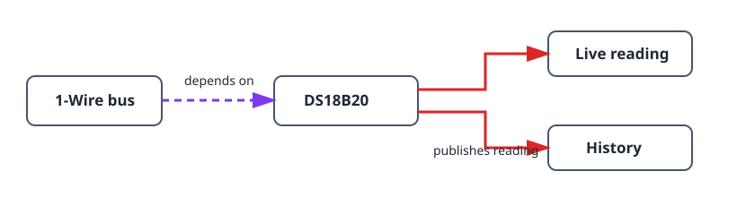

This project builds the smallest useful sensor chain: a DS18B20 probe on a
1-Wire bus. It teaches the same dependency order used by larger systems, while
giving you a live temperature and a history chart to validate placement and
readings before adding a thermostat or automation.

## What you will build

```text
DS18B20 probe → 1-Wire bus → temperature reading and history
```

## Hardware

- ESP32 board.
- DS18B20 probe.
- 4.7 kΩ pull-up resistor between the probe's DATA line and 3V3.


Do not use a floating DATA line: without the pull-up resistor the bus may scan
intermittently or report invalid readings.

## Device graph and creation order



1. Create a [`onewire_bus`](/gekko/reference/devices/onewire-bus/) on the GPIO
   connected to the probe DATA line.
2. Open the bus and run **Scan**. Confirm that the expected probe appears.
3. Create a [`ds18b20_temperature_sensor`](/gekko/reference/devices/ds18b20/)
   from the scanned address.
4. Wait for the sensor to become `ready`, then open it and confirm the live
   reading and history chart.

The scan binds the sensor to one unique 64-bit ROM address. You can use several
probes on one bus, but create one sensor instance for each discovered address.

## Verify the reading

1. Compare the displayed temperature with a trusted thermometer after the probe
   has stabilised in the same place.
2. Move the probe briefly between warmer and cooler environments and confirm
   that its value and history react in the expected direction.
3. Disconnect the probe in a safe test setup. The sensor must become unavailable
   or faulted, not keep presenting the previous value as a current reading.

## Common problems

- **Scan finds no probes:** check DATA, 3V3, GND and the 4.7 kΩ pull-up.
- **The temperature jumps:** check the cable and sensor placement before adding
  smoothing or calibration.
- **The wrong probe is selected:** rescan and use the displayed ROM address;
  never identify probes only by cable colour or physical position.

Once the reading is reliable, use it as the temperature dependency of a
[thermostat with relay](/gekko/projects/thermostat-with-relay/).
