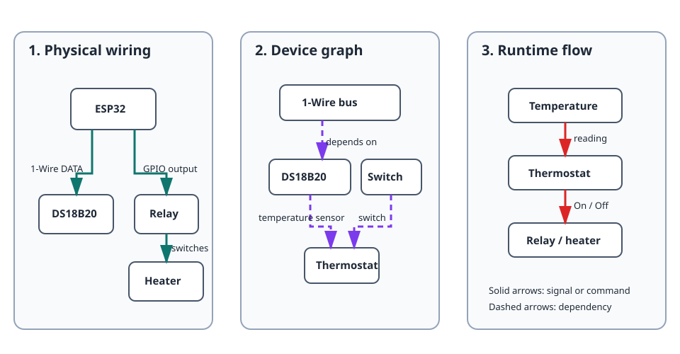

This project controls a heater or cooler from a DS18B20 temperature probe. It
is the best first multi-device project because it combines physical wiring,
device dependencies, automation, live status, and safe behaviour.

## What you will build

```text
DS18B20 probe → thermostat → relay → heater or cooler
```

The thermostat receives a live temperature from the probe and commands the
relay when the value crosses the target and hysteresis limits.

## Hardware

- ESP32 board.
- DS18B20 probe with a 4.7 kΩ pull-up resistor between DATA and 3V3.
- Relay module suitable for the load.
- Heater or cooler connected through the relay according to the module and
  mains-safety documentation.

> Never connect a mains load directly to an ESP32. Use an appropriately rated,
> enclosed relay or contactor and follow local electrical-safety requirements.

## Device graph and creation order



Create and check devices in this order:

1. Create a [`onewire_bus`](/gekko/reference/devices/onewire-bus/) on the GPIO
   wired to the probe.
2. Use **Scan** and create the discovered
   [`ds18b20_temperature_sensor`](/gekko/reference/devices/ds18b20/).
3. Create a [`gpio_switch`](/gekko/reference/devices/gpio-switch/) for the
   relay. Set its safe state to the non-energised state of the load.
4. Toggle the GPIO switch manually and confirm the relay behaves as expected.
5. Create a [`thermostat`](/gekko/reference/devices/thermostat/) and select the
   DS18B20 as its temperature dependency and the GPIO switch as its switch
   dependency.

Do not create the thermostat before its sensor and switch have reached `ready`.
The portal filters dependency selectors to compatible devices, but a manual
check before continuing makes wiring problems easier to isolate.

## Minimal thermostat settings

For a heater, choose a target temperature and a small hysteresis band. For
example, with a target of 25.0 °C and 0.5 °C hysteresis, the thermostat turns
the heater on below 24.5 °C and turns it off at 25.0 °C. Confirm the selected
mode matches the load: heating and cooling reverse the on/off direction.

Set safe limits before relying on the system. The thermostat must stop driving
the output when the probe is unavailable or reports a value outside its safe
range; the GPIO switch's safe state is the final fallback.

## Verify it works

1. Check that the bus, probe, switch, and thermostat all show `ready`.
2. Compare the displayed temperature with a trusted thermometer.
3. Temporarily adjust the target so the thermostat should command the relay.
4. Confirm the relay state changes only at the hysteresis boundary, not on
   every small measurement fluctuation.
5. Disconnect the probe or disable its bus in a safe test setup. Confirm the
   thermostat reports a blocked or fault state and the output returns to the
   configured safe state.

## Common problems

- **No probe appears in Scan:** check the DATA GPIO, 3V3/GND wiring, and the
  4.7 kΩ pull-up resistor.
- **Relay logic is reversed:** enable the GPIO switch's inverted option only
  after confirming the relay module is active-low.
- **Thermostat cannot select a dependency:** create and enable the matching
  sensor or switch first, then wait for it to reach `ready`.
- **Output switches too frequently:** widen hysteresis and check probe
  placement before changing control logic.
