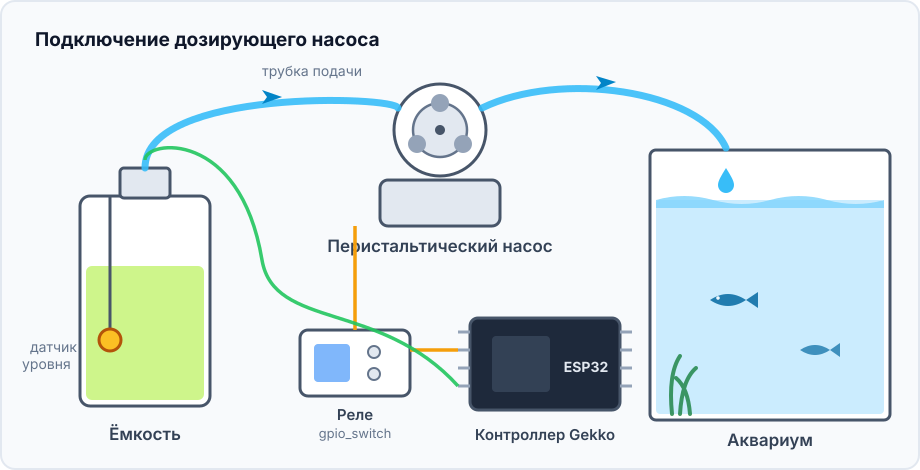
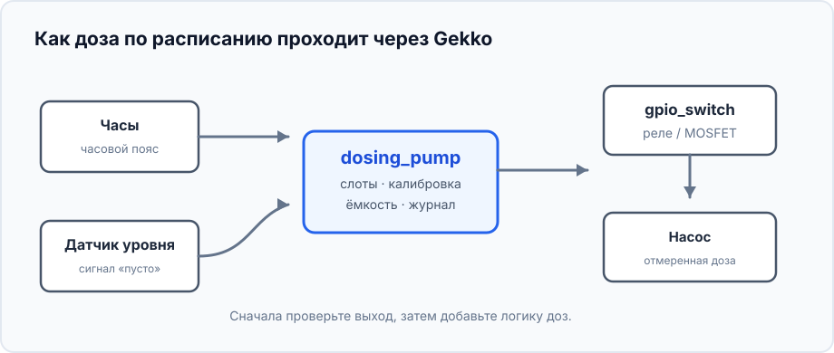
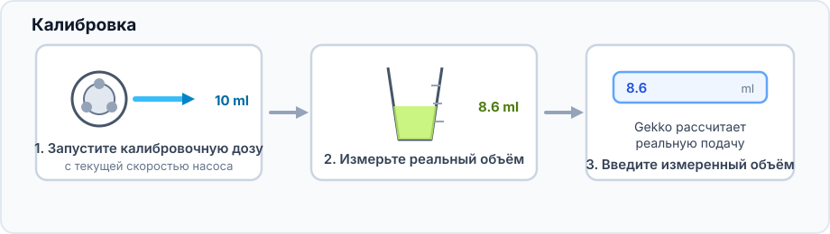
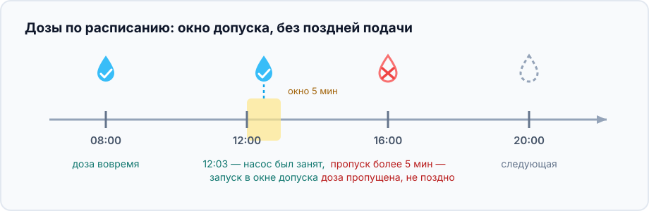
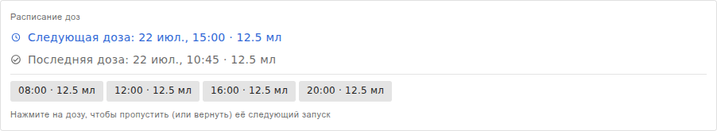
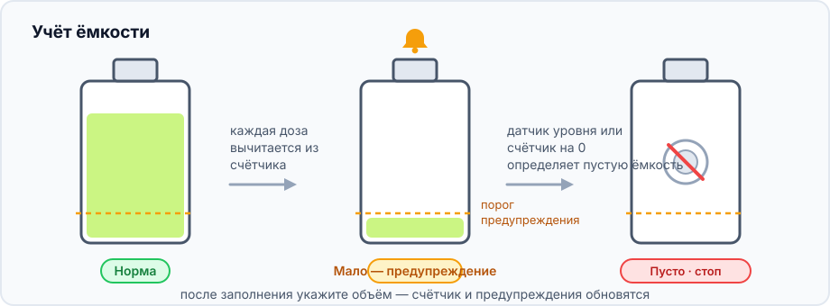

Этот проект добавляет небольшое отмеренное количество жидкости в заданное
время: для аквариумных добавок, удобрений или другого раствора, которому
полезнее несколько повторяемых малых доз, чем одна большая.

## Что получится

```text
Часы → слоты доз → dosing_pump
                       ├→ GPIO-выключатель → насос
                       └→ счётчик ёмкости и журнал
```

## Оборудование и безопасность



- ESP32, низковольтный перистальтический насос и реле либо MOSFET, рассчитанный
  на насос.
- Трубка, ёмкость и мерный цилиндр либо весы для калибровки.
- Необязательный поплавковый датчик уровня в ёмкости.

> Первые тесты делайте чистой водой в мерный цилиндр, а не неизвестным объёмом
> добавки в аквариум. Не подключайте мотор насоса непосредственно к GPIO ESP32.

## Граф устройств и порядок создания



1. Укажите часовой пояс и дождитесь корректного времени NTP либо добавьте RTC
   DS3231.
2. Создайте [`gpio_switch`](/gekko/ru/reference/devices/gpio-switch/) для реле
   или MOSFET; его безопасное состояние должно выключать мотор.
3. С водой и мерным цилиндром ненадолго включите GPIO-выключатель вручную и
   убедитесь, что мотор останавливается.
4. При необходимости создайте датчик уровня и проверьте состояния «норма» и
   «пусто».
5. Создайте `dosing_pump`: выберите выключатель насоса, датчик, ёмкость и
   порог предупреждения.

## Откалибруйте фактическую подачу



Длина и высота трубки, а также износ меняют подачу. Калибруйте с окончательно
уложенной трубкой; жидкость при калибровке действительно уходит из ёмкости.

## Добавьте первое расписание



Сначала добавьте одну небольшую дозу на несколько минут вперёд и проверьте, что
насос включается один раз, затем останавливается. Старая пропущенная доза не
догоняется: это предотвращает опасную подачу накопленного объёма после перезапуска.

## Пример сохранённого расписания



В примере четыре слота по 12,5 мл: 08:00, 12:00, 16:00 и 20:00 — всего 50 мл
за день. Это только пример структуры: объём определяют тесты воды и инструкция
к конкретной добавке. Нажмите слот, чтобы пропустить только его следующее
срабатывание, например в день подмены воды.

## Следите за ёмкостью



Пополняйте ёмкость до порога предупреждения и указывайте новый объём командой
**Set volume**. Датчик уровня дополнительно защитит от сухого хода, если
счётчик неточен. Первые дни сверяйте тесты и журнал доз.

## Типичные проблемы

- **Доза не запускается:** проверьте часы, часовой пояс, автоматический режим
  и не отмечена ли ёмкость как пустая.
- **Объём неверный:** повторите калибровку с установленной трассой трубки.
- **Мотор работает, жидкости нет:** заполните трубку водой и проверьте вход,
  перегибы и направление трубки.
- **Мотор не останавливается:** немедленно выключите GPIO-выход и проверьте
  реле и его безопасное состояние до включения автоматики.

Подробности всех настроек — в [справке дозирующего насоса](/gekko/ru/reference/devices/dosing-pump/).
