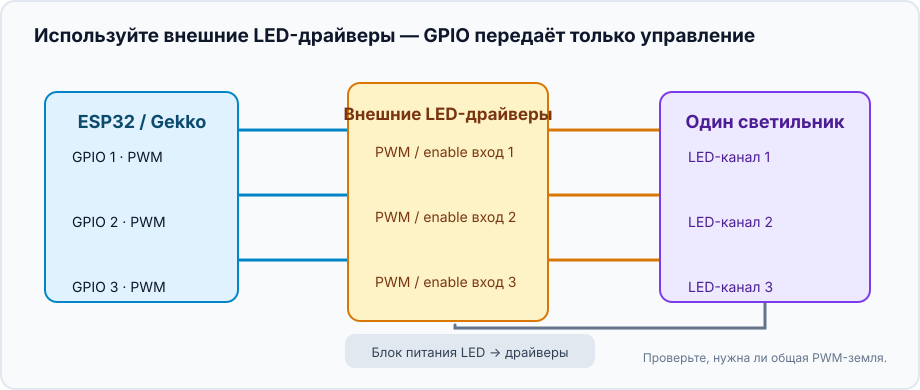
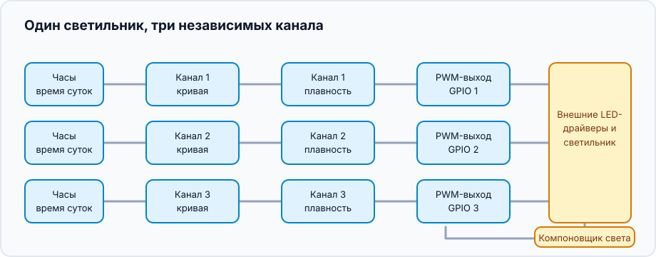
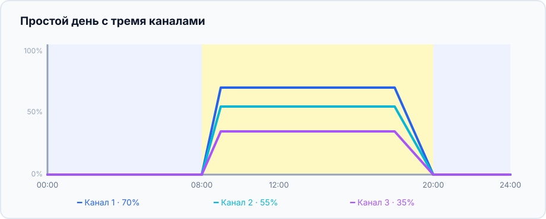

Этот проект объединяет независимые диммируемые LED-каналы в один светильник.
Каналы могут быть любыми LED-линиями или другими нагрузками с PWM-управлением:
задайте им свои имена и уровни. Gekko управляет ритмом дня, а LED-драйвер или
MOSFET-каскад подаёт электрическую мощность.

## Что получится

```text
Часы → кривые каналов → плавные переходы → PWM-выходы → LED-драйверы → светильник
                                      └──────── компоновщик ────────┘
```

У каждого канала своя кривая, а один компоновщик даёт всему светильнику общий
режим **Off**, **Manual** или **Scheduled**.

## Оборудование и безопасность



- Контроллер ESP32 и один подходящий PWM GPIO для каждого канала.
- LED-драйвер с документированным PWM/enable-входом диммирования либо
  MOSFET-каскад, рассчитанный на LED-нагрузку и её блок питания.
- Отдельный блок питания нужной мощности для LED. **Не** подключайте LED-линию
  непосредственно к GPIO ESP32.
- Общая земля нужна только если документация драйвера требует общий
  низковольтный PWM-опорный провод. Перед подключением проверьте напряжение,
  полярность и развязку входа драйвера.

Сначала подключите один канал и задайте малый ручной уровень. Убедитесь, что
яркость изменяется в ожидаемую сторону, и лишь затем подключайте остальные.

## Соберите граф устройств



Для каждого физического канала создайте цепочку:

1. Создайте [`analog_output`](/gekko/ru/reference/devices/analog-outputs/) для
   его GPIO, например «PWM канала 1».
2. Добавьте `fade_analog_output`, нацеленный на этот PWM-выход. Он сделает
   плавными и ручные изменения, и переходы по расписанию.
3. Добавьте `scheduled_analog_output`, нацеленный на fade, например «Кривая
   канала 1».
4. Повторите для остальных каналов, затем создайте один
   `analog_output_composer` — например «Основной свет» — и добавьте в него все
   scheduled outputs.

Компоновщик — обычная точка управления. В повседневной работе разместите на
панели его, а не отдельные PWM-выходы.

## Нарисуйте первый простой день

Для начала достаточно нескольких точек:

| Время | Канал 1 | Канал 2 | Канал 3 | Смысл |
| --- | ---: | ---: | ---: | --- |
| 00:00 | 0% | 0% | 0% | ночь / выключено |
| 08:00 | 0% | 0% | 0% | начало подъёма |
| 09:00 | 35% | 20% | 10% | мягкое утро |
| 12:00 | 70% | 55% | 35% | дневной уровень |
| 18:00 | 70% | 55% | 35% | удержание уровня |
| 20:00 | 0% | 0% | 0% | конец спада |



Эти проценты — только пример формы кривой, а не рекомендация яркости. Начните
ниже целевого уровня, наблюдайте за светильником и его обитателями, затем
меняйте по одному параметру. Не делайте период яркого света длиннее лишь
потому, что у канала есть запас.

## Проверьте светильник

1. В компоновщике выберите **Manual** и задайте каждому каналу малое значение.
   Убедитесь, что реагирует каждый физический канал и драйверы не перегреваются.
2. Верните режим **Off**: все каналы должны уйти в ноль.
3. Выберите **Scheduled** и временно поставьте переход на несколько минут
   вперёд. Проследите, как каждый канал поднимается, удерживается и гаснет по
   своей кривой.
4. Перезапустите контроллер или временно уберите корректное время. Убедитесь,
   что scheduled outputs безопасно переходят к нулю, а не оставляют старую
   яркость.

Когда простая кривая надёжна, переименуйте каналы по реальному светильнику и
уточняйте их уровни. Сохраняемый профиль светильника и управляемая
акклиматизация появятся позже; пока компоновщик держит существующие кривые
вместе.

## Частые проблемы

- **Один канал работает наоборот:** проверьте логику входа диммирования
  драйвера. У некоторых входов малый duty cycle означает яркий свет.
- **Свет прыгает вместо плавного перехода:** scheduled output должен целиться
  в `fade_analog_output`, а не в исходный PWM-выход.
- **Светильник не включается:** проверьте часы контроллера, режим компоновщика,
  внешний блок питания LED и enable-вход драйвера.
- **Меняется лишь один канал:** убедитесь, что все scheduled outputs добавлены
  в компоновщик и каждый указывает на свою цепочку fade/output.

Подробности настроек и редактора кривых — в
[Analog outputs & light composer](/gekko/ru/reference/devices/analog-outputs/).
