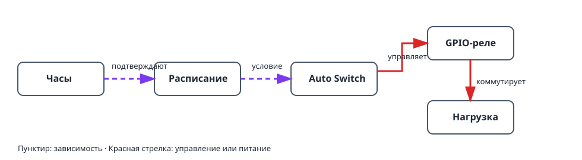

Этот проект включает и выключает нагрузку в заданное время. Физическое реле
отделено от правила времени: **расписание** определяет, активно ли окно, а
**Auto Switch** передаёт это условие на GPIO-реле.

## Что получится

```text
Часы и часовой пояс → расписание → Auto Switch → GPIO-реле → нагрузка
```

## Оборудование и безопасность

- Плата ESP32 и релейный модуль, подходящий для нагрузки.
- Низковольтная тестовая нагрузка, например светодиод, для первой проверки.

> Не подключайте сетевое напряжение напрямую к ESP32. Используйте закрытое
> реле или контактор подходящей мощности и соблюдайте правила электробезопасности.

## Граф устройств и порядок создания



1. Укажите часовой пояс контроллера и дождитесь корректных часов от NTP либо
   добавьте RTC DS3231. До этого расписание намеренно остаётся невалидным.
2. Создайте [`gpio_switch`](/gekko/ru/reference/devices/gpio-switch/) для
   реле и задайте безопасное обесточенное состояние нагрузки.
3. Вручную включите и выключите GPIO-устройство с низковольтной тестовой
   нагрузкой.
4. Создайте [`schedule`](/gekko/ru/reference/devices/schedule/) с простым
   ежедневным правилом, например 09:00–09:10, **всегда включено**.
5. Создайте `auto_switch`: выберите GPIO-выключатель как цель **switch**,
   расписание как **condition** и включите режим **Auto**.

Auto Switch объединяет все условия логическим И. При одном условии реле
включено только в активное время расписания. Режимы ручного включения и
выключения игнорируют условия; после проверки верните режим Auto.

## Безопасная проверка

1. Убедитесь, что время и часовой пояс контроллера соответствуют установке.
2. Создайте короткое окно через несколько минут, сохраните его и наблюдайте
   статус расписания и следующее переключение.
3. Проверьте, что Auto Switch включает тестовую нагрузку в начале окна и
   выключает в конце.
4. В безопасной тестовой установке измените время контроллера или отключите
   синхронизацию. Расписание должно стать невалидным или неактивным, а реле —
   вернуться в безопасное выключенное состояние.

## Типичные проблемы

- **Реле не включается:** проверьте, что Auto Switch в режиме **Auto**, а
  расписание сейчас активно.
- **Расписание невалидно:** настройте часовой пояс и дождитесь NTP либо
  подключите DS3231.
- **Логика реле обратная:** сначала проверьте GPIO-выключатель; инверсию GPIO
  включайте только для активного низким уровнем реле.
- **Время ошибается на час:** проверьте часовой пояс и переход на летнее время,
  а не отдельные правила.

Подробности правил — в разделе [«Расписания и автоматика»](/gekko/ru/guides/schedules-and-automation/).
