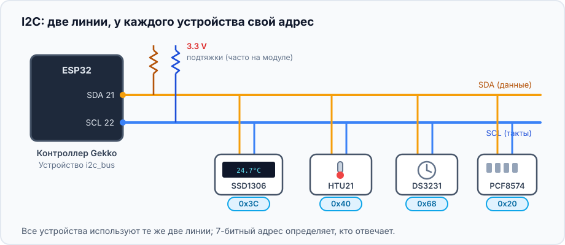
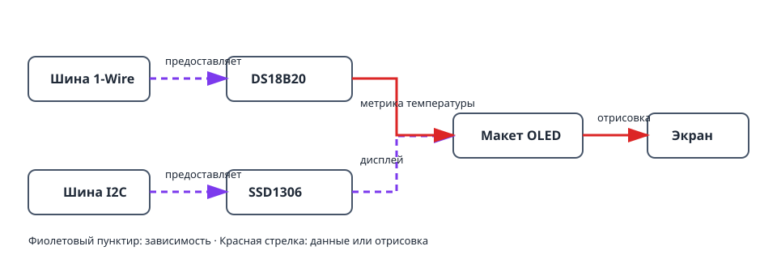
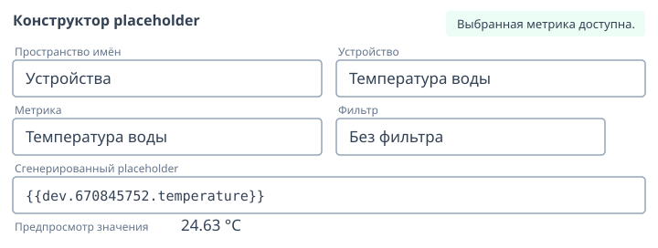
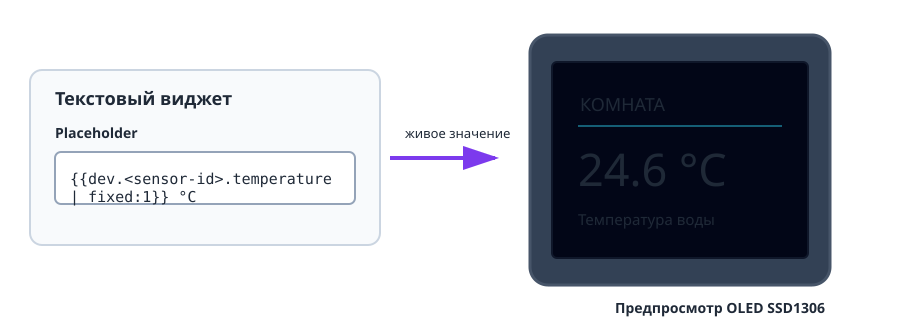

Этот проект превращает работающий датчик температуры в небольшой экран статуса.
Здесь две независимые шины: 1-Wire для DS18B20 и I2C для OLED SSD1306. Макет
дисплея затем использует живую метрику датчика.

## Что получится

```text
DS18B20 → метрика температуры → макет OLED → живой экран
                    ↑
         шина 1-Wire     шина I2C → дисплей SSD1306
```

## Оборудование

- Плата ESP32 и DS18B20 с подтягивающим резистором 4,7 кОм между DATA и 3V3.
- I2C OLED SSD1306, обычно с адресом `0x3C`.
- Линии I2C между ESP32 и дисплеем: SDA, SCL, 3V3 и GND.



Не смешивайте подключение датчика и дисплея: DS18B20 использует DATA 1-Wire,
а OLED — SDA и SCL I2C.

## Граф устройств и порядок создания



1. Создайте и проверьте [`onewire_bus`](/gekko/ru/reference/devices/onewire-bus/),
   выполните сканирование, затем создайте
   [`ds18b20_temperature_sensor`](/gekko/ru/reference/devices/ds18b20/).
2. Создайте [`i2c_bus`](/gekko/ru/reference/devices/i2c-bus/) для линий OLED
   SDA и SCL. Если адрес дисплея неизвестен — выполните сканирование.
3. Создайте дисплей `ssd1306` на этой шине, с найденным адресом и правильной
   панелью.
4. Дождитесь статуса датчика и дисплея `ready`. Откройте дисплей, нажмите
   **Design** и создайте текстовый виджет.
5. Вставьте метрику температуры через placeholder builder:

   ```text
   Комната {{dev.<sensor-id>.temperature | fixed:1}} °C
   ```



Placeholder становится реальной зависимостью дисплея. Поэтому Gekko предупредит
о попытке удалить датчик, пока его метрика используется в макете.

## Проверка экрана



1. Проверьте предпросмотр редактора до сохранения на дисплей.
2. Убедитесь, что OLED показывает ту же температуру, что и страница датчика.
3. Слегка нагрейте или охладите датчик и проверьте изменение значения на экране.
4. В безопасной тестовой установке отключите датчик. Его placeholder должен
   стать пустым или недоступным, не мешая отрисовке остального макета.

## Типичные проблемы

- **OLED пустой:** проверьте питание, SDA/SCL, адрес I2C и панель дисплея.
- **Нет значения датчика:** дождитесь `ready` и используйте placeholder builder,
  а не вводите предполагаемый ID устройства вручную.
- **Текст обрезан:** используйте предпросмотр, меньший шрифт или вторую страницу;
  не рассчитывайте ширину текста по фиксированному числу символов.
- **Датчик нельзя удалить:** сначала удалите или замените его placeholder в
  макете дисплея.

Полный процесс макета описан в [«Дисплеи и редактор раскладки»](/gekko/ru/guides/displays/).
