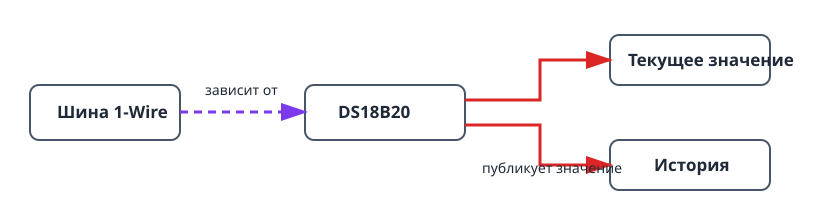

Этот проект собирает самую маленькую полезную цепочку датчика: DS18B20 на
шине 1-Wire. Он показывает тот же порядок зависимостей, что и более крупные
системы, и даёт текущее значение температуры с графиком истории. Так можно
проверить подключение и расположение датчика до добавления термостата или иной
автоматики.

## Что получится

```text
Датчик DS18B20 → шина 1-Wire → текущее значение и история температуры
```

## Оборудование

- Плата ESP32.
- Датчик DS18B20.
- Подтягивающий резистор 4,7 кОм между линией DATA датчика и 3V3.


Не оставляйте линию DATA без подтяжки: без резистора шина может находить
датчик непостоянно или показывать недостоверные значения.

## Граф устройств и порядок создания



1. Создайте [`onewire_bus`](/gekko/ru/reference/devices/onewire-bus/) на GPIO,
   подключённом к линии DATA датчика.
2. Откройте шину и выполните **сканирование**. Убедитесь, что появился нужный
   датчик.
3. Создайте [`ds18b20_temperature_sensor`](/gekko/ru/reference/devices/ds18b20/)
   по найденному адресу.
4. Дождитесь статуса датчика `ready`, откройте его и проверьте текущее
   показание и график истории.

Сканирование привязывает датчик к уникальному 64-битному ROM-адресу. На одной
шине можно использовать несколько датчиков, но для каждого найденного адреса
нужно создать отдельный экземпляр.

## Проверка показаний

1. После стабилизации датчика в одном месте сравните значение с проверенным
   термометром.
2. Ненадолго перенесите датчик из более тёплой среды в более холодную и
   убедитесь, что показание и история меняются в ожидаемую сторону.
3. В безопасной тестовой установке отключите датчик. Он должен стать
   недоступным или перейти в ошибочное состояние, а не продолжать показывать
   старое значение как текущее.

## Типичные проблемы

- **Сканирование не находит датчик:** проверьте DATA, 3V3, GND и подтягивающий
  резистор 4,7 кОм.
- **Температура скачет:** проверьте кабель и расположение датчика, прежде чем
  добавлять сглаживание или калибровку.
- **Выбран не тот датчик:** повторите сканирование и используйте показанный
  ROM-адрес; не различайте датчики только по цвету кабеля или месту установки.

Когда показание станет надёжным, используйте его как зависимость температуры в
[термостате с реле](/gekko/ru/projects/thermostat-with-relay/).
