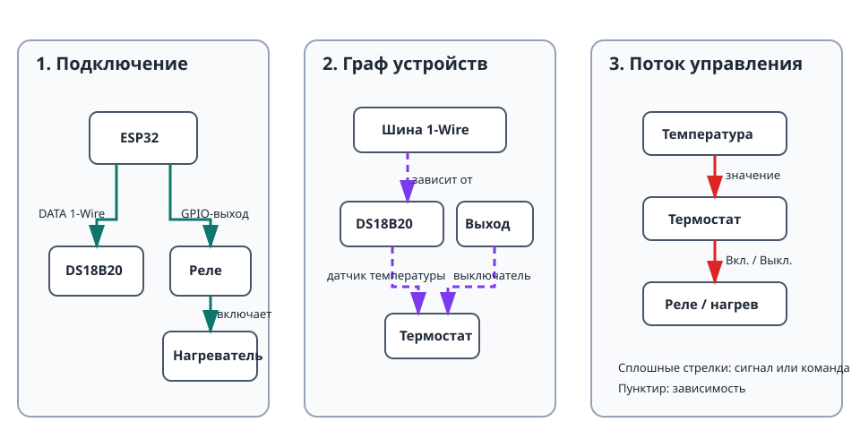

Этот проект управляет нагревателем или охладителем по датчику температуры
DS18B20. Это первый полноценный многокомпонентный сценарий: здесь есть
физическое подключение, зависимости устройств, автоматика, живой статус и
безопасное поведение.

## Что получится

```text
Датчик DS18B20 → термостат → реле → нагреватель или охладитель
```

Термостат получает текущую температуру, сравнивает её с заданным значением и
гистерезисом, а затем управляет реле.

## Оборудование

- Плата ESP32.
- Датчик DS18B20 с подтягивающим резистором 4,7 кОм между DATA и 3V3.
- Релейный модуль, подходящий для нагрузки.
- Нагреватель или охладитель, подключённый через реле в соответствии с
  документацией модуля и правилами безопасности для сетевого напряжения.

> Никогда не подключайте сетевую нагрузку напрямую к ESP32. Используйте
> подходящее по мощности закрытое реле или контактор и соблюдайте местные
> правила электробезопасности.

## Граф устройств и порядок создания



Создавайте и проверяйте устройства в таком порядке:

1. Создайте [`onewire_bus`](/gekko/ru/reference/devices/onewire-bus/) на GPIO,
   к которому подключён датчик.
2. Выполните **сканирование** и создайте найденный
   [`ds18b20_temperature_sensor`](/gekko/ru/reference/devices/ds18b20/).
3. Создайте [`gpio_switch`](/gekko/ru/reference/devices/gpio-switch/) для реле.
   В качестве безопасного состояния укажите обесточенное состояние нагрузки.
4. Вручную переключите GPIO-выключатель и убедитесь, что реле работает
   ожидаемым образом.
5. Создайте [`thermostat`](/gekko/ru/reference/devices/thermostat/) и выберите
   DS18B20 как зависимость датчика температуры, а GPIO-выключатель — как
   зависимость выключателя.

Не создавайте термостат до того, как датчик и выключатель достигнут `ready`.
Портал показывает только совместимые устройства в списках зависимостей, но
проверка каждого предыдущего шага упрощает поиск ошибки в подключении.

## Минимальные настройки термостата

Для нагревателя выберите целевую температуру и небольшую полосу гистерезиса.
Например, при цели 25,0 °C и гистерезисе 0,5 °C термостат включает нагреватель
ниже 24,5 °C и выключает при 25,0 °C. Убедитесь, что режим соответствует
нагрузке: для нагрева и охлаждения направление включения противоположно.

До начала эксплуатации укажите безопасные пределы. При недоступности датчика
или значении за безопасным диапазоном термостат должен прекратить управление
выходом; безопасное состояние GPIO-выключателя служит последней защитой.

## Проверка работы

1. Убедитесь, что шина, датчик, выключатель и термостат имеют статус `ready`.
2. Сравните показание температуры с проверенным термометром.
3. Временно измените цель, чтобы термостат должен был переключить реле.
4. Убедитесь, что реле переключается на границе гистерезиса, а не при каждом
   небольшом колебании измерения.
5. В безопасной тестовой установке отключите датчик или его шину. Убедитесь,
   что термостат показывает заблокированное или ошибочное состояние, а выход
   возвращается в безопасное состояние.

## Типичные проблемы

- **Сканирование не находит датчик:** проверьте GPIO DATA, питание 3V3/GND и
  подтягивающий резистор 4,7 кОм.
- **Логика реле обратная:** включайте инверсию GPIO-выключателя только после
  проверки, что релейный модуль действительно активен низким уровнем.
- **Термостат не даёт выбрать зависимость:** сначала создайте и включите
  подходящий датчик или выключатель, затем дождитесь `ready`.
- **Выход переключается слишком часто:** увеличьте гистерезис и проверьте
  расположение датчика, прежде чем менять логику управления.
